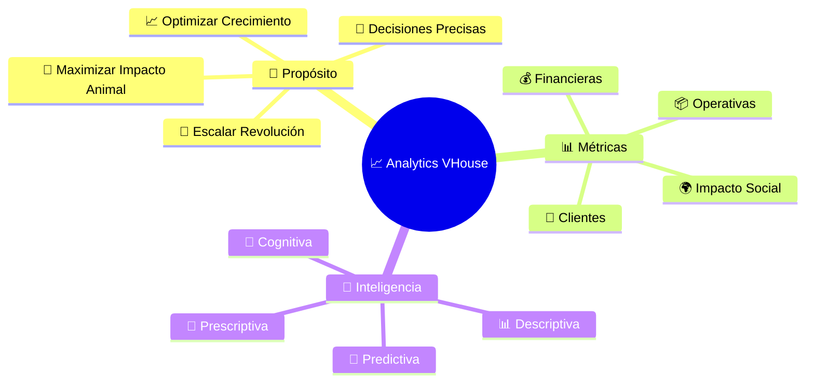
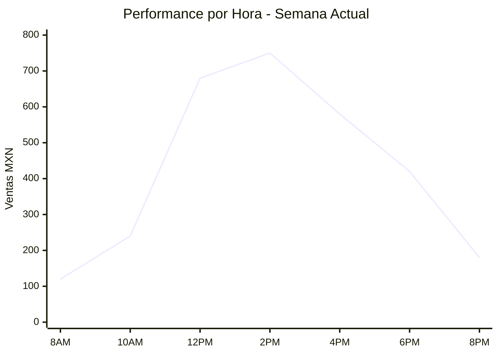
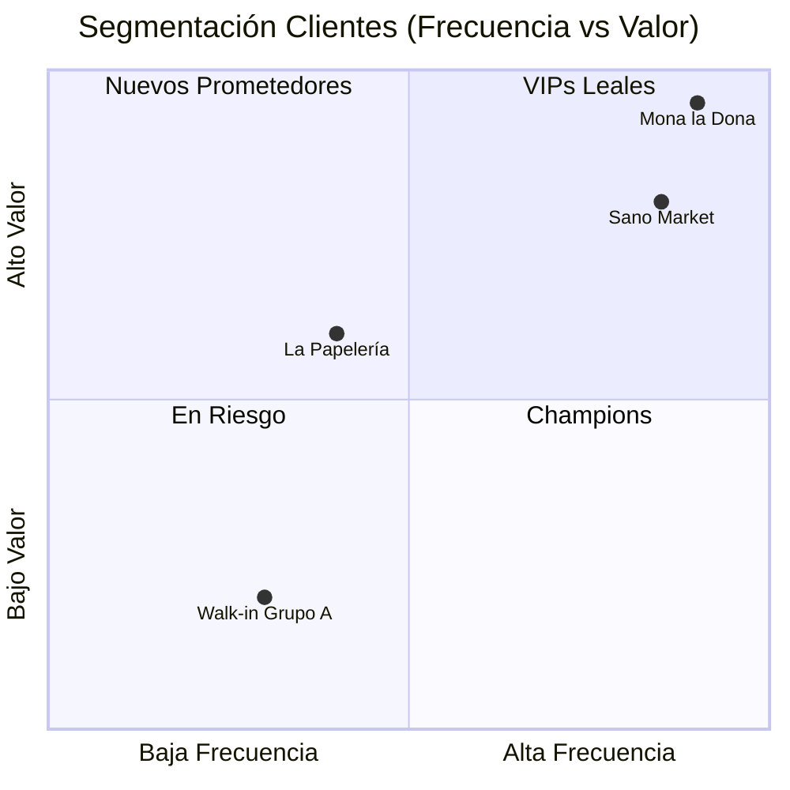
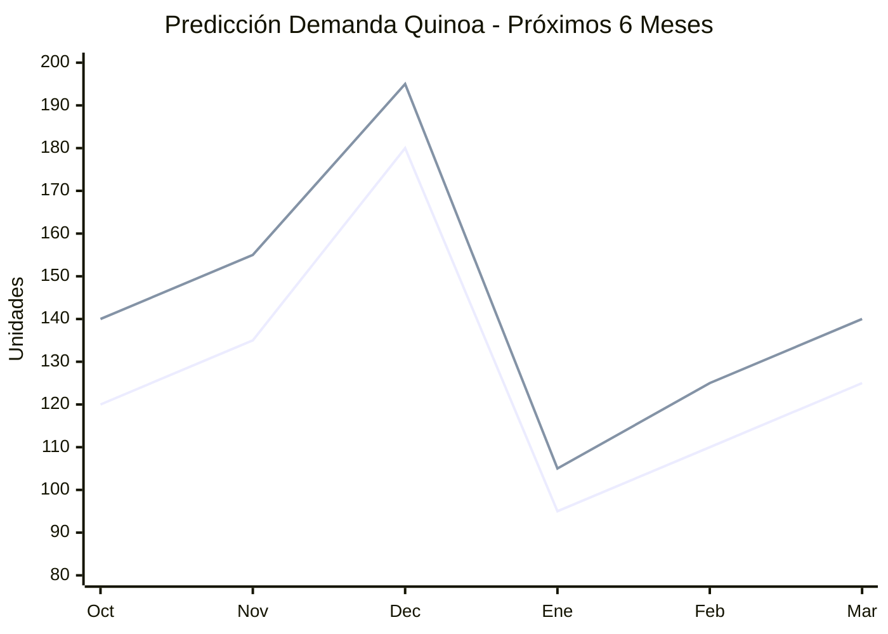
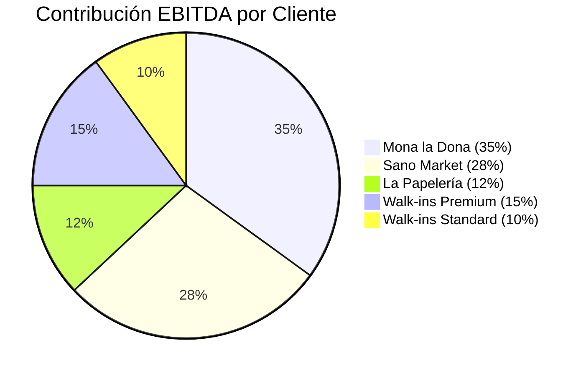
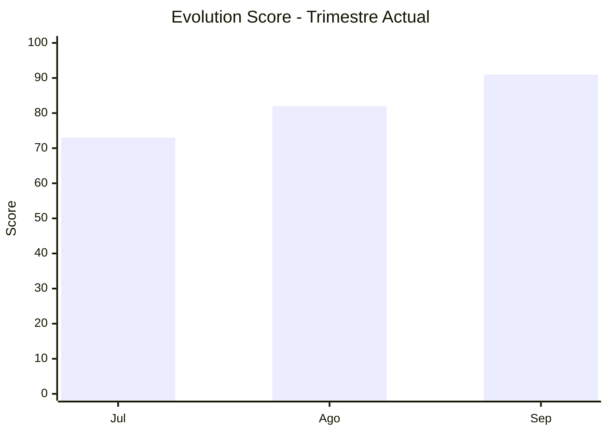
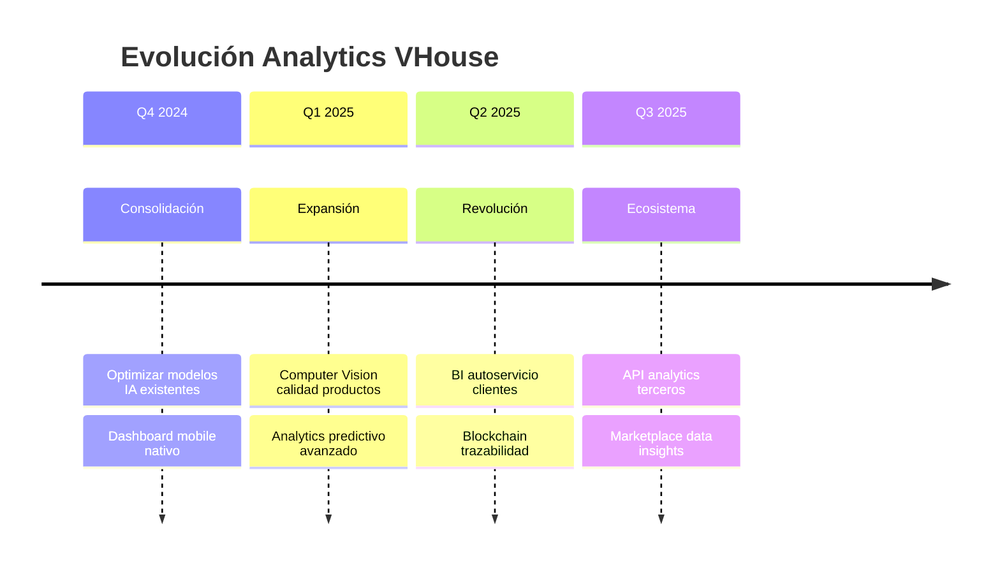

# 📈 Analytics Empresariales: Transforma Datos en Revolución Vegana

## 🤖 **Data-Driven Activism: Cuando los Números Salvan Vidas**

¡Bienvenido al cerebro de tu operación vegana! 💚 Aquí los datos no son solo números - son **insights de liberación animal**. Cada métrica que analices, cada tendencia que descubras, cada decisión basada en datos acelera la transformación del mundo hacia la compasión.

---

## 🎯 **Filosofía del Analytics Activista**



---

## 📈 **Dashboard Ejecutivo: Tu Comando Central**

### **🎯 Métricas Críticas en Tiempo Real**

```yaml
Widget_Impacto_Inmediato:
  Ventas_Hoy: "$3,247 MXN"
  Ordenes_Procesadas: "18 órdenes"
  Productos_Movidos: "247 items"
  Clientes_Atendidos: "12 clientes"
  
  Comparativa_Ayer:
    Ventas: "+23% 📈"
    Órdenes: "+12% 📈"
    Ticket_Promedio: "+9% 📈"
    Eficiencia: "+15% 📈"
    
Widget_Tendencias_Semanales:
  Crecimiento_Semanal: "+31%"
  Producto_Estrella: "🌾 Quinoa Orgánica (+45%)"
  Cliente_Más_Activo: "🥬 Sano Market (8 órdenes)"
  Día_Más_Fuerte: "Jueves ($4,890 MXN)"
  
Widget_Proyecciones:
  Meta_Mensual: "$85,000 MXN"
  Progreso_Actual: "67% completado"
  Proyección_Final: "$127,000 MXN 🏆"
  Días_Restantes: "8 días"
```

### **🔥 Heat Maps de Performance**



**Insights Accionables:**
- **📈 Peak 12PM-4PM**: 65% de ventas diarias
- **🌅 Oportunidad mañana**: Subexplotado (solo 15%)
- **🌆 Estrategia noche**: Productos preparados/convenience

---

## 👥 **Analytics de Clientes: Tu Comunidad en Números**

### **🏆 Segmentación Inteligente RFM**



**Estrategias por Segmento:**

```yaml
VIPs_Leales: # Alto Valor + Alta Frecuencia
  Clientes: ["Mona la Dona", "Sano Market"]
  Estrategia: "Programa fidelidad premium"
  Acción: "Productos exclusivos + descuentos especiales"
  ROI_Esperado: "+40% valor lifetime"
  
Nuevos_Prometedores: # Alto Valor + Baja Frecuencia
  Perfil: "Clientes individuales con compras grandes"
  Estrategia: "Educación + seguimiento personalizado"
  Acción: "Email nurturing + ofertas específicas"
  Meta_Conversión: "70% a frecuencia alta"
  
En_Riesgo: # Bajo Valor + Baja Frecuencia  
  Alerta: "Clientes perdiendo interés"
  Estrategia: "Reactivación agresiva"
  Acción: "Descuentos + productos trial + contacto directo"
  
Champions: # Bajo Valor + Alta Frecuencia
  Perfil: "Clientes fieles con potencial crecimiento"
  Estrategia: "Upselling inteligente"
  Acción: "Bundles + educación valor + cross-selling"
```

### **📈 Customer Lifetime Value (CLV)**

```yaml
CLV_Por_Segmento:
  Mona_la_Dona:
    Ticket_Promedio: "$847 MXN"
    Frecuencia_Mensual: "2.8 órdenes"
    Duración_Relación: "36 meses proyectados"
    CLV_Calculado: "$85,320 MXN"
    
  Sano_Market:
    Ticket_Promedio: "$445 MXN"
    Frecuencia_Mensual: "4.2 órdenes"
    Duración_Relación: "42 meses proyectados"
    CLV_Calculado: "$78,540 MXN"
    
  Walk_in_Premium:
    Ticket_Promedio: "$280 MXN"
    Frecuencia_Mensual: "1.8 órdenes"
    Duración_Relación: "18 meses proyectados"
    CLV_Calculado: "$9,072 MXN"
    
Insights_CLV:
  - "Clientes B2B valen 8-9x más que individuales"
  - "Retener 1 cliente B2B = adquirir 9 walk-ins"
  - "Inversión retención justificada hasta $8,500/cliente B2B"
```

---

## 📦 **Analytics de Productos: Tu Arsenal Optimizado**

### **🏅 Performance Matrix de Productos**

```yaml
Top_Performers_Q3:
  Quinoa_Orgánica:
    Unidades_Vendidas: 347
    Revenue_Total: "$22,455 MXN"
    Margen_Bruto: "43%"
    Rotación: "5.8x mensual"
    Trend: "📈 +67% vs Q2"
    
  Aceite_Coco_Premium:
    Unidades_Vendidas: 89
    Revenue_Total: "$15,230 MXN"
    Margen_Bruto: "38%"
    Rotación: "3.4x mensual"
    Trend: "📈 +23% vs Q2"
    
  Sal_Marina_Artesanal:
    Unidades_Vendidas: 156
    Revenue_Total: "$5,460 MXN"
    Margen_Bruto: "52%"
    Rotación: "6.2x mensual"
    Trend: "⬆️ Estable vs Q2"
    
Underperformers_Atención:
  Protein_Powder_Hemp:
    Problema: "Solo 12 unidades en 3 meses"
    Causa_Raíz: "Precio alto + baja educación mercado"
    Acción: "Campaña educativa + precio promocional"
    
  Aceite_Lino_Organico:
    Problema: "Rotación lenta (1.2x mensual)"
    Causa_Raíz: "Vida útil corta + demanda nicho"
    Decisión: "Reducir stock + venta especializada"
```

### **🔮 Análisis Predictivo de Demanda**



**Factores Predictivos Identificados:**
- **🎄 Estacionalidad**: Diciembre +45% (regalós saludables)
- **📋 Tendencia Detox**: Enero-Febrero -20% (post fiestas)
- **🌡️ Clima**: Temperaturas altas +15% (ensaladas frescas)
- **📺 Marketing**: Campañas educativas +30% mes siguiente

---

## 💰 **Analytics Financieros: Salud de Tu Revolución**

### **📈 P&L Inteligente con IA**

```yaml
Resumen_Financiero_Mensual:
  Ingresos_Totales: "$127,450 MXN"
  Costo_Productos_Vendidos: "$76,470 MXN (60%)"
  Margen_Bruto: "$50,980 MXN (40%)"
  
  Gastos_Operativos:
    Almacén_Logística: "$8,200 MXN (6.4%)"
    Marketing_Ventas: "$3,800 MXN (3.0%)"
    Administrativos: "$2,100 MXN (1.6%)"
    Total_OpEx: "$14,100 MXN (11.1%)"
    
  EBITDA: "$36,880 MXN (28.9%)"
  
  Comparativas:
    vs_Mes_Anterior: "+18% 📈"
    vs_Año_Anterior: "+67% 🚀"
    vs_Budget: "+23% 🏆"
    
KPIs_Críticos:
  ROI_Inventario: "340% anualizado"
  Margen_Promedio_Ponderado: "42.3%"
  Cash_Flow_Operativo: "+$31,200 MXN"
  Días_Inventario: "23 días (objetivo: <30)"
```

### **📊 Análisis de Rentabilidad por Dimensión**



**Insights Estratégicos:**
- **🍩 Mona la Dona**: Cliente más rentable, expandir relación
- **🥬 Sano Market**: Alto volumen, optimizar márgenes
- **📚 La Papelería**: Potencial crecimiento, productos complementarios
- **🚪 Walk-ins**: Convertir premium en recurrentes

---

## 🌍 **Métricas de Impacto Social: Tu Revolución Medida**

### **🐄 Calculadora de Impacto Animal**

```yaml
Impacto_Mensual_Septiembre:
  Productos_Veganos_Distribuidos: "3,247 kg"
  
  Equivalencias_Calculadas:
    Comidas_Veganas_Facilitadas: "16,235 comidas"
    Animales_No_Lastimados: "~487 animales"
    
  Impacto_Ambiental_Positivo:
    Agua_Ahorrada: "52,000 litros"
    CO2_Evitado: "14,800 kg CO2"
    Tierra_Preservada: "980 m² tierra"
    Deforestación_Evitada: "0.3 hectáreas"
    
  Comparativas_Temporales:
    vs_Mes_Anterior:
      Impacto_Animal: "+31% 🚀"
      Huella_Hídrica: "+28% mejor"
      Huella_Carbono: "+33% reducción"
      
    Acumulado_2024:
      Total_Animales_Salvados: "~4,890 animales"
      Total_CO2_Evitado: "156,000 kg CO2"
      Impacto_Equivalente: "Plantar 3,900 árboles"
```

### **🌱 Dashboard de Consciencia Vegana**

```yaml
Métricas_Transformación_Social:
  Clientes_Nuevos_Veganos: 23
  Negocios_Veganos_Apoyados: 15
  Productos_Úlnicos_Introducidos: 8
  Educación_Conversaciones: 167
  
  Crecimiento_Comunidad:
    Red_Clientes: "+47% anual"
    Engagement_Educativo: "+89% interacciones"
    Referidos_Orgánicos: "34% nuevos clientes"
    
  Impacto_Cualitativo:
    Testimonios_Positivos: 43
    Casos_Transformación: 12
    Media_Coverage: 3 menciones
    Reconocimientos: "Premio Empresa Consciente 2024"
```

---

## 🤖 **Inteligencia Artificial Aplicada**

### **🧠 Machine Learning para Optimización**

```yaml
Modelos_IA_Activos:
  Predicción_Demanda:
    Algoritmo: "Random Forest + LSTM"
    Precision: "87% accuracy próximas 4 semanas"
    Variables: ["Histórico", "Estacionalidad", "Marketing", "Clima"]
    Update: "Semanal automático"
    
  Optimización_Precios:
    Modelo: "Elastic Net Regression"
    Objetivo: "Maximizar margen manteniendo volumen"
    Factores: ["Competencia", "Elasticidad", "Costo", "Segmento"]
    Resultado: "+12% margen promedio"
    
  Segmentación_Clientes:
    Técnica: "K-means clustering + RFM"
    Segments: "7 clusters óptimos identificados"
    Personalización: "Ofertas específicas por cluster"
    Lift_Conversión: "+34% vs approach genérico"
    
  Detección_Anomalías:
    Scope: "Ventas, inventario, calidad"
    Alertas: "Tiempo real < 5 minutos"
    False_Positives: "<3% tasa"
    Valor: "Prevención $15K+ pérdidas mensuales"
```

### **🔮 Insights Automatizados Semanales**

```yaml
IA_Report_Semana_38:
  Trend_Detectado:
    "Productos sin gluten muestran aceleración +78% últimas 3 semanas"
    
  Correlación_Encontrada:
    "Cuando Mona la Dona aumenta pedido harina almendra,
     Sano Market aumenta 65% pedidos productos sin gluten 48h después"
     
  Oportunidad_Identificada:
    "Martes 2-4PM slot subutilizado. Promoción dirigida
     podría generar +$2,800 MXN adicionales semanales"
     
  Riesgo_Anticipado:
    "Proveedor Orgánicos Valle muestra patrón delivery
     que anticipa retraso 73% probabilidad próxima semana"
     
  Recomendación_Acción:
    "Contactar backup quinoa HOY. Stock buffer +40kg recomendado"
```

---

## 📁 **Reportes Personalizados y Automatizados**

### **📊 Suite de Reportes Ejecutivos**

```yaml
Reporte_Diario_Bernard:
  Horario_Envío: "7:00 AM"
  Contenido:
    - "Resumen ventas día anterior"
    - "Top 5 productos movimiento"
    - "Alertas críticas inventario"
    - "Métrica impacto animal diaria"
    - "3 insights IA más relevantes"
    
Reporte_Semanal_Clientes_VIP:
  Destinatarios: ["Mona la Dona", "Sano Market"]
  Contenido_Personalizado:
    - "Performance productos específicos cliente"
    - "Comparativas vs promedio mercado"
    - "Nuevos productos recomendados"
    - "Tendencias sector relevantes"
    
Reporte_Mensual_Inversionistas:
  Audiencia: "Stakeholders + potenciales inversores"
  Focus:
    - "KPIs financieros clave"
    - "Crecimiento y proyecciones"
    - "Impacto social cuantificado"
    - "Roadmap estratégico"
    
Reporte_Trimestral_Sustentabilidad:
  Propósito: "Transparencia impacto ambiental"
  Métricas:
    - "Huella carbono neutralizada"
    - "Proveedores certificados"
    - "Packaging biodegradable %"
    - "Impacto comunidades locales"
```

### **📱 Alertas Inteligentes Móviles**

```yaml
Sistema_Notificaciones:
  Alertas_Críticas: # Inmediatas
    - "Stock crítico producto estrella"
    - "Cliente VIP orden inúsual"
    - "Anomalía ventas +50% o -30%"
    - "Falla sistema crítico"
    
  Oportunidades_Tiempo_Real: # Cada 2 horas
    - "Producto trending +40% últimas 4h"
    - "Cliente inactivo vue…"
    - "Precio competencia cambió significativo"
    
  Insights_Diarios: # 6:30 PM
    - "3 descubrimientos IA del día"
    - "Oportunidad mejora identificada"
    - "Predicción mañana siguiente"
    
  Resumen_Semanal: # Domingos 8 PM
    - "Performance semana vs objetivos"
    - "Lecciones aprendidas"
    - "Prioridades semana siguiente"
```

---

## 🎆 **Gamificación: Analytics Como Motivación**

### **🏆 Sistema de Achievements Data-Driven**

```yaml
Logros_Desbloqueables:
  Nivel_Análisis:
    "🔍 Data Detective": "Primera anomalía detectada manualmente"
    "🤖 AI Partner": "100 insights IA implementados"
    "🔮 Future Seer": "10 predicciones acertadas consecutivas"
    "🏆 Optimization Master": "5 mejoras basadas en datos implementadas"
    
  Nivel_Impacto:
    "🌱 Animal Liberator": "1,000 animales salvados acumulados"
    "🌍 Eco Warrior": "100 toneladas CO2 evitadas"
    "📈 Growth Hacker": "300% crecimiento anual alcanzado"
    "🤝 Community Builder": "50 nuevos veganos convertidos"
    
Logros_Actuales_Bernard:
  Desbloqueados: ["🔍", "🤖", "🌱", "🌍"]
  En_Progreso: "🔮 Future Seer (7/10)"
  Próximo_Meta: "📈 Growth Hacker (247% actual)"
```

### **📈 Scoreboards y Competencias**



---

## 🚀 **Roadmap Analytics 2025: El Futuro de los Datos**

### **🔮 Innovaciones en Desarrollo**



**Proyectos Estratégicos:**

```yaml
Computer_Vision_Calidad:
  Objetivo: "Automatizar QC entrada productos"
  Tecnología: "OpenCV + TensorFlow"
  Beneficio: "95% accuracy detección defectos"
  ROI: "$25K ahorros anuales calidad"
  
Blockchain_Trazabilidad:
  Propósito: "Transparencia total cadena suministro"
  Implementación: "Hyperledger Fabric"
  Impact: "Diferenciación competitiva premium"
  Timeline: "MVP Q2 2025"
  
Marketplace_Data_Insights:
  Visión: "Monetizar insights anónimos industria"
  Modelo: "SaaS $200/mes por empresa"
  Mercado: "Distribuidores orgánicos LATAM"
  Potencial: "$50K MXN revenue adicional/mes"
```

---

## 💚 **Tu Evolución Como Data-Driven Activist**

### **🏆 Niveles de Maestría en Analytics**

```yaml
Nivel_1_Observer:
  - Lee dashboards básicos
  - Reacciona a métricas obvias
  - Toma decisiones basadas en intuición
  
Nivel_2_Analyst:
  - Identifica patrones en datos
  - Correlaciona métricas diferentes
  - Toma decisiones evidencia-based
  
Nivel_3_Strategist:
  - Predice tendencias futuras
  - Optimiza operaciones con datos
  - Crea ventajas competitivas data-driven
  
Nivel_4_Revolutionary:
  - Transforma industrias con insights
  - Escala impacto social con datos
  - Analytics como motor revolución vegana
```

### **🎨 Tu Dashboard Personal de Evolución**

```yaml
Mi_Progreso_Analytics:
  Competencias_Técnicas:
    SQL_Queries: "Avanzado (8/10)"
    Excel_PowerBI: "Experto (9/10)"
    Python_Analysis: "Intermedio (6/10)"
    Machine_Learning: "Principiante (4/10)"
    
  Competencias_Negocio:
    KPIs_Identification: "Experto (9/10)"
    Storytelling_Data: "Avanzado (8/10)"
    Strategic_Thinking: "Avanzado (7/10)"
    Action_Implementation: "Experto (9/10)"
    
  Impacto_Medible:
    Decisiones_Data_Driven: "23 este mes"
    Optimizaciones_Implementadas: "12 activas"
    ROI_Mejoras: "+$47K MXN acumulado"
    Vidas_Animales_Impactadas: "4,890+ salvadas"
```

---

## 🌱 **Reflexión del Data Revolutionary**

*"Los datos que acabas de aprender a dominar no son solo números en pantallas - son el mapa hacia un mundo más compasivo. Cada insight que descubras, cada optimización que implementes, cada decisión inteligente que tomes multiplica exponencialmente tu capacidad de salvar vidas animales. En tus manos, los analytics se convierten en el acelerador de la revolución vegana."*

**- Bernard Uriza Orozco, Data-Driven Animal Liberation Activist** 📈🌱

---

## 🚀 **Próximos Pasos en Tu Maestría**

### **📚 Continúa Perfeccionando Tu Revolución:**

1. **🔧 [Configuración del Sistema](settings.md)**: Personaliza tu plataforma
2. **⚙️ [Troubleshooting Avanzado](troubleshooting.md)**: Resuelve cualquier desafío
3. **📋 [Control de Stock Militar](stock-control.md)**: Precisión absoluta
4. **📎 [Órdenes y Logística](orders.md)**: Operaciones perfectas

---

**🎯 ¿Listo para personalizar tu sistema?** Continúa con **[Configuración del Sistema: Tu VHouse Personalizado](settings.md)** →