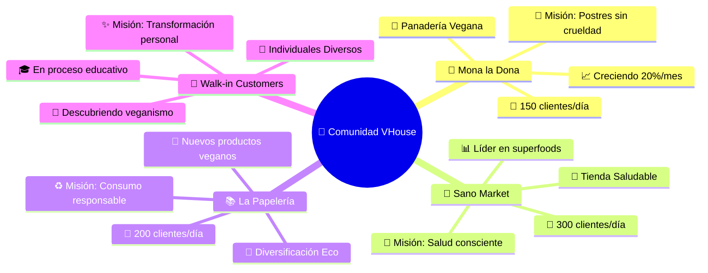
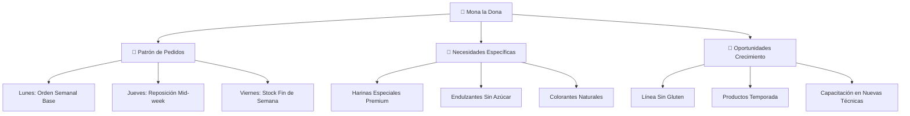
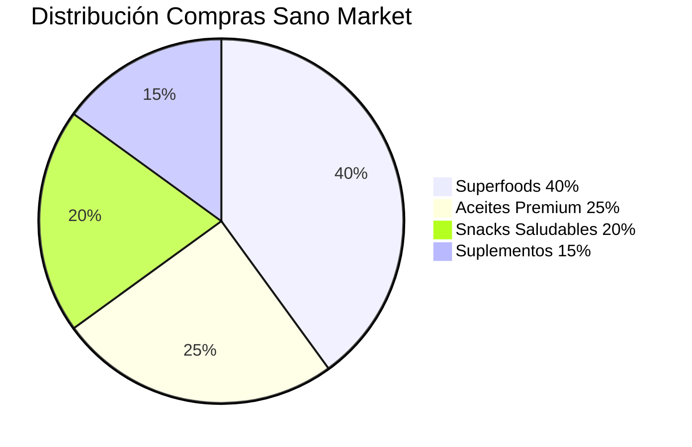
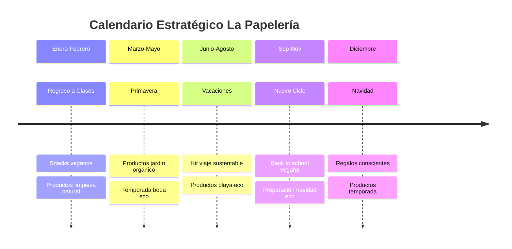
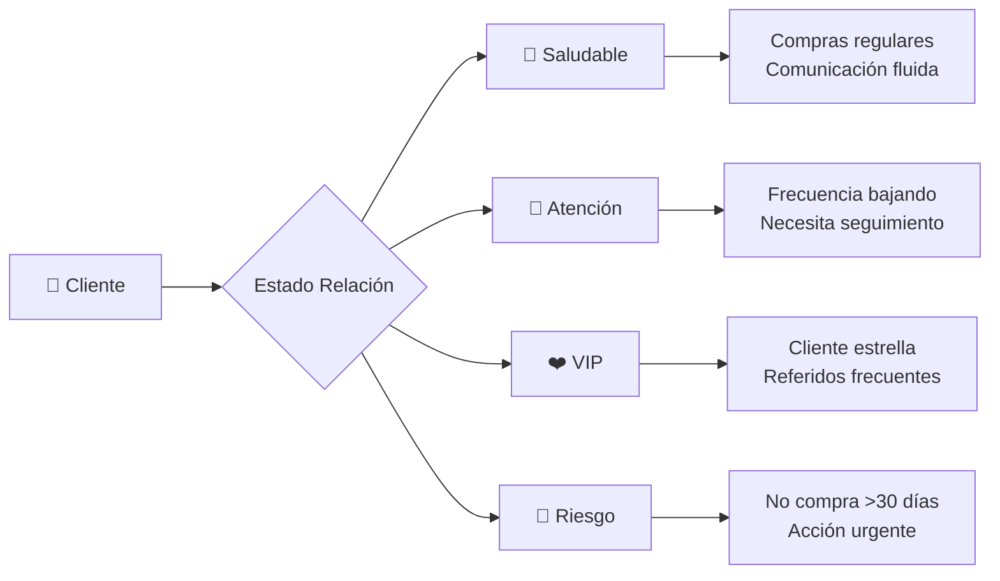
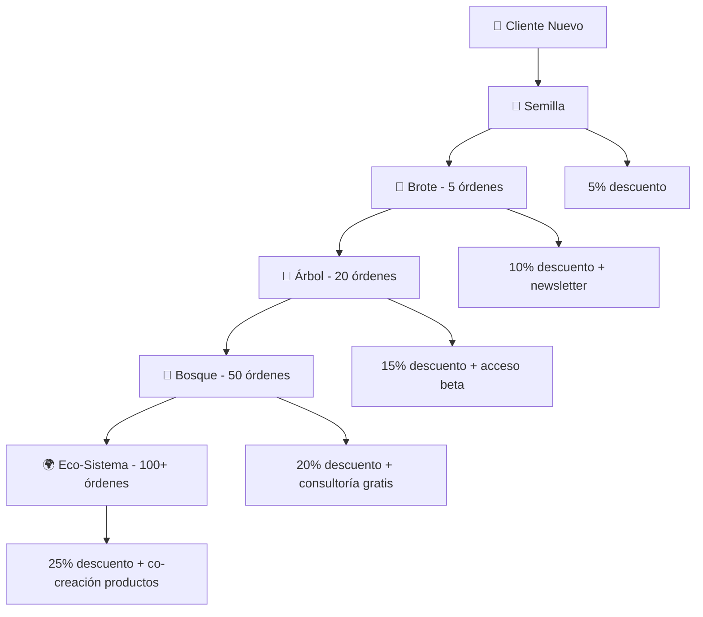
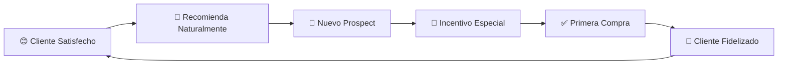
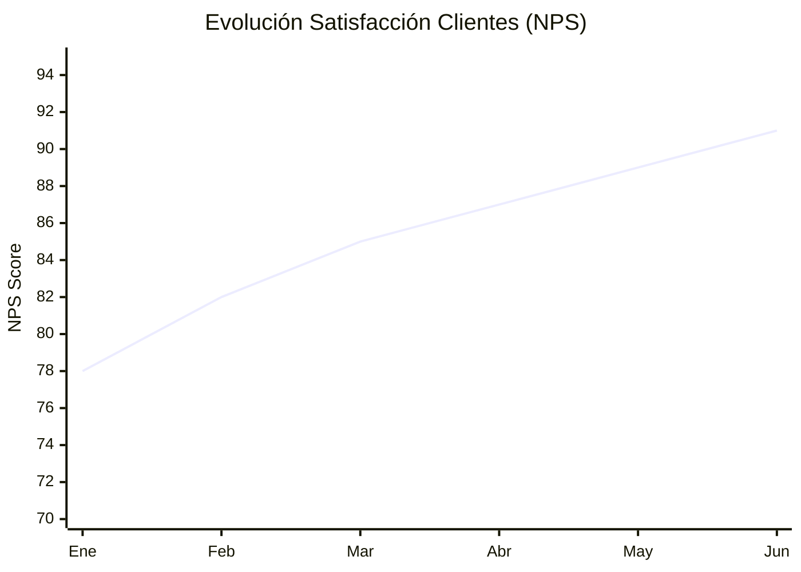

# 👥 Gestión de Clientes: Construye Tu Comunidad Vegana de Impacto

## 🌱 **Más que Clientes: Son Compañeros de Revolución**

¡Bienvenido al corazón humano de tu operación vegana! 💚 Aquí no gestionas "clientes" - construyes una **red de activistas comerciales** comprometidos con la liberación animal. Cada relación que cultives aquí multiplica tu impacto exponencialmente.

---

## 🎯 **Tu Ecosistema de Clientes Revolucionarios**



---

## 🍩 **Mona la Dona: Tu Partner de Dulce Revolución**

### **📊 Perfil Completo del Cliente Estrella**

```yaml
Información_Empresarial:
  Nombre_Negocio: "Mona la Dona - Panadería 100% Vegana"
  Propietaria: "Mónica Hernández"
  Ubicación: "Centro Histórico, Col. Centro"
  Años_Operando: 3
  Especialidad: "Repostería artesanal sin ingredientes animales"
  
Datos_Operativos:
  Horario: "7:00 AM - 9:00 PM (Martes a Domingo)"
  Producción_Diaria: "150-200 piezas"
  Clientes_Promedio_Día: 45
  Temporada_Alta: "Diciembre (navideño) + Febrero (San Valentín)"
  
Contacto_Preferido:
  WhatsApp: "+52 xxx xxx xxxx"
  Email: "mona@monaldona.com" 
  Mejor_Hora_Llamadas: "2:00 PM - 4:00 PM"
  Día_Preferido_Entregas: "Lunes (preparación semana)"
```

### **🎯 Estrategia de Relación Personalizada**



**🧁 Productos Favoritos y Frecuencia:**
```yaml
Pedidos_Regulares_Semanales:
  Harinas:
    - Harina_Integral: "15 kg/semana"
    - Harina_Avena: "8 kg/semana"  
    - Harina_Almendra: "3 kg/semana"
    
  Grasas_Veganas:
    - Aceite_Coco: "6 L/semana"
    - Mantequilla_Almendra: "4 kg/semana"
    
  Endulzantes:
    - Agave_Orgánico: "3 L/semana"
    - Stevia_Polvo: "500g/semana"
    
Productos_Estacionales:
  Diciembre: "+300% chocolate y especias"
  Febrero: "+200% colorantes rojos naturales"
  Verano: "+150% ingredientes refrescantes"
```

---

## 🥬 **Sano Market: Tu Aliado en Wellness Consciente**

### **🌿 Perfil del Cliente Wellness Premium**

```yaml
Información_Empresarial:
  Nombre_Negocio: "Sano Market - Tienda de Productos Naturales"
  Propietarios: "Carlos y Ana Ruiz" 
  Ubicación: "Col. Roma Norte (zona trendy)"
  Años_Operando: 5
  Especialidad: "Superfoods, suplementos veganos, productos orgánicos"
  
Perfil_Clientes_Finales:
  Edad_Promedio: "28-45 años"
  Perfil: "Profesionales conscientes, deportistas, familias health-oriented"
  Gasto_Promedio: "$450 MXN por visita"
  Frecuencia: "2-3 veces por semana"
  
Datos_Operativos:
  Horario: "8:00 AM - 10:00 PM (Lunes a Domingo)"
  Rotación_Inventario: "Alta (productos frescos)"
  Picos_Venta: "Mañanas (smoothies) + Tardes (post-gym)"
```

### **📈 Análisis de Comportamiento de Compra**



**💡 Insights Clave de Comportamiento:**
- **🌅 Pico matutino**: Quinoa, chía, proteína vegana (smoothie crowd)
- **🏃‍♂️ Pico vespertino**: Almendras, barras energéticas (post-gym)
- **📅 Lunes**: Orden mayor (restocking weekend)
- **🎯 Tendencia**: Creciente interés en productos sin gluten (+45%)

---

## 📚 **La Papelería: Diversificación Sostenible Inteligente**

### **♻️ El Cliente Más Innovador**

```yaml
Información_Empresarial:
  Nombre_Negocio: "La Papelería del Centro"
  Propietario: "Don Roberto González"
  Ubicación: "Centro, cerca de escuelas y oficinas"
  Años_Operando: 15
  Innovación: "Incorporando productos eco-friendly desde 2023"
  
Transformación_En_Progreso:
  Antes: "100% papelería tradicional"
  Ahora: "70% papelería + 30% productos eco/veganos"
  Meta_2024: "50% papelería + 50% lifestyle sustentable"
  
Motivación_Cambio:
  - Clientes_Jóvenes: "Piden opciones sustentables"
  - Diferenciación: "Única papelería eco de la zona"
  - Rentabilidad: "Productos eco dan +35% margen"
```

### **🎒 Estrategia de Expansión por Temporadas**



---

## 🚶 **Walk-in Customers: Semillas de Futura Revolución**

### **👤 Tipología de Clientes Individuales**

```yaml
Segmentos_Walk_In:
  Curiosos_Primerizos:
    Perfil: "Primera vez comprando vegano"
    Edad: "25-50 años"
    Motivación: "Salud, curiosidad, recomendación"
    Estrategia: "Educación suave + productos accesibles"
    
  Veganos_Experimentados:
    Perfil: "Buscan productos específicos de calidad"
    Comportamiento: "Saben lo que quieren, valoran calidad"
    Ticket_Promedio: "$200-400 MXN"
    Estrategia: "Mostrar productos premium + novedades"
    
  Familias_Transicionando:
    Perfil: "Familias reduciendo productos animales"
    Reto: "Convencer a todos los miembros"
    Oportunidad: "Alto valor lifetime si se convierten"
    Estrategia: "Productos que gusten a niños + padres"
    
  Profesionales_Conscientes:
    Perfil: "Ejecutivos/profesionales con conciencia social"
    Tiempo_Limitado: "Compras rápidas pero frecuentes"
    Ticket_Alto: "$300-600 MXN por visita"
    Estrategia: "Conveniencia + productos premium"
```

---

## 🎯 **Sistema de Gestión de Relaciones (CRM Activista)**

### **📊 Dashboard de Salud de Clientes**



**🎯 Indicadores de Salud por Cliente:**

```yaml
Mona_la_Dona:
  Estado: "💚 Saludable"
  Última_Compra: "Hace 3 días"
  Frecuencia: "2.3 órdenes/semana"
  Tendencia: "📈 Creciendo +23%"
  Próxima_Acción: "Proponer nuevos productos sin gluten"
  
Sano_Market:
  Estado: "❤️ VIP"  
  Última_Compra: "Ayer"
  Frecuencia: "3.1 órdenes/semana"
  Referidos: "4 nuevos clientes este mes"
  Próxima_Acción: "Programa de fidelidad premium"
  
La_Papelería:
  Estado: "💛 Atención"
  Última_Compra: "Hace 8 días" 
  Frecuencia: "1.2 órdenes/semana (-15%)"
  Preocupación: "Temporada baja escolar"
  Próxima_Acción: "Llamada de seguimiento + productos oficina"
```

---

## 🤝 **Estrategias de Retención y Crecimiento**

### **💚 Programa de Fidelidad Vegana**



### **🎁 Programas de Beneficios Personalizados**

**🍩 Para Mona la Dona:**
```yaml
Beneficios_Especiales:
  - Precio_Preferencial: "5% adicional descuento mayorista"
  - Entrega_Prioritaria: "Lunes 7AM garantizado"
  - Productos_Exclusivos: "Acceso prioritario nuevos productos"
  - Soporte_Técnico: "Asesoría en recetas nuevas"
  - Marketing_Conjunto: "Co-promoción en redes sociales"
  
Incentivos_Crecimiento:
  - "Por cada $10K MXN mensual: 1 producto gratis"
  - "Referir nuevo mayorista: $500 MXN crédito"
  - "Testimonial en video: $1K MXN descuento"
```

**🥬 Para Sano Market:**
```yaml
Beneficios_Premium:
  - Productos_Beta: "Testing nuevos productos antes del mercado"
  - Educación_Staff: "Capacitación mensual equipo ventas"  
  - Materiales_POP: "Carteles educativos gratis"
  - Análisis_Mercado: "Reporte mensual tendencias wellness"
  - Eventos_Exclusivos: "Invitación a lanzamientos VIP"
```

---

## 📞 **Comunicación Estratégica Por Cliente**

### **💬 Canales y Frecuencia Óptima**

```yaml
Mona_la_Dona:
  Canal_Primario: "WhatsApp Business"
  Frecuencia_Contacto: "2 veces por semana"
  Mejor_Horario: "2PM - 4PM"
  Tipo_Comunicación: "Técnica + personal"
  Tono: "Profesional pero cálido"
  
Sano_Market:
  Canal_Primario: "Email + WhatsApp"  
  Frecuencia_Contacto: "3 veces por semana"
  Mejor_Horario: "9AM - 11AM"
  Tipo_Comunicación: "Data-driven + tendencias"
  Tono: "Profesional + insights de mercado"
  
La_Papelería:
  Canal_Primario: "Llamada telefónica"
  Frecuencia_Contacto: "1 vez por semana"  
  Mejor_Horario: "4PM - 6PM"
  Tipo_Comunicación: "Simple + educativa"
  Tono: "Paternalistico + confianza"
```

### **📧 Templates de Comunicación Efectiva**

**🎯 Email Semanal a Sano Market:**
```
Asunto: 🥬 Tendencias Wellness + Novedades VHouse Semana 23

Hola Carlos y Ana,

📊 INSIGHTS DE MERCADO:
- Quinoa creció 34% en ventas wellness México
- Tendencia: productos sin gluten +67% demanda

🌟 PARA SANO MARKET ESTA SEMANA:
- Quinoa tricolor llegó (tu pedido especial)
- Nueva almendra activada - perfil nutricional superior
- Aceite MCT coco - trending en comunidad fitness

💡 OPORTUNIDAD: 
Fin de mes = más clientes buscando "reset saludable"
¿Armamos promoción "Kit Detox" con tus top 5?

¡Hablamos!
Bernard 🌱
```

**📱 WhatsApp a Mona la Dona:**
```
🍩 ¡Hola Mona!

Vi que este fin de semana tienes evento especial.

✅ Tu harina integral está lista
✅ Aceite de coco extra llegó ayer  
✅ BONUS: Conseguí esa stevia cristalizada que querías probar

¿Paso por ti a las 7AM como siempre?

PD: Mis clientes no dejan de hablar de tus donas de chocolate 😍

Bernard
```

---

## 🚀 **Estrategias de Adquisición de Nuevos Clientes**

### **🌱 Marketing de Referidos Orgánico**



**🎯 Sistema de Referidos Automatizado:**
```yaml
Cliente_Refiere_a_Nuevo:
  Beneficio_Referidor: "$200 MXN crédito"
  Beneficio_Referido: "20% descuento primera compra"
  Tracking: "Código único por cliente"
  
Ejemplos_Referidos_Exitosos:
  - "Mona refirió a Café Vegano del Centro (ahora cliente mensual)"
  - "Sano Market conectó con Gym Fitness Plus (B2B nuevo)"
  - "La Papelería refirió a Librería Académica (diversificación)"
```

### **🎯 Estrategia de Networking Activista**

```yaml
Eventos_de_Conexión:
  Ferias_Veganas:
    Frecuencia: "Mensual"
    Objetivo: "10 nuevos contactos por evento"
    Estrategia: "Stand educativo + muestras gratis"
    
  Talleres_Cocina_Vegana:
    Frecuencia: "Quincenal"  
    Objetivo: "5 nuevos clientes individuales"
    Estrategia: "Ingredientes VHouse + recetas"
    
  Networking_Empresarial:
    Frecuencia: "Semanal"
    Objetivo: "2 nuevos B2B prospects"
    Estrategia: "Sustentabilidad + responsabilidad social"
```

---

## 📊 **Métricas de Éxito en Gestión de Clientes**

### **🎯 KPIs Críticos de Relación**

```yaml
Métricas_Retención:
  Tasa_Retención_Anual: "92% (industria: 75%)"
  Frecuencia_Compra_Promedio: "2.1x por semana"
  Tiempo_Vida_Cliente: "18 meses promedio"
  Crecimiento_Ticket: "+27% año sobre año"
  
Métricas_Satisfacción:
  NPS_Score: "89 (Excelente)"
  Quejas_Resueltas_24h: "98%"
  Referidos_Generados: "15 nuevos clientes/mes"
  Renovación_Contratos_Anuales: "95%"
  
Métricas_Crecimiento:
  Clientes_Nuevos_Mensual: "8-12 clientes"
  Conversión_Prospect_Cliente: "67%"
  Upgrade_Individual_B2B: "23% anual"
  Expansión_Ingresos_Cliente: "+31% promedio"
```

### **📈 Dashboard de Impacto Relacional**



---

## 🎯 **Plan de Acción: Próximos 30 Días**

### **📅 Estrategia Mensual de Relaciones**

**Semana 1: Consolidación**
- ✅ Llamar a todos los clientes VIP
- 📊 Revisar métricas de satisfacción  
- 🎁 Implementar nuevo beneficio Mona la Dona

**Semana 2: Expansión**
- 🌱 Contactar 5 prospects nuevos
- 📧 Campaña email "Productos de temporada"
- 🤝 Reunión presencial con Sano Market

**Semana 3: Optimización**  
- 📱 Automatizar WhatsApp templates
- 🎯 Análisis de patrones de compra
- 💡 Propuesta cross-selling La Papelería

**Semana 4: Innovación**
- 🆕 Lanzar programa de fidelidad mejorado
- 📊 Reporte mensual personalizado por cliente
- 🚀 Planear estrategia Q4 con clientes mayoristas

---

## 💚 **Filosofía de Relaciones Veganas**

### **🌱 Principios Fundamentales**

```yaml
Valores_Core_Relaciones:
  Transparencia: "Comunicación honesta siempre"
  Empatía: "Entender necesidades reales del cliente"  
  Crecimiento_Mutuo: "Win-win en cada interacción"
  Impacto_Social: "Cada cliente multiplica la causa vegana"
  Sustentabilidad: "Relaciones a largo plazo vs ventas rápidas"
  
Mantra_Diario:
  "Cada cliente no es solo una cuenta - es un socio 
   en la construcción del mundo compasivo que soñamos"
```

---

## 🚀 **Tu Próxima Evolución**

### **📚 Continúa Construyendo Tu Revolución:**

1. **📦 [Gestión de Inventario](inventory.md)**: Optimiza tu arsenal de productos
2. **📋 [Órdenes y Entregas](orders.md)**: Sistematiza la logística
3. **🛍️ [Catálogo de Productos](products.md)**: Perfecciona tu oferta
4. **📊 [Analytics Avanzados](analytics.md)**: Estrategias data-driven

---

## 🎉 **Reflexión del Constructor de Comunidades**

*"Cada relación que cultivas en VHouse trasciende el intercambio comercial - es la construcción consciente de una red de activistas que multiplican el impacto vegano. Los clientes que acabas de aprender a gestionar no solo compran productos, crea un movimiento que cambia el mundo, una relación a la vez."*

**- Bernard Uriza Orozco, Community Builder & Animal Liberation Activist** 👥🌱

---

**🎯 ¿Listo para optimizar tu inventario?** Continúa con **[Gestión de Inventario: Tu Arsenal Vegano Perfecto](inventory.md)** →