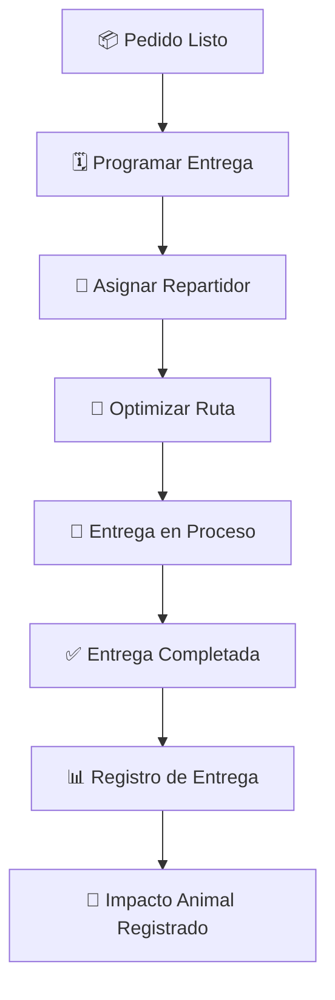

# 🚚 Gestión de Entregas

## 📋 Descripción General

El sistema de gestión de entregas de VHouse te permite coordinar y rastrear todas las entregas a tus clientes como **Mona la Dona** 🍩, **Sano Market** 🥬 y **La Papelería** 📚.

## 🎯 Funcionalidades Principales

### 📦 Programación de Entregas
- Calendario de entregas
- Rutas optimizadas
- Horarios personalizados por cliente
- Notificaciones automáticas

### 🚛 Seguimiento en Tiempo Real
- Estado de entregas
- Ubicación del repartidor
- Confirmación de entrega
- Firmas digitales

### 📊 Reportes de Entregas
- Tiempo promedio de entrega
- Entregas completadas vs pendientes
- Satisfacción del cliente
- Análisis de rutas

## 🌱 Por la Liberación Animal

Cada entrega eficiente significa más productos veganos en las manos correctas, acelerando la adopción del veganismo y salvando vidas animales.

¡Cada entrega cuenta para los animales! 🌱✨