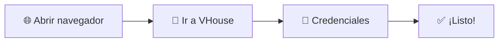
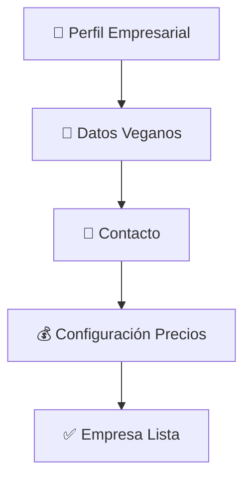
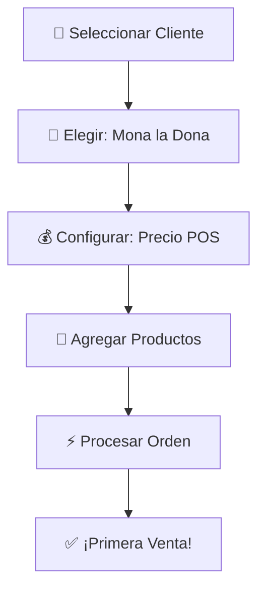
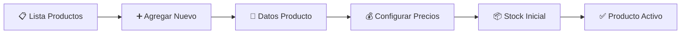
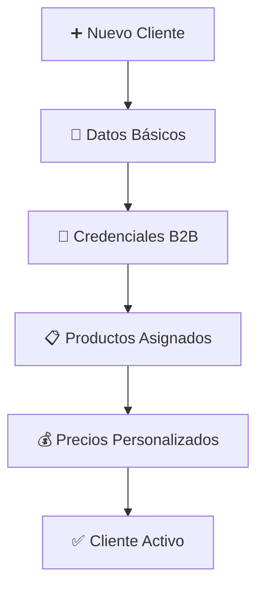
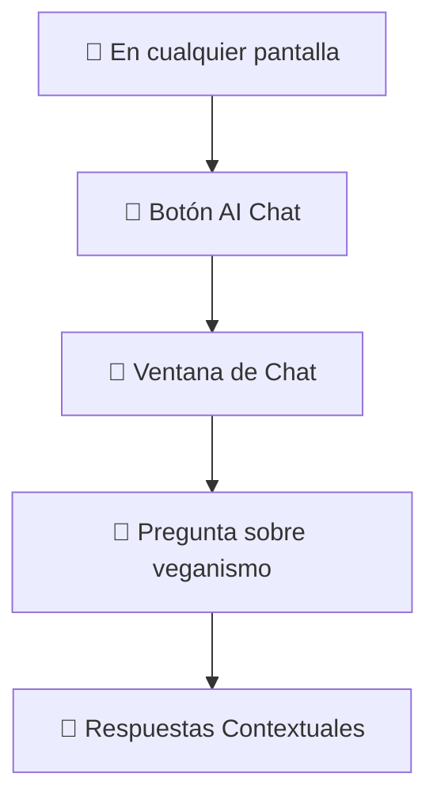

# 🚀 Primeros Pasos en VHouse: Tu Revolución Vegana Comienza Aquí

## 🌱 **¡Bienvenido a Tu Nueva Era de Activismo Sistematizado!**

Este es el momento en que tu pasión por los animales se convierte en **operaciones ultra-eficientes**. En menos de 15 minutos, tendrás VHouse funcionando completamente para impulsar tu negocio vegano. ¡Vamos a comenzar!

---

## ✨ **Configuración Rápida: De 0 a Héroe Vegano en 3 Pasos**

### **Paso 1: Acceso al Sistema** 🔐

1. **Abre tu navegador favorito** (Chrome, Firefox, Edge)
2. **Navega a VHouse**: `tu-dominio-vhouse.com`
3. **Inicia sesión** con tus credenciales empresariales

> 💡 **Tip de Activista**: Guarda la URL como favorito con el emoji 🌱 para acceso rápido

---

### **Paso 2: Configuración Inicial de Tu Imperio Vegano** ⚙️

#### **🏢 Configuración de Tu Empresa**

**Información Básica:**
- 📝 **Nombre de tu empresa**: "Distribuidora VHouse Bernard"
- 🌱 **Misión**: "Revolucionando el mundo con productos veganos"
- 📧 **Email**: tu-email-empresarial@gmail.com
- 📱 **Teléfono**: Tu número de contacto

**Configuración de Precios:**
- 💰 **Precio Costo**: Tu costo real de adquisición
- 🏪 **Precio POS**: Para revendedores (markup ~30-40%)
- 🏷️ **Precio Público**: Para consumidores finales (markup ~50-70%)

---

### **Paso 3: ¡Tu Primera Venta Vegana!** 🎉

#### **🛒 Accediendo al POS Futurista**

1. **Haz clic en** `🛒 Sistema POS` desde el menú principal
2. **Verás la interfaz minimalista** con tres áreas principales:
   - 🎛️ **Controles Universales** (arriba)
   - 📱 **Panel de Productos** (izquierda) 
   - 📋 **Carrito Inteligente** (derecha)

#### **🎯 Tu Primera Orden: Demo con Mona la Dona**

**Paso a Paso:**
1. **Clic en** `👥` **selector de cliente** → **Selecciona** `🍩 Mona la Dona`
2. **Clic en** `💰` **selector de precio** → **Selecciona** `🏪 Precio POS`
3. **Busca productos**: Escribe "harina" en el buscador 🔍
4. **Agrega productos**: Haz clic en productos para agregarlos
5. **Ajusta cantidades**: Usa los botones `+` `-` en cada producto
6. **Procesa la orden**: Clic en `⚡ Procesar Orden`
7. **¡Celebra!** 🎉 Has completado tu primera venta vegana sistematizada

---

## 🏗️ **Configuración Avanzada: Optimizando Tu Operación**

### **📦 Configuración de Inventario Inicial**

#### **Paso 1: Agregar Tus Productos Estrella**

**Datos Esenciales por Producto:**
- 🏷️ **Nombre**: Descriptivo y claro
- 😊 **Emoji**: Para identificación visual rápida
- 💰 **Precios**: Costo, POS, Público
- 📦 **Stock**: Cantidad inicial disponible
- 🌱 **Vegano**: Siempre ✅ (obviamente)
- ✅ **Activo**: Para que aparezca en el POS

#### **Productos de Ejemplo para Comenzar:**
| Emoji | Producto | Costo | POS | Público |
|-------|----------|-------|-----|---------|
| 🌾 | Harina Integral | $35 | $50 | $70 |
| 🥥 | Aceite de Coco | $120 | $160 | $200 |
| 🧂 | Sal Marina | $25 | $35 | $50 |
| 🍫 | Cacao Orgánico | $80 | $110 | $150 |

---

### **👥 Configuración de Tus Clientes Revolucionarios**

#### **🍩 Configurando Mona la Dona**

**Información Requerida:**
- 🏢 **Nombre del Negocio**: "Mona la Dona"
- 🔑 **Código**: "mona-dona" (para URL del portal)
- 👤 **Persona de Contacto**: "Mónica"
- 📧 **Email**: monica@monaldona.com
- 📱 **Teléfono**: +52 xxx xxx xxxx

**Productos Especializados para Mona la Dona:**
- 🌾 Harinas especiales para repostería
- 🧈 Mantequillas veganas para hornear
- 🍫 Chocolates y coberturas veganas
- 🥥 Endulzantes naturales

---

## 🎯 **Flujo de Trabajo Diario: Tu Nueva Rutina Activista**

### **🌅 Rutina Matutina (5 minutos)**

1. **Accede a VHouse** con tu café vegano ☕
2. **Revisa el dashboard** - métricas de ayer
3. **Verifica stock crítico** - productos con bajo inventario
4. **Revisa pedidos pendientes** - órdenes para procesar
5. **¡Estás listo!** Para un día de ventas veganas exitosas

### **🌆 Rutina Nocturna (3 minutos)**
1. **Revisa ventas del día** 📊
2. **Actualiza stock** si recibiste mercancía 📦
3. **Programa entregas** para mañana 🚚
4. **Celebra tu impacto** - cada venta salva vidas 🎉

---

## 🤖 **Tu Asistente IA: Primer Contacto**

### **¿Cómo Activar Tu Copiloto Vegano?**

**Primeras Preguntas Para Probar:**
- "¿Qué productos necesita más Mona la Dona?"
- "¿Cuál es mi producto más vendido esta semana?"
- "¿Cómo puedo aumentar mis ventas veganas?"
- "¿Qué tendencias ves en mis datos?"

---

## ✅ **Checklist: ¿Estás Listo Para La Revolución?**

### **Configuración Básica Completa** ✨
- [ ] ✅ Acceso al sistema funcionando
- [ ] 🏢 Datos de empresa configurados
- [ ] 💰 Estructura de precios definida
- [ ] 📦 Al menos 5 productos cargados
- [ ] 👥 Mona la Dona configurada como cliente
- [ ] 🛒 Primera venta de prueba realizada
- [ ] 🤖 Asistente IA probado y funcionando

### **Configuración Avanzada (Opcional)** 🚀
- [ ] 🥬 Sano Market configurado
- [ ] 📚 La Papelería configurado
- [ ] 🏪 Proveedores básicos agregados
- [ ] 📊 Dashboard personalizado
- [ ] 📧 Notificaciones configuradas

---

## 🆘 **¿Necesitas Ayuda? ¡Estamos Contigo!**

### **Recursos de Soporte Inmediato:**
- 🤖 **Asistente IA**: Disponible 24/7 en cualquier pantalla
- 📚 **Manual completo**: Guías detalladas para cada función
- 💌 **Soporte directo**: soporte@vhouse.com

### **Problemas Comunes y Soluciones Rápidas:**

**🔐 "No puedo acceder"**
- Verifica tu URL y credenciales
- Limpia caché del navegador
- Intenta en navegador privado/incógnito

**📦 "No veo productos"**
- Verifica que estén marcados como "Activos"
- Revisa los filtros del POS
- Confirma que tengan stock > 0

**🛒 "El POS no responde"**
- Actualiza la página (F5)
- Verifica conexión a internet
- Contacta soporte si persiste

---

## 🎉 **¡Felicitaciones! Tu Revolución Vegana Ha Comenzado**

Ya tienes VHouse funcionando y estás listo para **sistematizar tu activismo**. Cada venta que proceses, cada cliente que sirvas, cada producto que distribuyas es un paso hacia un mundo más compasivo.

### **Próximos Pasos en Tu Viaje:**
1. 🛒 [Domina el Sistema POS](pos-system.md) - Conviértete en un maestro de ventas
2. 👥 [Gestiona Tus Clientes](clients.md) - Construye tu comunidad vegana
3. 📊 [Analiza Tu Impacto](analytics.md) - Mide y maximiza tu revolución

---

## 💚 **Mensaje de Tu Desarrollador Activista**

*"Cada configuración que completas, cada venta que procesas, cada cliente que atiendes con VHouse es una declaración de que **el software puede servir a la compasión**. Tu éxito es el éxito de todos los animales. ¡Adelante, revolucionario!"*

**- Bernard Uriza Orozco, Creador de VHouse** 🌱

---

*¿Listo para el siguiente nivel? Continúa con [Sistema POS Completo](pos-system.md) →*