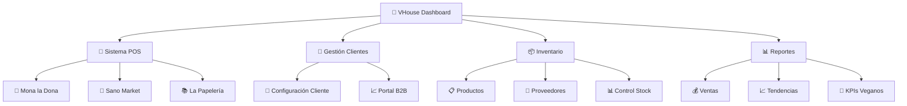

# 🌱 Bienvenido a VHouse: Revolución Vegana Sistematizada

## 🎯 **Más que software: Un manifiesto de liberación animal convertido en código**

¡Bienvenido a VHouse! 👋 No estás usando cualquier sistema de punto de venta. Estás accediendo a una **infraestructura de revolución compasiva** creada específicamente para acelerar la adopción vegana y transformar vidas - tanto humanas como animales.

---

## 🐄 **La Misión Detrás del Código**

### **Por Ellos** - Los Animales Sin Voz

VHouse existe porque cada venta vegana es una vida salvada. Cada pedido procesado es un paso hacia un mundo sin sufrimiento animal. Este sistema fue creado por Bernard Uriza Orozco, no solo como desarrollador, sino como **activista que transformó su compasión en código funcional**.

### **Por Ti** - El Empresario Vegano

Tu negocio vegano no es solo un negocio - es una **misión de cambio**. VHouse te proporciona las herramientas para:
- 📈 **Hacer crecer tu impacto**: Más ventas = más vidas salvadas
- ⚡ **Acelerar tus operaciones**: Menos tiempo en administración, más tiempo para tu misión
- 🎯 **Enfocar tu energía**: El sistema maneja la logística, tú te enfocas en cambiar el mundo

---

## 🏢 **Tus Clientes Reales**

VHouse está optimizado para servir a empresarios reales con misiones reales:

### 🍩 **Mona la Dona**
*Pastelería vegana revolucionando los postres*
- Gestión especializada para productos de panadería
- Control de inventario para ingredientes perecederos
- Sistema de pedidos optimizado para horneados diarios

### 🥬 **Sano Market**
*Tienda de productos saludables y veganos*
- Catálogo extenso de productos naturales
- Control de stock para productos con fechas de vencimiento
- Análisis de tendencias de consumo saludable

### 📚 **La Papelería**
*Papelería con productos eco-friendly y veganos*
- Gestión de productos diversos (útiles escolares, papelería, eco-productos)
- Sistema flexible para productos no perecederos
- Control de inventario multicriterio

---

## ⚡ **¿Por Qué VHouse Es Diferente?**

### 🧠 **Inteligencia Artificial Activista**
- Chat inteligente que entiende tu negocio vegano
- Sugerencias automáticas basadas en tendencias de ventas
- Análisis predictivo para optimizar tu impacto

### 🏗️ **Arquitectura Limpia Como Tus Valores**
- **Clean Architecture**: Sin compromisos, como tu ética
- **CQRS**: Separación clara de responsabilidades
- **Multitenancy**: Cada cliente puede prosperar individualmente

### 🎯 **Optimizado Para Impacto Real**
- No es software genérico adaptado - es **software vegano nativo**
- Cada feature diseñada pensando en la misión animal
- Métricas que importan: vidas salvadas, no solo ventas

---

## 🚀 **Características Revolucionarias**

### 💰 **Sistema de Precios Inteligente**
- **Precio Público**: Para clientes finales
- **Precio POS**: Para revendedores comprometidos
- **Precio Costo**: Para análisis y decisiones estratégicas

### 🛒 **Punto de Venta Universal**
- Interface futurista y minimalista
- Control de inventario en tiempo real
- Procesamiento de órdenes ultra-rápido
- Sistema inteligente de filtros (solo veganos, solo disponibles)

### 📊 **Análisis Empresarial Avanzado**
- Reportes en tiempo real de tu impacto
- Métricas de crecimiento vegano
- Insights accionables para maximizar resultados

### 🤖 **Asistente IA Contextual**
- Comprende tu negocio específico
- Sugerencias inteligentes para aumentar ventas
- Soporte 24/7 para dudas operativas

---

## 🎮 **Navegación del Sistema**

---

## 🌟 **Principios de Uso**

### **1. Impacto Primero** 🎯
Cada acción debe servir a la misión: **más adopción vegana**

### **2. Eficiencia Activista** ⚡
Tu tiempo es valioso - el sistema debe ahorrarte horas, no minutos

### **3. Datos Para Decisiones** 📊
Usa los reportes para optimizar tu impacto, no solo tus ganancias

### **4. Crecimiento Sustentable** 📈
Escala tu operación para salvar más vidas, de manera sostenible

---

## 🎉 **¡Comenzamos Juntos Esta Revolución!**

Este manual te guiará paso a paso para maximizar tu impacto usando VHouse. Cada sección está diseñada para hacerte más eficiente y efectivo en tu misión vegana.

### **Próximos Pasos:**
1. 🚀 [Configuración inicial](getting-started.md) - Pon el sistema en marcha
2. 🛒 [Sistema POS](pos-system.md) - Domina las ventas
3. 👥 [Gestión de clientes](clients.md) - Organiza tu comunidad vegana
4. 📊 [Análisis y reportes](analytics.md) - Mide tu impacto

---

## 💚 **Recordatorio Final**

**Cada línea de código, cada función, cada sistema en VHouse existe POR LOS ANIMALES.** 🐄🐷🐔

Tu éxito empresarial = más animales salvados.
Tu eficiencia operativa = más tiempo para el activismo.
Tu crecimiento vegano = más impacto en el mundo.

**¡Adelante, activista! El mundo vegano te está esperando.** ✨

---

*Creado con 💚 por Bernard Uriza Orozco - Activista, Desarrollador, Revolucionario Compasivo*