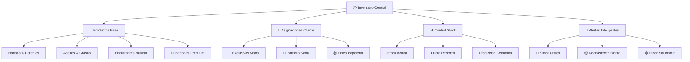
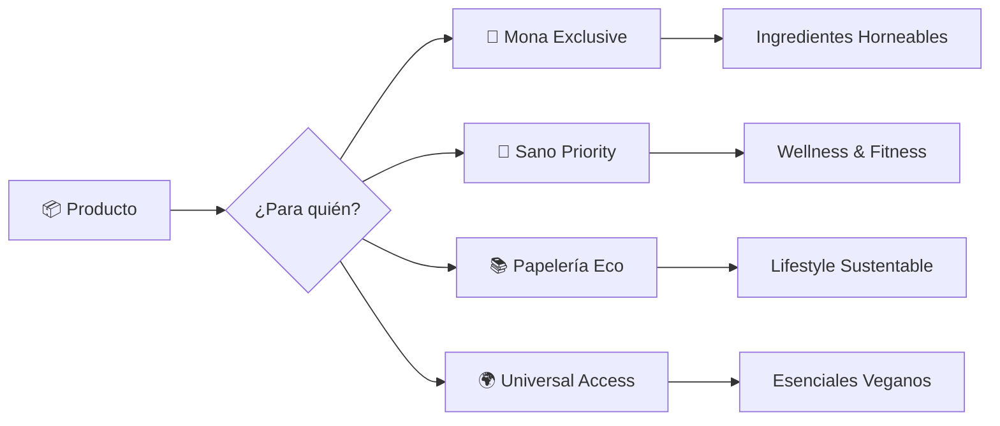
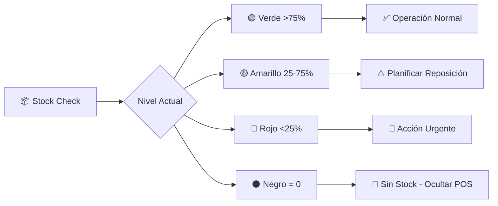
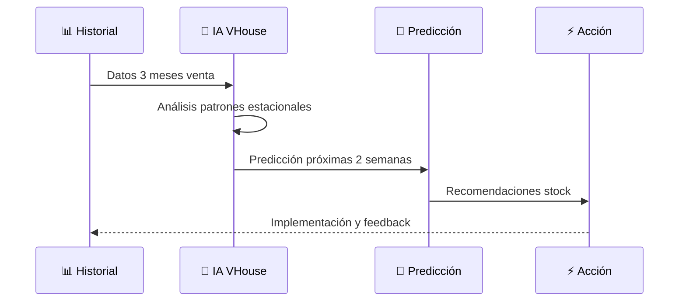
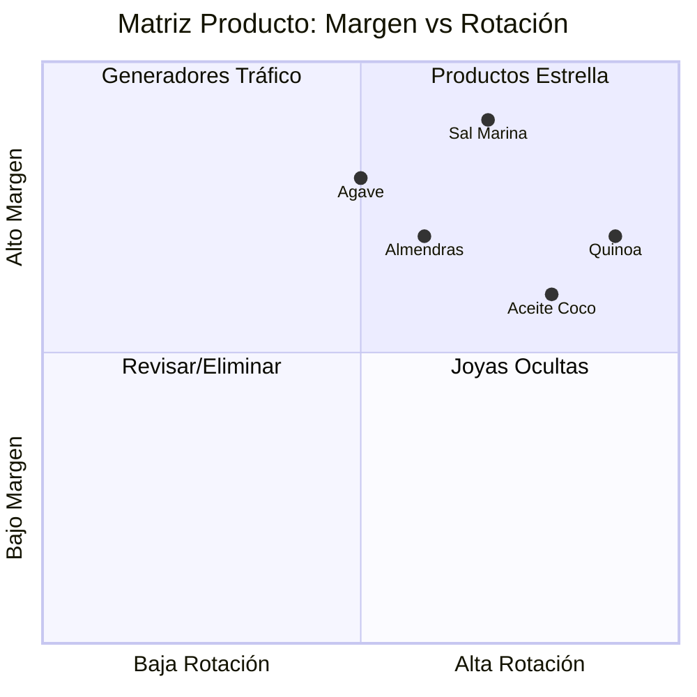
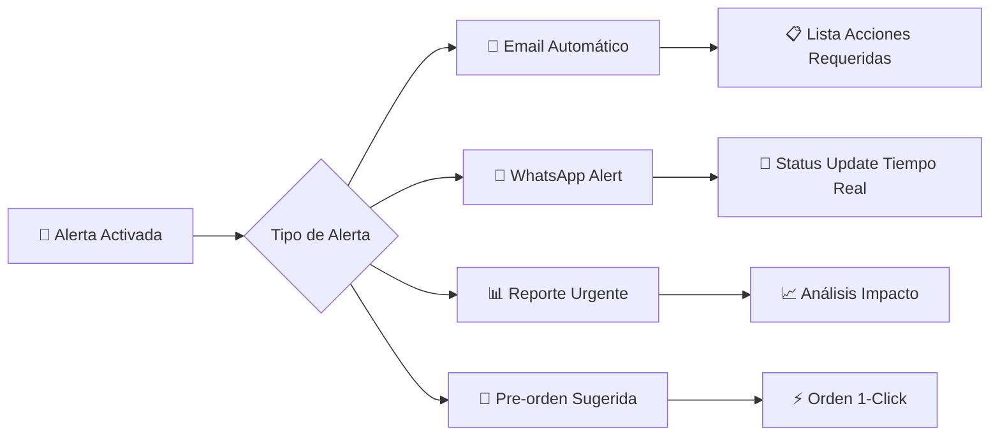
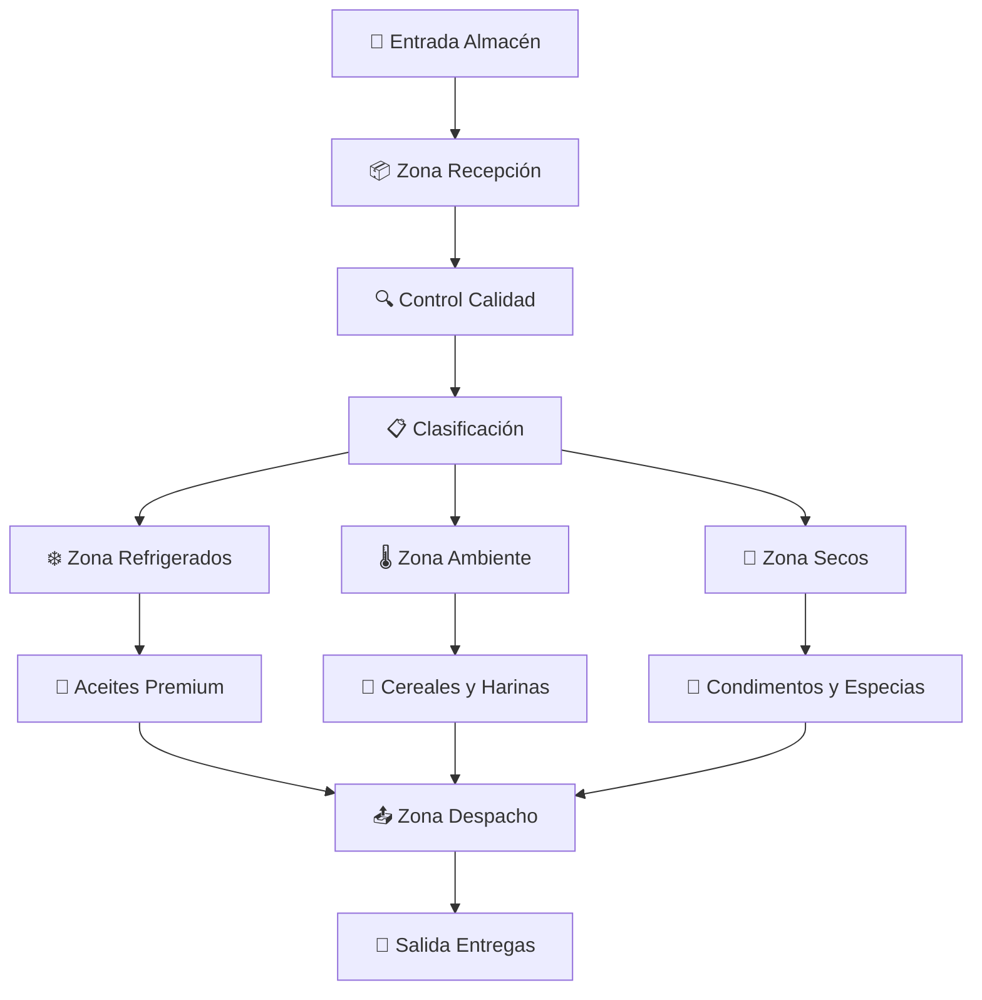
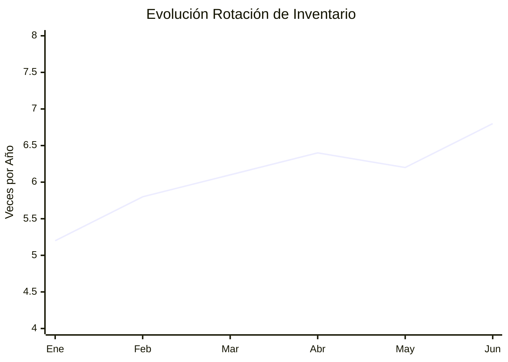

# 📦 Gestión de Inventario: Tu Arsenal Vegano Inteligente

## 🌟 **Más que Stock: Es Tu Armamento Para La Revolución Vegana**

¡Bienvenido al comando central de tu operación vegana! 💚 Aquí no gestionas simples productos - administras un **arsenal de herramientas para la liberación animal**. Cada item en tu inventario es una bala vegana lista para transformar el mundo.

---

## 🎯 **Visión Estratégica del Inventario VHouse**



---

## 🌾 **Categorización Inteligente: Tu Catálogo Organizado**

### **🎨 Sistema de Clasificación por Impacto**

```yaml
Categorías_Primarias:
  Proteínas_Vegetales:
    - Quinoa (todas las variedades)
    - Amaranto orgánico
    - Proteína de guisante en polvo
    - Levadura nutricional (B12)
    
  Grasas_Saludables:
    - Aceites premium (oliva, coco, lino)
    - Mantequillas de frutos secos
    - Semillas (chía, lino, hemp)
    - Aguacates y derivados
    
  Endulzantes_Éticos:
    - Agave orgánico certificado
    - Stevia pura (sin aditivos)
    - Dátiles medjool premium
    - Jarabe de maple canadiense
    
  Harinas_Especializadas:
    - Integral orgánica
    - Avena certificada sin gluten
    - Almendra blanqueada
    - Coco deshidratada
    
  Superfoods_Premium:
    - Espirulina hawaiana
    - Cacao crudo ceremonial
    - Maca peruana auténtica
    - Bayas de goji tibetanas
```

### **🏷️ Etiquetado Inteligente por Cliente**



---

## 📊 **Control de Stock: Precisión Militar**

### **🎯 Niveles de Inventario Optimizados**

```yaml
Ejemplo_Quinoa_Orgánica:
  Stock_Actual: 45 kg
  Stock_Mínimo: 15 kg (punto de alerta)
  Stock_Ideal: 60 kg (nivel confort)
  Stock_Máximo: 100 kg (límite almacén)
  
  Consumo_Promedio_Semanal: 12 kg
  Tiempo_Reposición_Proveedor: 5-7 días
  Stock_Seguridad: 20 kg (para imprevistos)
  
  Estado_Actual: 🟢 Saludable
  Próximo_Pedido: "En 2-3 semanas"
  Alertas: "Ninguna activa"
```

### **🚦 Sistema de Semáforos Inteligente**



**Interpretación Práctica:**
- **🟢 Verde**: Tranquilo, continúa operando
- **🟡 Amarillo**: Programa orden para próxima semana
- **🔴 Rojo**: Llama al proveedor HOY
- **⚫ Negro**: Producto no disponible para venta

---

## 🏪 **Asignación por Cliente: Inventario Personalizado**

### **🍩 Portfolio Exclusivo Mona la Dona**

```yaml
Productos_Mona_Exclusivos:
  Harinas_Premium:
    - Harina_Almendra_Blanqueada: "Solo para Mona (premium)"
    - Harina_Coco_Extra_Fina: "Textura especial repostería"
    - Harina_Avena_Sin_Gluten: "Certificación especial"
    
  Endulzantes_Artesanales:
    - Agave_Cristalino_Premium: "Grado repostería"
    - Stevia_Cristalizada: "Producto exclusivo"
    - Jarabe_Maple_Grado_A: "Solo lotes premium"
    
  Stock_Reservado:
    - "20% stock harinas premium reservado para Mona"
    - "Primera opción en nuevos productos repostería"
    - "Stock de emergencia para pedidos urgentes"
```

### **🥬 Catálogo Especializado Sano Market**

```yaml
Foco_Wellness_Sano:
  Superfoods_Certificados:
    - Quinoa_Tricolor: "Variedad premium"
    - Chía_Negra_Orgánica: "Omega 3 superior"
    - Spirulina_Hawaiana: "Más proteína por gramo"
    
  Aceites_Terapéuticos:
    - MCT_Oil_Premium: "Para comunidad fitness"
    - Aceite_Hemp_Orgánico: "Omega perfecto"
    - Oliva_Extra_Virgin_Cold: "Primera extracción"
    
  Rotación_Rápida:
    - "Stock alta rotación - reposición cada 3-4 días"
    - "Productos con fecha vencimiento visible"
    - "Prioridad en entregas frescas"
```

---

## 🤖 **Inteligencia Artificial en Inventario**

### **🧠 Predicción de Demanda Inteligente**



**Ejemplo Predicciones IA:**
```yaml
Predicciones_Semana_24:
  Quinoa_Orgánica:
    Predicción: "Demanda +30% vs promedio"
    Razón: "Tendencia detox post-vacaciones"
    Acción: "Incrementar stock a 80 kg"
    
  Aceite_Coco:
    Predicción: "Demanda normal"
    Razón: "Sin eventos estacionales"
    Acción: "Mantener stock actual"
    
  Harina_Almendra:
    Predicción: "Demanda +45% (solo Mona)"
    Razón: "Nueva línea galletas sin gluten"
    Acción: "Stock adicional exclusivo Mona"
```

### **💡 Insights Automatizados**

```yaml
IA_Insights_Semanales:
  "Patrón_Detectado": "Viernes = +40% venta aceites premium"
  "Recomendación": "Stock extra aceites jueves noche"
  
  "Correlación_Encontrada": "Quinoa alta = Almendras altas (+78%)"
  "Estrategia": "Bundle quinoa-almendras para maximizar venta"
  
  "Oportunidad_Identificada": "Productos sin gluten crecen 65% mensual"
  "Acción_Sugerida": "Expandir línea sin gluten próximo trimestre"
```

---

## 📈 **Análisis de Rotación y Performance**

### **🏆 Ranking de Productos Estrella**

```yaml
Top_10_Rotación_Rápida:
  1. "🌾 Quinoa Orgánica": 
     Rotación: "5.2 veces/mes"
     Margen: "43%"
     Estatus: "⭐ Producto Estrella"
     
  2. "🥥 Aceite Coco Premium":
     Rotación: "4.8 veces/mes"
     Margen: "38%"
     Estatus: "🚀 Generador Tráfico"
     
  3. "🧂 Sal Marina Artesanal":
     Rotación: "4.5 veces/mes"
     Margen: "52%"
     Estatus: "💎 Alto Margen"
     
  4. "🌰 Almendras Orgánicas":
     Rotación: "3.8 veces/mes"
     Margen: "41%"
     Estatus: "🔄 Rotación Consistente"
     
  5. "🍯 Agave Cristalino":
     Rotación: "3.2 veces/mes"
     Margen: "45%"
     Estatus: "📈 Crecimiento Sostenido"
```

### **📊 Matriz de Decisiones Estratégicas**



**Estrategias por Cuadrante:**
- **⭐ Estrella**: Maximizar stock y promoción
- **🚀 Tráfico**: Mantener disponibilidad constante  
- **💎 Joyas**: Venta consultiva especializada
- **❓ Revisar**: Evaluar descontinuar o renegociar

---

## 🚨 **Sistema de Alertas y Acciones Automáticas**

### **⚠️ Tipos de Alertas Críticas**

```yaml
Alertas_Configuradas:
  Stock_Crítico:
    Trigger: "<15% del stock ideal"
    Acción: "Email + WhatsApp inmediato"
    Destinatario: "Bernard + asistente"
    
  Producto_Venciendo:
    Trigger: "30 días antes vencimiento"
    Acción: "Promoción especial automática"
    Estrategia: "25% descuento para rotación rápida"
    
  Demanda_Anómala:
    Trigger: "+50% vs promedio histórico"
    Acción: "Verificar stock disponible"
    Follow_up: "Contactar proveedor preventivo"
    
  Cliente_Sin_Stock:
    Trigger: "Cliente VIP busca producto agotado"
    Acción: "Localizar producto en red proveedores"
    Compromiso: "Conseguir en <24 horas"
```

### **🔄 Automatizaciones Inteligentes**



---

## 🏪 **Gestión de Proveedores Integrada**

### **🤝 Red de Proveedores Confiables**

```yaml
Proveedores_Primarios:
  Orgánicos_del_Valle:
    Especialidad: "Quinoa y cereales andinos"
    Tiempo_Entrega: "3-5 días"
    Calidad: "⭐⭐⭐⭐⭐ Premium"
    Relación: "Exclusividad regional"
    
  NaturaVida_Premium:
    Especialidad: "Aceites prensados en frío"
    Tiempo_Entrega: "2-4 días"
    Certificaciones: "Orgánico + Fair Trade"
    Ventaja: "Mejores precios mayorista"
    
  SuperFoods_Andes:
    Especialidad: "Superfoods auténticos"
    Tiempo_Entrega: "5-7 días"
    Único: "Productos difíciles de conseguir"
    Calidad: "Grado exportación"
    
  Local_Artesanal:
    Especialidad: "Productos regionales únicos"
    Tiempo_Entrega: "1-2 días"
    Ventaja: "Flexibilidad y personalización"
    Relación: "Apoyo a productores locales"
```

### **📦 Optimización de Órdenes de Compra**

```yaml
Estrategia_Reposición:
  Pedidos_Programados:
    - "Lunes: Orden base semanal (70% necesidades)"
    - "Jueves: Reposición mid-week (30% ajustes)"
    - "Emergencias: Proveedores locales <24h"
    
  Cantidades_Optimizadas:
    - "MOQ respetado para mejores precios"
    - "Stock 2-3 semanas = punto dulce almacenaje"
    - "Productos perecederos: rotación 7-10 días"
    
  Negociación_Inteligente:
    - "Descuentos por volumen trimestral"
    - "Términos de pago 15-30 días"
    - "Devoluciones por calidad garantizadas"
```

---

## 📍 **Gestión de Almacén Físico**

### **🗺️ Layout Optimizado del Almacén**



### **🏷️ Sistema de Ubicación Inteligente**

```yaml
Código_Ubicación:
  Formato: "ZONA-ESTANTE-NIVEL-POSICIÓN"
  Ejemplo: "A-03-2-B" = Zona A, Estante 3, Nivel 2, Posición B
  
Productos_Ubicación:
  "Quinoa Orgánica 500g": "A-01-1-A (acceso rápido)"
  "Aceite Coco Premium": "B-02-1-C (zona refrigerada)"
  "Harina Almendra": "A-03-2-B (productos Mona)"
  "Spirulina Hawaiian": "C-01-3-A (productos premium)"
  
Principios_Organización:
  - "Productos alta rotación = ubicación accesible"
  - "Productos cliente específico = zona dedicada"
  - "Productos premium = mayor seguridad"
  - "FIFO estricto para productos con vencimiento"
```

---

## 📊 **Métricas y KPIs de Inventario**

### **🎯 Indicadores Críticos de Performance**

```yaml
KPIs_Semanales:
  Rotación_Inventario: "6.2x anual (objetivo: 8x)"
  Nivel_Servicio: "97.8% (sin stockouts)"
  Exactitud_Inventario: "99.2% (audit mensual)"
  Tiempo_Reposición: "4.1 días promedio"
  
KPIs_Financieros:
  Valor_Inventario_Total: "$125,000 MXN"
  Inventario_Muerto: "<2% del total"
  ROI_Inventario: "340% anual"
  Costo_Almacenamiento: "8% del valor inventario"
  
KPIs_Operativos:
  Tiempo_Picking_Promedio: "3.2 min por orden"
  Errores_Despacho: "<0.5% órdenes"
  Satisfacción_Disponibilidad: "96% clientes"
  Cumplimiento_Entregas: "98.7% on-time"
```

### **📈 Dashboard de Salud del Inventario**



---

## 🚀 **Optimización Continua: Tu Evolución Constante**

### **🔄 Ciclo de Mejora Mensual**

```mermaid
cycle
    title Ciclo Optimización Inventario
    
    "📊 Análisis Performance" --> "🎯 Identificar Oportunidades"
    "🎯 Identificar Oportunidades" --> "⚡ Implementar Cambios"
    "⚡ Implementar Cambios" --> "📈 Medir Resultados"
    "📈 Medir Resultados" --> "🔧 Ajustar Estrategia"
    "🔧 Ajustar Estrategia" --> "📊 Análisis Performance"
```

**Mejoras Implementadas Mes a Mes:**
- **Enero**: Sistema de alertas automáticas
- **Febrero**: Optimización layout almacén  
- **Marzo**: Integración IA para predicciones
- **Abril**: Automatización órdenes recurrentes
- **Mayo**: Dashboard tiempo real gerencial
- **Junio**: Expansión proveedores premium

---

## 💚 **Tu Evolución Como Maestro del Inventario**

### **🏆 Niveles de Maestría**

```yaml
Nivel_1_Organizador:
  - Control básico de stock
  - Alertas manuales de reposición  
  - Inventarios físicos mensuales
  
Nivel_2_Optimizador:
  - Predicciones basadas en tendencias
  - Automatización de alertas críticas
  - Negociación mejorada con proveedores
  
Nivel_3_Estratega:
  - IA para predicciones avanzadas
  - Optimización automática puntos reorden
  - Inventario como ventaja competitiva
  
Nivel_4_Visionario:
  - Inventario predictivo 100% automatizado
  - Red de proveedores estratégica
  - Inventario como motor de crecimiento revolucionario
```

---

## 🌱 **Reflexión del Maestro Logístico**

*"Tu inventario no es solo una colección de productos - es la infraestructura física de la revolución vegana. Cada decisión de stock, cada optimización, cada mejora en tu gestión multiplica tu capacidad de impactar positivamente el mundo. El inventario perfecto es aquel que nunca limita tu misión de transformación."*

**- Bernard Uriza Orozco, Logistics Revolutionary** 📦🌱

---

## 🚀 **Próximos Pasos en Tu Maestría**

### **📚 Continúa Perfeccionando Tu Operación:**

1. **🛍️ [Gestión de Productos](products.md)**: Perfecciona tu catálogo
2. **🏪 [Proveedores Estratégicos](suppliers.md)**: Construye tu red de aliados
3. **📋 [Control de Stock Avanzado](stock-control.md)**: Técnicas de precisión militar
4. **🚚 [Órdenes y Entregas](orders.md)**: Logística de impacto

---

**🎯 ¿Listo para perfeccionar tu catálogo?** Continúa con **[Gestión de Productos: Tu Arsenal Vegano Perfecto](products.md)** →