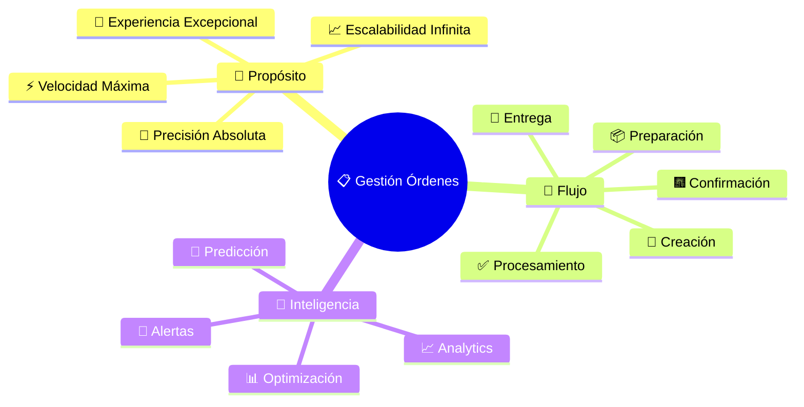
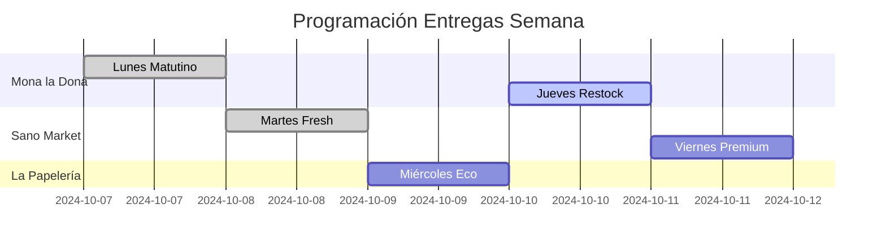
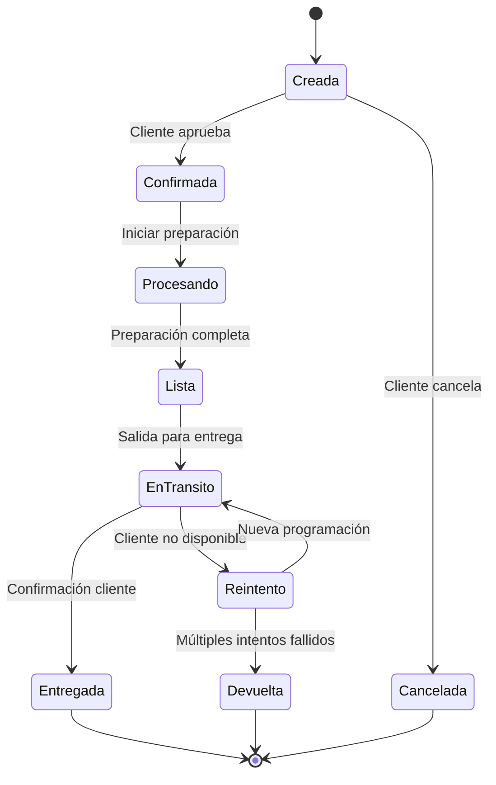
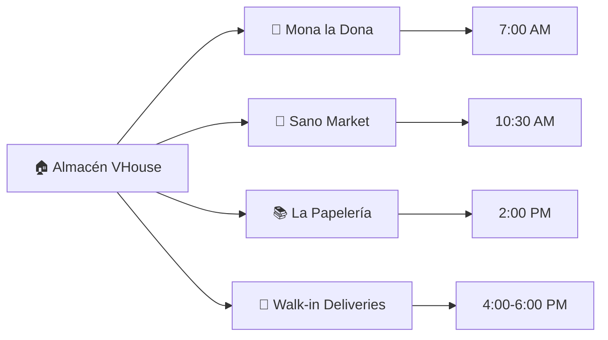
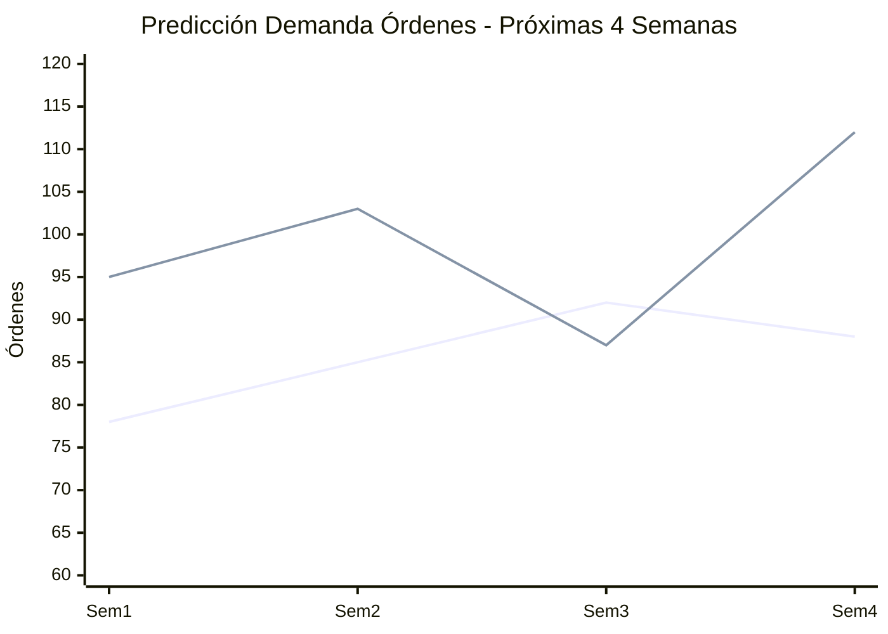

# 📋 Órdenes y Seguimiento: La Logística de Tu Revolución Vegana

## 🚀 **Cada Orden es un Paso Hacia la Liberación Animal**

¡Bienvenido al centro neurálgico de tu operación vegana! 💚 Aquí no solo gestionas "pedidos" - orquestas una **logística de transformación mundial**. Cada orden procesada, cada entrega completada, cada seguimiento perfecto acelera el futuro compasivo.

---

## 🎯 **Filosofía de Gestión de Órdenes VHouse**



---

## 📈 **Dashboard de Órdenes: Tu Centro de Comando**

### **🔥 Métricas en Tiempo Real**

```yaml
Widget_Status_General:
  Órdenes_Hoy: "23 órdenes"
  En_Proceso: "7 órdenes"
  Listas_Entrega: "12 órdenes"
  Entregadas: "4 órdenes"
  
  Valor_Total_Hoy: "$18,450 MXN"
  Ticket_Promedio: "$802 MXN"
  
  Performance:
    Tiempo_Promedio_Proceso: "8.3 minutos"
    On_Time_Delivery: "96% últimos 7 días"
    Satisfacción_Cliente: "4.8/5 estrellas"
    
Widget_Urgentes:
  Retrasos_Potenciales: "2 órdenes"
  Stock_Insuficiente: "1 producto"
  Confirmaciones_Pendientes: "3 clientes"
  Entregas_Hoy: "8 programadas"
```

### **📅 Vista de Calendario Inteligente**



---

## 📝 **Ciclo de Vida de una Orden: De la Idea a la Realidad**

### **🔄 Estados de Orden y Transiciones**



**Descripción Detallada de Estados:**

```yaml
Creada:
  Descripción: "Orden generada en POS pero pendiente confirmación"
  Tiempo_Máximo: "30 minutos"
  Acciones_Disponibles: ["Confirmar", "Editar", "Cancelar"]
  Auto_Transition: "Si no confirmada en 30min -> Cancelada"
  
Confirmada:
  Descripción: "Cliente aprobó orden, lista para procesamiento"
  Trigger_Siguiente: "Manual o automático según configuración"
  SLA: "Iniciar procesamiento <2 horas"
  
Procesando:
  Descripción: "Preparando productos, verificando stock"
  Actividades: ["Picking", "Packing", "Quality Check", "Documentation"]
  Tiempo_Estimado: "15-45 minutos según tamaño"
  
Lista:
  Descripción: "Orden empacada, esperando recolección/envío"
  Notificación: "Cliente recibe aviso automático"
  Programación: "Entrega coordinada según ruta"
  
EnTransito:
  Descripción: "Orden en camino al cliente"
  Tracking: "GPS en tiempo real si disponible"
  Comunicación: "Updates periódicos a cliente"
  
Entregada:
  Descripción: "Cliente recibió y confirmó orden"
  Documentación: "Evidencia entrega + firma/foto"
  Follow_up: "Encuesta satisfacción automática"
```

---

## 🍩 **Órdenes Especializadas por Cliente**

### **🍩 Mona la Dona - Proceso Panadero**

```yaml
Perfil_Orden_Mona:
  Frecuencia: "2-3 órdenes por semana"
  Horario_Preferido: "Entregas Lunes 7:00 AM"
  Ticket_Promedio: "$847 MXN"
  
  Productos_Recurrentes:
    - "🌾 Harina Integral 15kg"
    - "🥥 Aceite Coco 6L"
    - "🍯 Agave Premium 3L"
    - "🥜 Mantequilla Almendra 4kg"
    
  Consideraciones_Especiales:
    Calidad: "Tolerancia cero defectos - afecta producción diaria"
    Tiempo: "Entregas tarde = pérdida día completo producción"
    Stock: "Reserva 20% productos críticos para emergencias"
    
  Proceso_Optimizado:
    Lunes_6AM: "Pre-picking automático orden programada"
    6:30AM: "Quality check final"
    6:45AM: "Carga vehículo"
    7:00AM: "Entrega puntual"
    7:15AM: "Confirmación + next order preview"
    
  SLA_Especiales:
    - "Entrega garantizada <15 min ventana acordada"
    - "Productos frescos <72h desde producción"
    - "Backup stock 24/7 para emergencias"
    - "Comunicación directa WhatsApp 6AM-10PM"
```

### **🥬 Sano Market - Flujo Wellness**

```yaml
Perfil_Orden_Sano:
  Frecuencia: "4-5 órdenes por semana"
  Patrón: "Miércoles y viernes principales"
  Variabilidad: "Ajustes según tendencias customer"
  
  Categorías_Principales:
    Superfoods: "40% del volumen"
    Aceites_Premium: "25% del volumen"
    Snacks_Saludables: "20% del volumen"
    Novedades_Test: "15% del volumen"
    
  Requerimientos_Úlnicos:
    Freshness: "Productos <30 días desde producción"
    Certificación: "Documentos calidad para reventa"
    Rotación: "FIFO estricto - productos por vencer primero"
    Educación: "Fichas nutricionales para staff"
    
  Optimizaciones_Especiales:
    Predicción: "IA analiza tendencias customer para sugerir cantidades"
    Cross_Selling: "Bundle sugerencias basadas en data"
    Seasonal: "Ajustes automáticos por estacionalidad"
    Quality: "Muestras gratis nuevos productos high-end"
```

### **📚 La Papelería - Diversificación Eco**

```yaml
Perfil_Orden_Papeleria:
  Estado: "Cliente en transformación (tradicional -> eco)"
  Frecuencia: "1-2 órdenes por semana"
  Crecimiento: "+78% últimos 6 meses"
  
  Evolución_Producto:
    Inicio: "Solo snacks veganos básicos"
    Actual: "Línea eco completa: snacks + limpieza + lifestyle"
    Futuro: "Sección wellness completa"
    
  Apoyo_Especializado:
    Educación: "Capacitación staff sobre productos veganos"
    Marketing: "Material POP personalizado"
    Pricing: "Estrategia competitiva vs papelerías tradicionales"
    Display: "Asesoría merchandising productos eco"
    
  Métricas_Éxito:
    - "Conversión clientes tradicionales -> eco: 23%"
    - "Margen productos eco: +35% vs tradicionales"
    - "Satisfacción cliente nueva línea: 4.7/5"
    - "Proyección: 50% revenue eco en 12 meses"
```

---

## 🚚 **Logística y Entregas: La Última Milla Perfecta**

### **🗺️ Optimización de Rutas**



**Algoritmo de Ruteo Inteligente:**

```yaml
Optimización_Ruta:
  Variables_Consideradas:
    - "Distancia física entre puntos"
    - "Tráfico tiempo real (Google Maps API)"
    - "Ventanas horarias cliente"
    - "Prioridad orden (VIP, urgente, regular)"
    - "Volumen/peso productos"
    - "Restricciones vehículo"
    
  Algoritmo: "Hybrid TSP + Machine Learning"
  
  Resultados_Optimización:
    Ahorro_Tiempo: "35% vs rutas manuales"
    Ahorro_Combustible: "28% menos kilómetros"
    Mejora_Puntualidad: "96% entregas on-time"
    Satisfacción_Delivery: "4.8/5 rating promedio"
    
  Ajustes_Dinámicos:
    - "Reasignación automática si retraso >15min"
    - "Rutas alternativas por incidentes tráfico"
    - "Priorización órdenes críticas tiempo real"
```

### **📱 Comunicación y Tracking**

```yaml
Sistema_Comunicación:
  Pre_Entrega:
    - "Confirmación orden 24h antes"
    - "Ventana entrega 2h antes"
    - "Notificación salida almacén"
    
  Durante_Entrega:
    - "ETA actualizado cada 15min"
    - "Aviso 'llegando en 10min'"
    - "Confirmación llegada"
    
  Post_Entrega:
    - "Confirmación entrega + foto"
    - "Invoice digital automático"
    - "Encuesta satisfacción (opcional)"
    
  Canales_Comunicación:
    Primario: "WhatsApp Business"
    Backup: "SMS + Email"
    Urgente: "Llamada telefónica"
    
  Templates_Mensaje:
    Confirmación: "🚚 Tu orden #1234 está programada para mañana 10-12h. ¿Confirmas disponibilidad?"
    En_Camino: "📦 Tu orden #1234 está en camino. ETA: 25 minutos. Track: vhouse.com/track/1234"
    Entregado: "✅ Orden #1234 entregada exitosamente. ¡Gracias por elevar la revolución vegana! 🌱"
```

---

## 🤖 **Automatizaciones Inteligentes**

### **🔄 Órdenes Recurrentes**

```yaml
Sistema_Recurrencia:
  Mona_la_Dona_Lunes:
    Trigger: "Cada lunes 6:00 PM (para entrega martes)"
    Template: "Orden base semanal"
    Ajustes_IA: "Predicción demanda + estacionalidad"
    Confirmación: "Auto-confirm si stock disponible"
    
  Sano_Market_Midweek:
    Patrón: "Miércoles + Viernes"
    Variabilidad: "IA analiza ventas customer para ajustar"
    Productos_Rotativos: "Introduce novedades automáticamente"
    
  Configuración_Flexible:
    - "Cliente puede pausar temporalmente"
    - "Ajustes de cantidad +/- 30% sin re-aprobación"
    - "Sustituciones automáticas productos agotados"
    - "Descuentos automáticos por fidelidad"
```

### **🚨 Alertas y Excepciones**

```yaml
Sistema_Alertas:
  Stock_Insuficiente:
    Trigger: "Orden confirmada pero stock <requerido"
    Acción_Auto: 
      1. "Verificar stock real vs sistema"
      2. "Buscar sustitutos compatibles"
      3. "Contactar cliente con opciones"
      4. "Orden emergencia a proveedor si crítico"
      
  Retraso_Potencial:
    Detección: "Orden no procesada dentro SLA"
    Escalación:
      - "15min retraso: Notificación interna"
      - "30min retraso: Manager alert"
      - "60min retraso: Cliente proactive communication"
      - "120min retraso: Compensación automática"
      
  Cliente_Inaccesible:
    Protocolo:
      1. "3 intentos comunicación (llamada + WhatsApp)"
      2. "Reprogramación automática +24h"
      3. "Después 3 intentos: Retorno almacén"
      4. "Producto perecedero: Donación/descarte controlado"
```

---

## 📈 **Analytics de Órdenes: Inteligencia Operativa**

### **🏆 KPIs Críticos de Performance**

```yaml
Métricas_Operativas:
  Eficiencia_Procesamiento:
    Tiempo_Promedio_Orden: "12.3 minutos"
    Órdenes_por_Hora: "4.9 órdenes"
    Accuracy_Picking: "99.2%"
    
  Calidad_Servicio:
    On_Time_Delivery: "96.7%"
    Perfect_Order_Rate: "94.1%"
    Customer_Satisfaction: "4.8/5"
    
  Eficiencia_Económica:
    Costo_por_Orden: "$23 MXN promedio"
    Margen_Promedio: "38.2%"
    Orders_per_Customer_Month: "8.7 órdenes"
    
Tendencias_Identificadas:
  - "Viernes = día más crítico (35% órdenes semanales)"
  - "Mañanas 40% más eficientes que tardes"
  - "Órdenes recurrentes 60% más rápidas de procesar"
  - "Clientes B2B 25% mejor margin que walk-ins"
```

### **🔮 Predicciones y Optimizaciones**



**Insights Accionables IA:**
- **Semana 2**: Pico demanda esperado (+21%) - preparar staff extra
- **Semana 3**: Caída post-pico (-15%) - oportunidad mantenimiento
- **Semana 4**: Recovery fuerte (+28%) - verificar stock crítico

---

## 📊 **Reportes Especializados**

### **📈 Reporte Ejecutivo Semanal**

```yaml
Reporte_Semanal_Orders:
  Header_KPIs:
    Total_Orders: "127 órdenes"
    Revenue: "$87,450 MXN"
    Avg_Ticket: "$688 MXN"
    Growth_vs_LastWeek: "+18.3%"
    
  Performance_Breakdown:
    Perfect_Orders: "120/127 (94.5%)"
    On_Time_Deliveries: "123/127 (96.9%)"
    Customer_Issues: "3 casos (2.4%)"
    Resolution_Time_Avg: "4.2 horas"
    
  Top_Insights:
    - "Mona la Dona incrementó orden promedio 23%"
    - "Nuevos productos eco La Papelería +156% uptake"
    - "Viernes tardío: bottleneck identificado"
    - "Cliente referral rate: 34% (excepcional)"
    
  Actions_Taken:
    - "Staff adicional programado viernes 2-6 PM"
    - "Proceso expedited para órdenes <$200"
    - "New customer onboarding optimizado"
```

### **🍩 Cliente-Specific Analytics**

```yaml
Mona_Performance_Report:
  Frequency: "2.8 orders/semana (consistente)"
  Loyalty: "36 semanas consecutivas (record)"
  Growth: "+31% order value últimos 3 meses"
  Satisfaction: "5.0/5 últimas 12 entregas"
  
  Opportunities:
    - "Nuevos productos sin gluten (market demand)"
    - "Bulk discounts para órdenes >$1000"
    - "Co-marketing partnership potential"
    
Sano_Trend_Analysis:
  Diversification: "43% incremento product variety"
  Seasonal_Adaptation: "Excelente ajuste summer products"
  Customer_Education: "67% uptake productos recomendados"
  
  Red_Flags:
    - "Ligera caída frecuencia (últimas 2 semanas)"
    - "Competencia nueva tienda wellness 2 cuadras"
    
  Action_Plan:
    - "Loyalty rewards upgrade"
    - "Exclusive products showcase"
    - "Competitive analysis & response"
```

---

## 💚 **Tu Evolución Como Operations Master**

### **🏆 Niveles de Maestría Operativa**

```yaml
Level_1_Order_Processor:
  - "Procesa órdenes básicas eficientemente"
  - "Sigue protocolos establecidos"
  - "Resuelve problemas comunes"
  
Level_2_Logistics_Coordinator:
  - "Optimiza rutas y tiempos"
  - "Anticipa y previene problemas"
  - "Mejora procesos continuamente"
  
Level_3_Operations_Strategist:
  - "Diseña sistemas escalables"
  - "Implementa automatizaciones inteligentes"
  - "Lidera transformación operativa"
  
Level_4_Logistics_Revolutionary:
  - "Reinventa industria con innovación"
  - "Escala operaciones exponencialmente"
  - "Logística como ventaja competitiva revolucionaria"
```

---

## 🌱 **Reflexión del Logistics Revolutionary**

*"Cada orden que procesas, cada entrega que completas, cada cliente que satisfaces no es solo una transacción comercial - es un acto de revolución. Tu maestría en la gestión de órdenes asegura que ningún obstáculo logístico detenga la distribución de productos que salvan vidas. Eres el arquitecto silencioso del futuro vegano."*

**- Bernard Uriza Orozco, Operations Revolutionary** 📋🌱

---

## 🚀 **Próximos Pasos en Tu Maestría**

### **📚 Continúa Perfeccionando Tu Revolución:**

1. **🚚 [Gestión de Entregas](deliveries.md)**: Última milla perfecta
2. **📋 [Control de Stock](stock-control.md)**: Precisión militar
3. **🔧 [Configuración Sistema](settings.md)**: Personaliza tu VHouse
4. **⚙️ [Troubleshooting](troubleshooting.md)**: Resuelve cualquier desafío

---

**🎯 ¿Listo para perfeccionar tus entregas?** Continúa con **[Gestión de Entregas: La Última Milla Perfecta](deliveries.md)** →