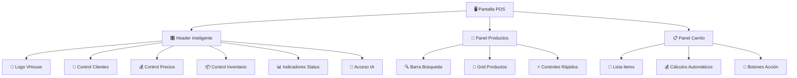
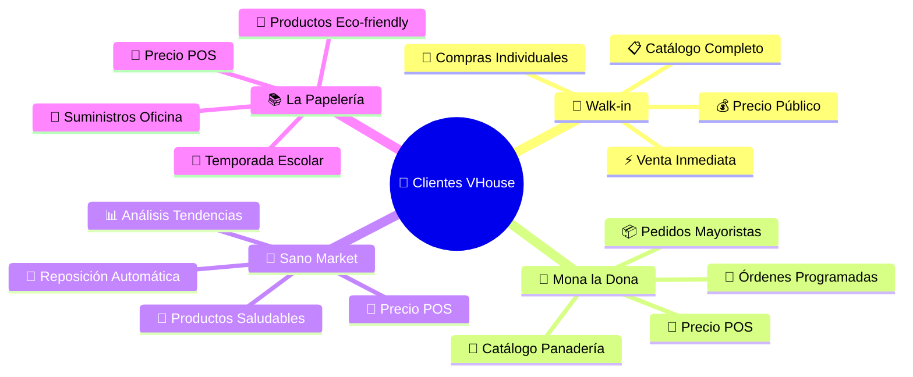
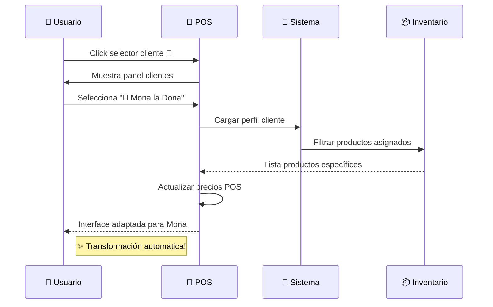
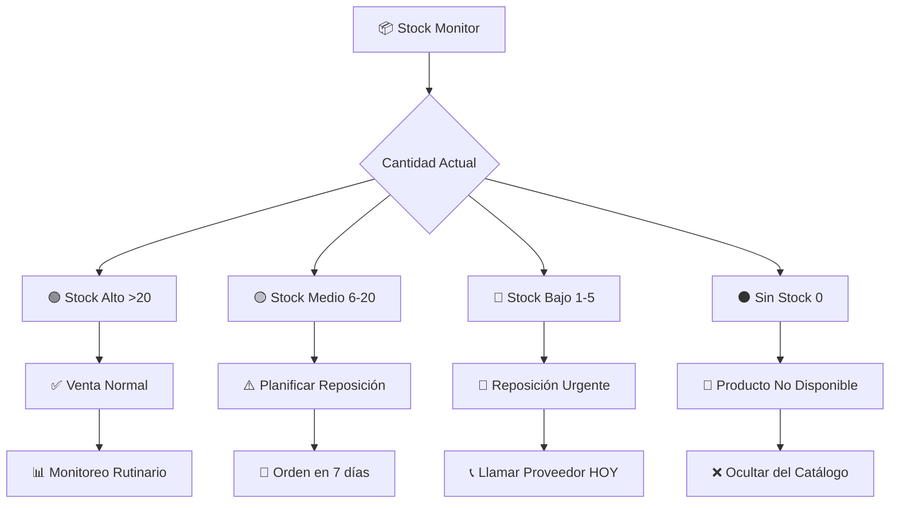
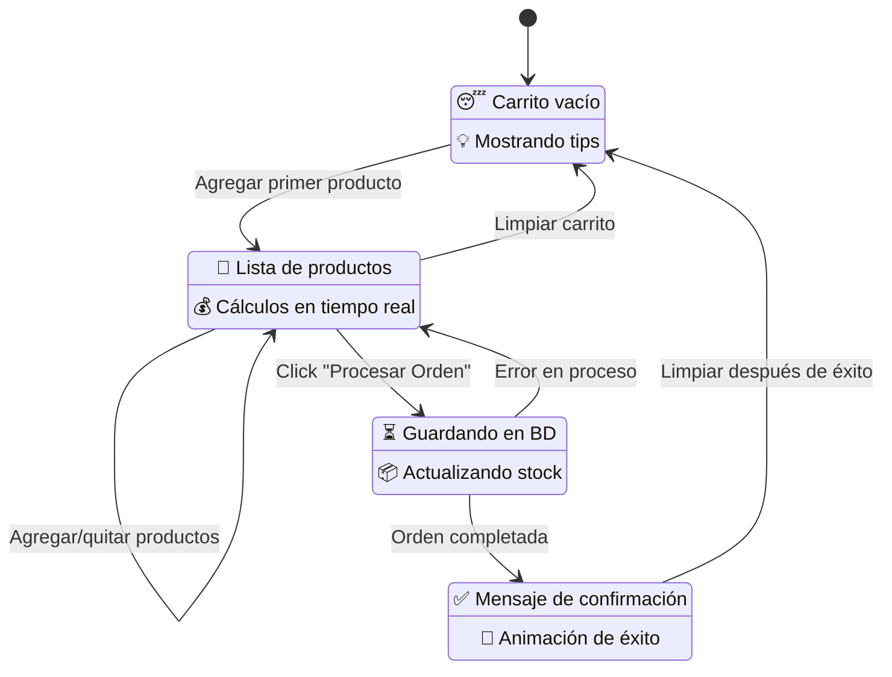
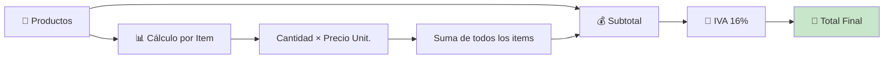
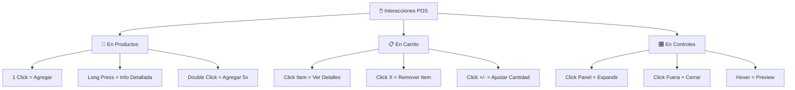
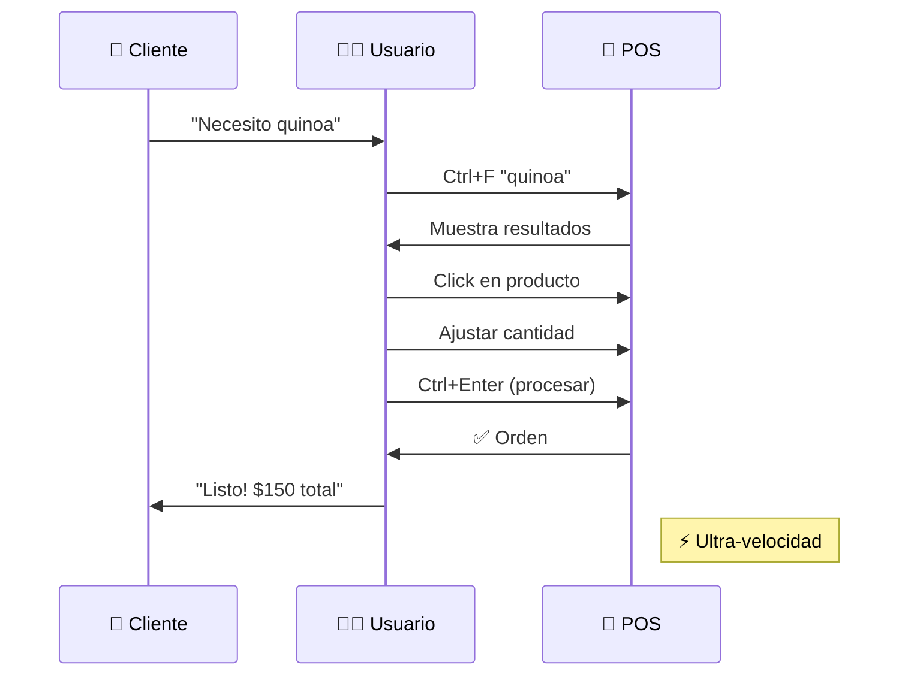
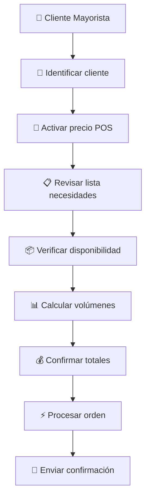

# 📚 POS Básico: Fundamentos Para El Activista Vegano

## 🌱 **Dominando los Conceptos Fundamentales**

¡Perfecto, revolucionario! 💚 Ya conociste el poder general del sistema POS, ahora vamos a profundizar en cada concepto fundamental. Este es tu manual de referencia para convertirte en un **maestro de ventas veganas sistematizadas**.

---

## 🧭 **Anatomía del Interface: Conoce Tu Herramienta**

### **🎯 Distribución de Pantalla Inteligente**



### **🎨 Código de Colores y Significados**

| Color | Significado | Aplicación |
|-------|-------------|------------|
| 🟢 **Verde** | Estado saludable, acción exitosa | Stock alto, venta completada |
| 🟡 **Amarillo** | Atención, precaución | Stock medio, procesos en curso |
| 🔴 **Rojo** | Urgencia, acción requerida | Stock bajo, errores, cancelación |
| 🔵 **Azul** | Información, neutralidad | Datos generales, botones secundarios |
| 🟣 **Morado** | IA activa, inteligencia | Asistente IA, sugerencias automatizadas |

---

## 👥 **Gestión de Clientes: Tu Comunidad Vegana**

### **🎯 Tipos de Cliente y Sus Características**



### **🔄 Flujo de Selección de Cliente**



### **🎯 Configuraciones por Cliente**

**🍩 Mona la Dona - Configuración Especializada**
```yaml
Cliente: Mona la Dona 🍩
Tipo_Precio: POS (Revendedor)
Productos_Asignados:
  - 🌾 Harinas especiales (Integral, Avena, Almendra)
  - 🧈 Mantequillas veganas (Coco, Almendra, Anacardo)  
  - 🍫 Chocolates y coberturas (Cacao, Algarroba)
  - 🥥 Endulzantes (Agave, Stevia, Dátiles)
  - 🧂 Ingredientes base (Sal marina, Vainilla)
Filtros_Especiales:
  - Solo_Productos_Horneables: true
  - Verificacion_Vegana: obligatoria
  - Alertas_Vencimiento: 7_dias
```

**🥬 Sano Market - Configuración Saludable**
```yaml
Cliente: Sano Market 🥬
Tipo_Precio: POS (Revendedor)  
Productos_Asignados:
  - 🥜 Frutos secos y semillas
  - 🌾 Superalimentos (Quinoa, Chía, Amaranto)
  - 🥥 Aceites premium (Oliva, Coco, Lino)
  - 🍯 Endulzantes naturales (Miel de agave, Stevia)
  - 💊 Suplementos veganos (B12, Omega 3, Proteína)
Filtros_Especiales:
  - Certificacion_Organica: preferida
  - Productos_Superfoods: prioridad
  - Analisis_Nutricional: habilitado
```

---

## 💰 **Sistema de Precios: Estrategia de Valor**

### **🎯 Estructura de Precios Detallada**

```mermaid
graph TD
    A[💰 Precio Base] --> B[📊 Costo Real]
    A --> C[🏪 Precio POS]
    A --> D[🏷️ Precio Público]
    A --> E[💡 Precio Sugerido]
    
    B --> F[Costo + Gastos Operativos]
    C --> G[Costo × 1.4 (40% margen)]
    D --> H[Costo × 1.7 (70% margen)]
    E --> I[Análisis de Mercado]
    
    F --> J[Base para Decisiones]
    G --> K[Para Revendedores]
    H --> L[Para Consumidor Final]
    I --> M[Referencia Competitiva]
```

### **📊 Ejemplo Real de Estructura de Precios**

**🌾 Producto: Harina Integral Orgánica (1kg)**

```yaml
Costos_Reales:
  Compra_Proveedor: $25.00
  Transporte: $3.00
  Almacenamiento: $2.00
  Costo_Total: $30.00

Precios_VHouse:
  Precio_Costo: $30.00      # Para análisis interno
  Precio_POS: $42.00        # $30 × 1.4 = Para Mona la Dona
  Precio_Publico: $51.00    # $30 × 1.7 = Para consumidor final
  Precio_Sugerido: $55.00   # Análisis de mercado

Margenes_Calculados:
  Margen_POS: 40%           # Sustentable para revendedores
  Margen_Publico: 70%       # Rentable para distribuidor
  Competitividad: ✅ Alta   # 15% menos que competencia
```

### **🎯 Casos de Uso por Tipo de Precio**

**🏷️ Precio Público - Cliente Directo**
```
Escenario: Cliente individual compra para uso personal
Cliente: José (consumidor final)
Producto: Quinoa Orgánica 500g
Precio: $75.00
Justificación: 
  ✅ Servicio personalizado
  ✅ Venta individual (no mayoreo)
  ✅ Margen para sostener operación
```

**🏪 Precio POS - Mona la Dona**
```
Escenario: Pedido mayorista para reventa
Cliente: Mona la Dona 🍩
Producto: Quinoa Orgánica 5kg (10 paquetes)
Precio: $50.00 por paquete
Justificación:
  ✅ Volumen considerable
  ✅ Cliente recurrente
  ✅ Margen justo para ambas partes
```

**📊 Precio Costo - Análisis Interno**
```
Escenario: Evaluación de rentabilidad
Usuario: Bernard (análisis estratégico)
Producto: Quinoa Orgánica
Precio: $35.00
Uso:
  📊 Calcular ROI real
  🎯 Evaluar competitividad
  📈 Tomar decisiones de inventario
```

---

## 📦 **Control de Inventario: Stock Inteligente**

### **🚦 Sistema de Alertas de Stock**



### **🔍 Filtros de Inventario Avanzados**

**✅ Solo Disponibles**
```yaml
Función: Ocultar productos con stock = 0
Beneficio: Evita frustración al cliente
Recomendación: ✅ SIEMPRE activo
Ejemplo:
  - 🌾 Harina Integral: 15 kg → ✅ Visible
  - 🥥 Aceite Coco: 0 L → ❌ Oculto
  - 🧂 Sal Marina: 3 kg → ✅ Visible (pero en rojo)
```

**🌱 Solo Veganos**
```yaml
Función: Filtro de certificación vegana
Beneficio: Verificación adicional
Nota: Redundante (todo en VHouse es vegano)
Uso_Recomendado: Para verificación con clientes escépticos
```

**🔍 Búsqueda Inteligente**
```yaml
Funcionalidades:
  - Búsqueda_por_Nombre: "quinoa" → encuentra "Quinoa Orgánica"
  - Búsqueda_por_Categoria: "harina" → todas las harinas
  - Búsqueda_por_Emoji: 🌾 → productos con emoji de cereal
  - Búsqueda_Fuzzy: "qinoa" → sugiere "quinoa"
Velocidad: Tiempo real (sin delay)
```

---

## 🛒 **Gestión del Carrito: Procesamiento Inteligente**

### **📝 Estados del Carrito y Transiciones**



### **💰 Cálculos Automáticos Detallados**



**Ejemplo de Cálculo Real - Pedido Mona la Dona:**

```yaml
Productos_Carrito:
  - Producto: "🌾 Harina Integral"
    Cantidad: 5
    Precio_Unit: $50.00
    Subtotal_Item: $250.00
    
  - Producto: "🥥 Aceite de Coco"  
    Cantidad: 2
    Precio_Unit: $160.00
    Subtotal_Item: $320.00
    
  - Producto: "🧂 Sal Marina"
    Cantidad: 1
    Precio_Unit: $35.00
    Subtotal_Item: $35.00

Calculos_Automaticos:
  Subtotal_Orden: $605.00    # Suma de todos los items
  IVA_16_Porciento: $96.80   # $605.00 × 0.16
  Total_Final: $701.80       # $605.00 + $96.80

Verificaciones_Sistema:
  ✅ Stock suficiente verificado
  ✅ Precios actualizados
  ✅ Cliente activo confirmado
  ✅ Cálculos matemáticos correctos
```

---

## ⚡ **Controles Rápidos y Atajos**

### **🎮 Atajos de Teclado Para Velocidad**

| Combinación | Acción | Contexto | Beneficio |
|-------------|--------|----------|-----------|
| `Ctrl + F` | 🔍 Búsqueda | Cualquier momento | Encuentra productos instantáneamente |
| `Ctrl + Enter` | ⚡ Procesar | Con productos en carrito | Venta ultra-rápida |
| `Esc` | 🚪 Cerrar | Paneles abiertos | Navegación limpia |
| `F5` | 🔄 Actualizar | Stock desactualizado | Inventario fresco |
| `Ctrl + L` | 🧹 Limpiar | Carrito con productos | Empezar orden nueva |

### **🖱️ Gestos y Clicks Inteligentes**



### **📱 Navegación Táctil (Tablets)**

**Para Uso en Tablet o Touch Screen:**
- **👆 Tap**: Agregar producto
- **👆👆 Double Tap**: Agregar múltiples unidades
- **👆🔄 Long Press**: Ver información detallada
- **👈👉 Swipe**: Navegar entre categorías
- **👌 Pinch**: Zoom en productos pequeños

---

## 🎯 **Patrones de Trabajo Eficientes**

### **🏃‍♂️ Venta Express (30 segundos)**



### **🎯 Venta Consultiva (2-3 minutos)**


### **📦 Venta Mayorista (5 minutos)**



---

## 🧠 **Psicología de Venta con VHouse**

### **🎯 Principios de Persuasión Vegana**

**🌱 Conexión Emocional**
```yaml
Técnica: Resaltar impacto animal
Ejemplo: "Esta quinoa orgánica alimenta sin lastimar animales"
Resultado: Cliente se siente parte de la solución
```

**📊 Autoridad con Datos**
```yaml
Técnica: Usar métricas del sistema
Ejemplo: "Es nuestro producto #1 este mes, 847 kg vendidos"
Resultado: Confianza basada en evidencia social
```

**⚡ Urgencia Inteligente**
```yaml  
Técnica: Alertas de stock mostradas estratégicamente
Ejemplo: "Solo quedan 3 unidades de este aceite premium"
Resultado: Acción inmediata sin presión agresiva
```

### **💬 Scripts de Venta Sugeridos**

**🍩 Para Mona la Dona:**
```
"Mona, basado en tus pedidos anteriores, el aceite de coco 
que pediste está perfectamente disponible. También tenemos 
la harina de almendra que tanto les gusta a tus clientes.
¿Agregamos ambos? Así aprovechas el pedido."
```

**🥬 Para Sano Market:**
```
"Para Sano Market tengo excelentes noticias: llegó la quinoa 
orgánica que esperabas, y la chía está en promoción por 
volumen. Tus clientes de superfoods van a estar felices."
```

**🚶 Para Walk-in Customer:**
```
"Este aceite de oliva extra virgen es 100% prensado en frío 
y certificado vegano. Es perfecto para cocina saludable, y 
está en el precio público porque es calidad premium."
```

---

## 🎉 **Indicadores de Maestría**

### **🏆 Niveles de Habilidad POS**

**🥉 Novato (0-50 ventas)**
- ✅ Procesa ventas básicas sin errores
- ✅ Usa filtros básicos correctamente
- ✅ Entiende diferencia entre tipos de precio
- ⏱️ Tiempo promedio: 3-5 minutos por venta

**🥈 Competente (51-200 ventas)**
- ✅ Usa atajos de teclado fluidamente
- ✅ Hace ventas sugeridas con IA
- ✅ Maneja clientes mayoristas con confianza
- ⏱️ Tiempo promedio: 1-3 minutos por venta

**🥇 Experto (201+ ventas)**
- ✅ Domina todos los flujos de trabajo
- ✅ Personaliza experiencia por cliente
- ✅ Usa datos para maximizar tickets
- ⏱️ Tiempo promedio: 30-60 segundos por venta

### **📊 Métricas de Éxito Personal**

```yaml
KPIs_Personales:
  Velocidad_Promedio: "< 2 minutos por venta"
  Precision_Calculos: "99.5% exactitud"
  Uso_Sugerencias_IA: "40% de ventas"
  Satisfaccion_Cliente: "95%+ feedback positivo"
  Crecimiento_Ticket: "25%+ vs promedio histórico"

Metas_Semanales:
  - Procesar 50+ órdenes sin errores
  - Usar asistente IA en 20+ consultas  
  - Incrementar ticket promedio 15%
  - Mantener tiempo promedio < 90 segundos
```

---

## 🚀 **Tu Próximo Nivel de Maestría**

### **📚 Continúa Tu Entrenamiento:**

1. **💰 [Procesamiento de Ventas](pos-sales.md)**: Técnicas avanzadas de venta
2. **📊 [Reportes POS](pos-reports.md)**: Análisis y métricas de rendimiento
3. **👥 [Gestión de Clientes](clients.md)**: Construye relaciones duraderas
4. **🤖 Guía del Asistente IA**: Maximiza el potencial de inteligencia artificial

### **🎮 Retos Para Practicar Ahora:**

- **⚡ Reto Velocidad**: 10 ventas en menos de 15 minutos
- **🎯 Reto Precisión**: 20 ventas consecutivas sin errores
- **🤖 Reto IA**: Usa el asistente para 5 sugerencias exitosas
- **👥 Reto Clientes**: Atiende a Mona, Sano y Papelería en una sesión

---

## 💚 **Reflexión del Activista-Desarrollador**

*"Dominar estos fundamentos no es solo sobre eficiencia operativa - es sobre crear la base sólida para que cada interacción con VHouse sea un momento de construcción del mundo vegano que soñamos. Cada venta fluida es una declaración de que la tecnología puede servir a la compasión."*

**- Bernard Uriza Orozco, Constructor de Revoluciones** 🌱

---

**🎯 ¿Listo para las técnicas avanzadas?** Continúa con **[Procesamiento de Ventas: Técnicas Magistrales](pos-sales.md)** →