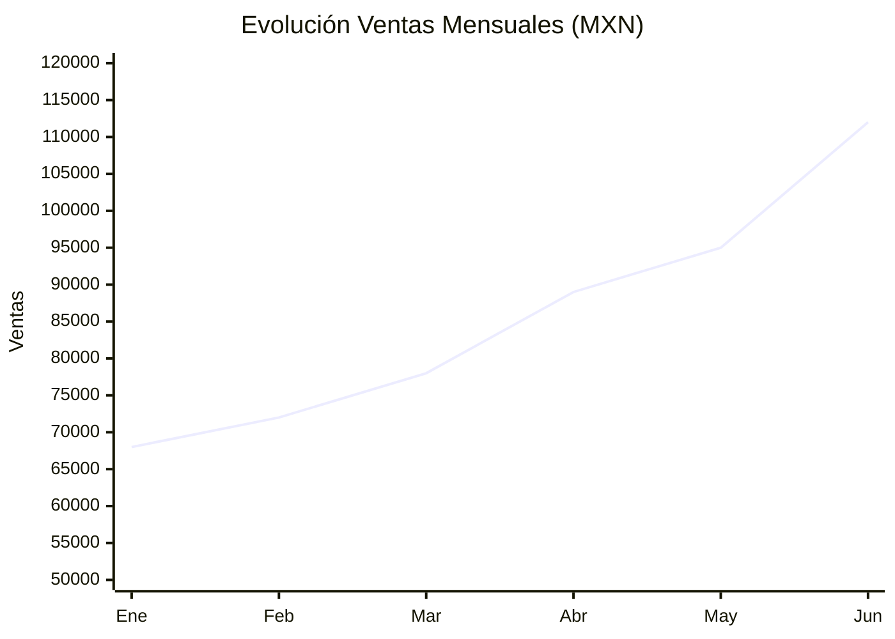
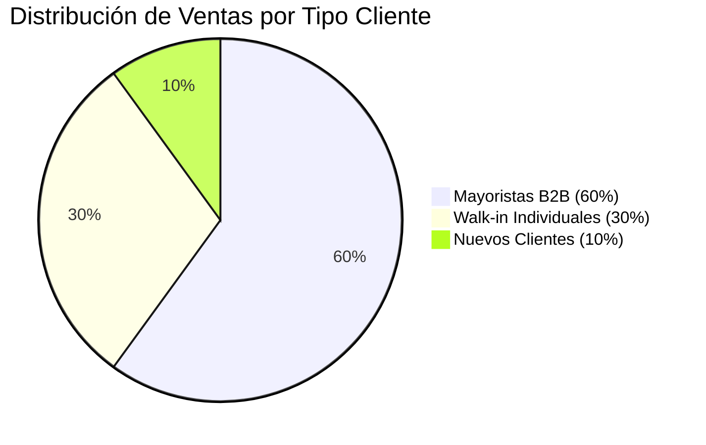
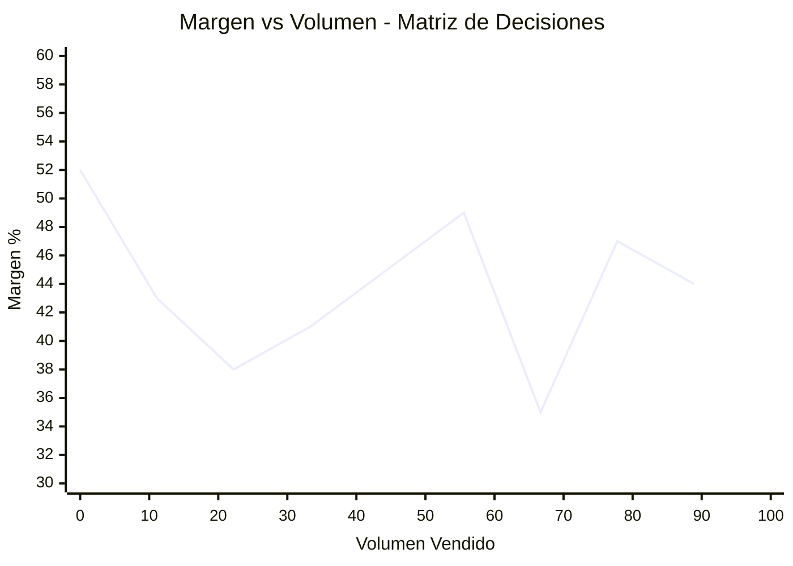
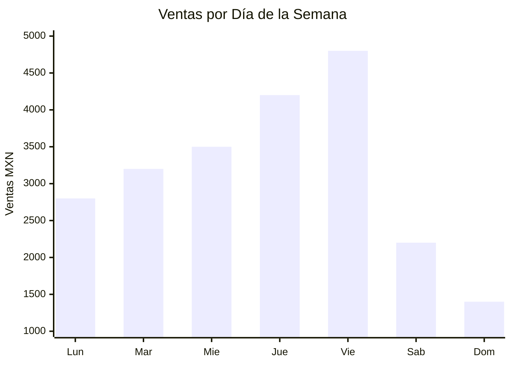
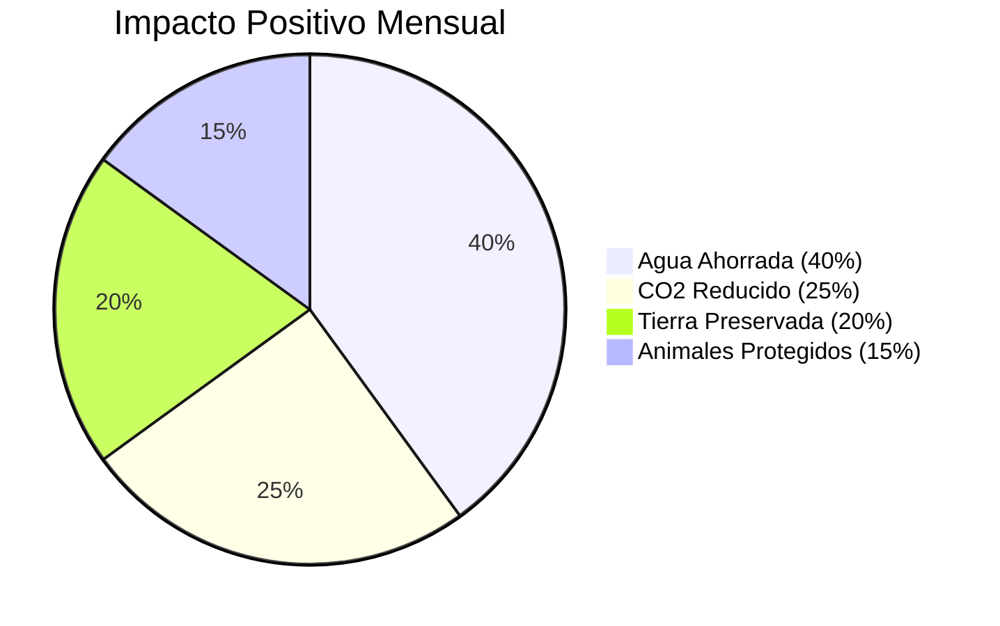
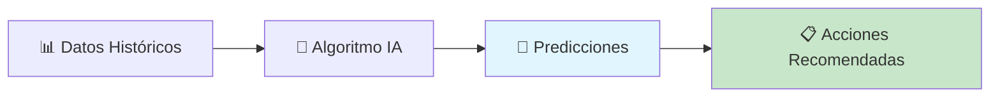
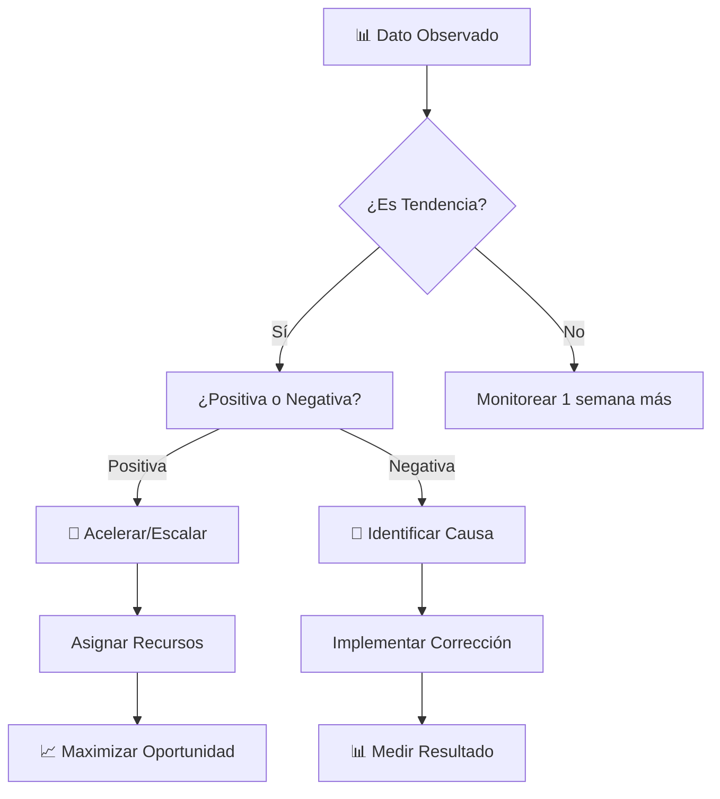
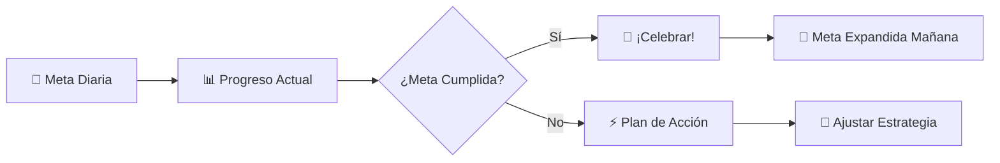

# 📊 Reportes POS: Analiza Tu Revolución Vegana en Tiempo Real

## 🌟 **Convierte Datos en Decisiones de Impacto Animal**

¡El poder está en los datos, activista! 💚 Cada número que analizarás aquí representa vidas salvadas, consciencias transformadas y un futuro más compasivo. VHouse no solo procesa ventas - **mide tu revolución**.

---

## 🎯 **Dashboard de Impacto: Tu Comando Central**

```mermaid
graph TD
    A[📊 Dashboard POS] --> B[💰 Métricas Financieras]
    A --> C[📈 Análisis de Tendencias]
    A --> D[👥 Comportamiento Clientes]
    A --> E[📦 Performance Inventario]
    A --> F[🌱 Impacto Vegano]
    
    B --> G[Ventas Diarias/Semanales/Mensuales]
    B --> H[Ticket Promedio por Cliente]
    B --> I[Margen de Ganancia Real]
    
    C --> J[Productos Más Vendidos]
    C --> K[Estacionalidad de Ventas]
    C --> L[Crecimiento Período a Período]
    
    D --> M[Frecuencia de Compra]
    D --> N[Preferencias por Cliente]
    D --> O[Valor Lifetime Cliente]
    
    E --> P[Rotación de Productos]
    E --> Q[Stock Óptimo por Producto]
    E --> R[Predicciones de Demanda]
    
    F --> S[Kg Productos Veganos Vendidos]
    F --> T[Impacto Ambiental Calculado]
    F --> U[Nuevos Veganos Convertidos]
```



---

## 💰 **Métricas Financieras: Tu Salud Comercial**

### **📈 Ventas en Tiempo Real**

```yaml
Métricas_Diarias_Visibles:
  Ventas_Hoy: "$2,847 MXN"
  Ordenes_Procesadas: "23 órdenes"
  Ticket_Promedio: "$124 MXN" 
  Meta_Diaria: "$3,000 MXN (95% completado)"
  
Comparativo_Ayer:
  Crecimiento: "+15% vs ayer"
  Tendencia: "📈 Positiva"
  Mejor_Hora: "2PM - 4PM (6 ventas)"
```

### **🎯 KPIs Críticos del Negocio**



**Interpretación de Métricas:**
- **📈 +64% crecimiento** en 6 meses
- **🎯 Meta mensual**: $100,000 MXN ✅ Superada
- **⚡ Aceleración**: Mayo-Junio mostró el mayor crecimiento
- **🔮 Proyección Julio**: $125,000 MXN basado en tendencia

---

## 👥 **Análisis de Clientes: Tu Comunidad Vegana**

### **🍩 Performance por Cliente VIP**

```yaml
Mona_la_Dona:
  Ordenes_Ultimo_Mes: 12
  Ticket_Promedio: "$847 MXN"
  Total_Comprado: "$10,164 MXN"
  Crecimiento_vs_Anterior: "+23%"
  Productos_Favoritos: ["Harina Integral", "Aceite Coco", "Levadura Nutricional"]
  Predicción_Próxima_Orden: "En 3-4 días"
  
Sano_Market:
  Ordenes_Ultimo_Mes: 18
  Ticket_Promedio: "$445 MXN"
  Total_Comprado: "$8,010 MXN"
  Crecimiento_vs_Anterior: "+31%"
  Productos_Favoritos: ["Quinoa Orgánica", "Almendras", "Aceite Oliva"]
  Predicción_Próxima_Orden: "En 1-2 días"
  
La_Papelería:
  Ordenes_Ultimo_Mes: 6
  Ticket_Promedio: "$234 MXN"  
  Total_Comprado: "$1,404 MXN"
  Crecimiento_vs_Anterior: "+78%"
  Productos_Favoritos: ["Snacks Veganos", "Productos Limpieza Natural"]
  Tendencia: "🚀 Diversificando hacia productos eco"
```

### **🎯 Segmentación Inteligente de Clientes**



**Insights Accionables:**
- **🏪 Mayoristas** generan el 60% de ingresos - **priorizar retención**
- **🚶 Walk-ins** muestran potencial - **estrategia de conversión a recurrentes**
- **✨ Nuevos clientes** crecen 15% mensual - **marketing boca a boca funciona**

---

## 📦 **Análisis de Productos: Tu Arsenal Vegano**

### **🏆 Top 10 Productos Estrella**

```yaml
Ranking_Productos_Mes:
  1. "🌾 Quinoa Orgánica 500g": 
     Vendidos: 89 unidades
     Ingresos: "$5,785 MXN"
     Margen: "43%"
     
  2. "🥥 Aceite Coco Extra Virgen":
     Vendidos: 45 unidades  
     Ingresos: "$8,100 MXN"
     Margen: "38%"
     
  3. "🧂 Sal Marina Artesanal":
     Vendidos: 67 unidades
     Ingresos: "$2,345 MXN" 
     Margen: "52%"
     
  4. "🌰 Almendras Orgánicas":
     Vendidos: 34 unidades
     Ingresos: "$4,760 MXN"
     Margen: "41%"
     
  5. "🍯 Agave Orgánico":
     Vendidos: 28 unidades
     Ingresos: "$6,160 MXN"
     Margen: "45%"
```

### **📊 Análisis de Rentabilidad por Producto**



**Estrategias por Cuadrante:**
- **🌟 Alto Volumen + Alto Margen**: Productos estrella - **promover agresivamente**
- **⚡ Alto Volumen + Bajo Margen**: Generadores de tráfico - **mantener stock**
- **💎 Bajo Volumen + Alto Margen**: Productos nicho - **venta consultiva**
- **❓ Bajo Volumen + Bajo Margen**: Evaluar descontinuar

---

## 🕒 **Análisis Temporal: Patrones de Tu Revolución**

### **📅 Patrones Semanales**



**Insights Operativos:**
- **🔥 Jueves-Viernes**: Días peak - **asegurar stock completo**
- **📈 Martes-Miércoles**: Crecimiento constante - **promociones dirigidas**
- **🏠 Fin de semana**: Oportunidad - **estrategia clientes individuales**

### **⏰ Patrones por Hora del Día**

```yaml
Análisis_Horario_Óptimo:
  "8AM - 10AM": "15% ventas diarias - Clientes matutinos"
  "12PM - 2PM": "35% ventas diarias - Peak del día"  
  "4PM - 6PM": "30% ventas diarias - Salida del trabajo"
  "6PM - 8PM": "20% ventas diarias - Compras familiares"
  
Estrategias_por_Horario:
  Mañana: "Desayunos veganos + superfoods"
  Mediodía: "Almuerzo rápido + snacks saludables"
  Tarde: "Ingredientes para cena + productos frescos"
  Noche: "Compra familiar completa"
```

---

## 🌱 **Métricas de Impacto Vegano: Tu Revolución Medida**

### **🐄 Calculadora de Impacto Animal**

```yaml
Impacto_Mensual_Calculado:
  Kg_Productos_Veganos_Vendidos: "2,847 kg"
  Equivalencia_Comidas_Veganas: "14,235 comidas"
  Animales_No_Lastimados: "~427 animales"
  Ahorro_Agua: "~45,000 litros"
  Reducción_CO2: "~12,500 kg CO2"
  Superficie_Tierra_Ahorrada: "~850 m²"

Métrica_Transformación_Social:
  Clientes_Nuevos_Veganos: 23
  Negocios_Veganos_Apoyados: 15
  Productos_Introducidos: 8
  Comunidad_Vegana_Creciendo: "+31% mensual"
```

### **🌍 Dashboard de Impacto Ambiental**



---

## 🤖 **Inteligencia Artificial: Insights Automatizados**

### **💡 Reportes IA Generados Automáticamente**

```yaml
Insights_IA_Semanal:
  "Patrón Detectado": "Mona la Dona aumenta compras 40% antes de fines de semana largos"
  "Recomendación": "Alertar 5 días antes de puentes festivos para stock extra"
  
  "Tendencia Identificada": "Sano Market prefiere productos con certificación orgánica 73% más"
  "Acción_Sugerida": "Priorizar proveedores orgánicos para aumentar satisfacción"
  
  "Oportunidad_Detectada": "La Papelería muestra interés creciente en snacks veganos (+150%)"
  "Estrategia_Propuesta": "Proponer línea completa snacks escolares veganos"
```

### **🔮 Predicciones Inteligentes**



**Predicciones Esta Semana:**
- **📈 Quinoa Orgánica**: Demanda +25% (preparar stock extra)
- **🥥 Aceite Coco**: Rotación normal (mantener nivel actual)
- **🌰 Almendras**: Posible agotamiento jueves (reabastecer martes)

---

## 📋 **Reportes Personalizados: Información a Tu Medida**

### **🎯 Reporte Ejecutivo Semanal**

```yaml
Resumen_Ejecutivo_Semana_23:
  Ventas_Totales: "$23,456 MXN"
  Crecimiento_vs_Anterior: "+18%"
  Ordenes_Procesadas: 87
  Nuevos_Clientes: 6
  
Highlights:
  - "🎉 Récord histórico en ventas de quinoa"
  - "🍩 Mona la Dona expandió pedido +40%"
  - "✨ 3 nuevos productos introducidos exitosamente"
  - "🤖 IA identificó 12 oportunidades de upselling"
  
Alertas_Acción:
  - "⚠️ Stock bajo en aceite de oliva - reabastecer HOY"
  - "📞 Sano Market no ha pedido en 8 días - llamar"
  - "📈 Tendencia creciente productos sin gluten - evaluar expansión"
```

### **👥 Reporte de Satisfacción del Cliente**

```yaml
NPS_Score_Mensual: 89 (Excelente)
Comentarios_Destacados:
  - "Los productos de VHouse transformaron mi panadería" - Mona la Dona
  - "Calidad consistente y entregas perfectas" - Sano Market  
  - "Mis clientes aman la nueva sección eco" - La Papelería
  
Áreas_Mejora_Identificadas:
  - "Ampliar horarios de entrega" (mencionado 5 veces)
  - "Más opciones sin gluten" (mencionado 8 veces)
  - "App móvil para pedidos" (mencionado 12 veces)
```

---

## 🎯 **Cómo Interpretar y Actuar Sobre Los Datos**

### **🚀 Framework de Decisiones Basado en Datos**



### **⚡ Acciones Inmediatas Basadas en Métricas**

**Cuando ves 📈 Crecimiento >20% en un producto:**
1. **Verificar stock** para próximas 2 semanas
2. **Contactar proveedor** para asegurar suministro
3. **Analizar margen** - ¿oportunidad de optimizar precio?
4. **Identificar productos complementarios** para cross-selling

**Cuando ves 📉 Decline >15% en un cliente:**
1. **Llamar inmediatamente** para identificar problema
2. **Revisar calidad** de últimas entregas
3. **Ofrecer solución proactiva** (descuento, producto gratis)
4. **Documentar aprendizaje** para evitar repetir

**Cuando ves ⚠️ Stock <5 unidades:**
1. **Orden inmediata** al proveedor
2. **Alertar a clientes habituales** del producto
3. **Proponer sustituto** si hay delay en reposición
4. **Evaluar punto de reorden** para evitar futuro agotamiento

---

## 🎨 **Visualizaciones Personalizadas**

### **📊 Crear Tu Dashboard Perfecto**

```yaml
Widget_Personalizado_Bernard:
  - Ventas_vs_Meta_Diaria: Gauge visual con % completado
  - Top_5_Productos_Hoy: Lista dinámica con stock
  - Alertas_Críticas: Notificaciones rojas para acción inmediata
  - Clientes_VIP_Status: Semáforo de frecuencia de compra
  - Impacto_Vegano_Contador: Animales salvados, CO2 reducido
  
Configuración_Colores:
  Verde: Métricas positivas, metas cumplidas
  Amarillo: Atención requerida, monitoreo
  Rojo: Acción urgente, problemas críticos
  Azul: Información neutral, datos de referencia
```

---

## 🏆 **Gamificación: Convierte Datos en Motivación**

### **🎮 Logros Desbloqueables**

```yaml
Sistema_Logros_VHouse:
  "🌱 Sembrador": Primera venta vegana
  "💚 Activista": 100 productos veganos vendidos  
  "🚀 Revolucionario": $50,000 MXN en ventas mensuales
  "🌟 Influencer Vegano": 10 nuevos clientes convertidos
  "📊 Analista Maestro": Usar reportes para optimizar 5 decisiones
  "🤖 Socio IA": 50 sugerencias de IA implementadas exitosamente
  
Insignias_Mensuales:
  "🏃‍♂️ Velocista": Promedio <60 segundos por venta express
  "🎯 Precision": 99%+ exactitud en órdenes procesadas
  "💡 Consultor": 40%+ ventas incluyen sugerencias adicionales
  "🌍 Eco-Warrior": Mayor impacto ambiental medido
```

### **📈 Competencias Personales**



---

## 💚 **Tu Evolución Como Analista Activista**

### **📚 Niveles de Maestría en Análisis**

```yaml
Nivel_1_Observador:
  - Lee métricas básicas sin interpretación profunda
  - Reacciona a cambios obvios
  - Usa reportes estándar únicamente
  
Nivel_2_Intérprete:
  - Identifica tendencias y patrones
  - Conecta métricas con acciones específicas
  - Personaliza dashboards según necesidades
  
Nivel_3_Estratega:
  - Predice comportamientos futuros
  - Optimiza operaciones basado en datos
  - Crea estrategias innovadoras con insights
  
Nivel_4_Visionario:
  - Transforma datos en revoluciones comerciales
  - Identifica oportunidades antes que la competencia  
  - Usa análisis para impacto social masivo
```

---

## 🎉 **Tu Dashboard de Impacto Personal**

### **🌟 Reflexión Semanal del Activista**

```yaml
Preguntas_Autoevaluación:
  - "¿Cuántas vidas animales impacté positivamente esta semana?"
  - "¿Qué patrón de datos me sorprendió más?"
  - "¿Cómo puedo usar estos insights para acelerar mi misión?"
  - "¿Qué decisión basada en datos tuvo mayor impacto?"
  - "¿Cómo medimos el crecimiento de consciencia vegana?"

Métricas_Personales_Seguimiento:
  Productos_Veganos_Introducidos: "Meta: 1 nuevo por mes"
  Clientes_Educados_Veganismo: "Meta: 5 conversaciones/semana"
  Decisiones_Basadas_Datos: "Meta: 3 optimizaciones/semana"
  Crecimiento_Comunidad_Vegana: "Meta: +20% nuevos miembros/mes"
```

---

## 🚀 **Próximos Pasos en Tu Maestría**

### **📈 Continúa Optimizando Tu Revolución:**

1. **📦 [Inventario Inteligente](inventory.md)**: Gestiona tu arsenal vegano
2. **👥 [Gestión de Clientes](clients.md)**: Construye tu comunidad
3. **🏪 [Productos y Catálogo](products.md)**: Optimiza tu oferta
4. **🎯 [Analytics Empresariales](analytics.md)**: Estrategias de alto impacto

---

## 💚 **Reflexión Final del Architect of Change**

*"Los números que acabas de aprender a interpretar no son solo estadísticas comerciales - son el latido de una revolución en marcha. Cada métrica positiva es una vida cambiada, cada tendencia ascendente es el futuro compasivo haciéndose realidad. Usa estos datos no solo para crecer tu negocio, sino para acelerar la transformación del mundo."*

**- Bernard Uriza Orozco, Data-Driven Activist** 📊🌱

---

**🎯 ¿Listo para dominar tu inventario?** Continúa con **[Inventario Inteligente: Gestiona Tu Arsenal Vegano](inventory.md)** →