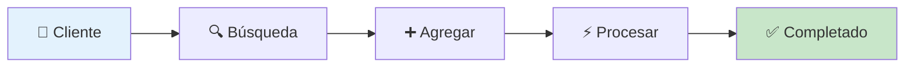
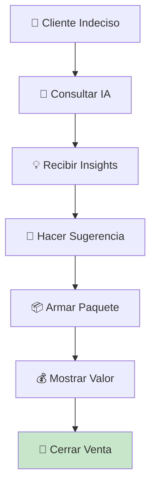
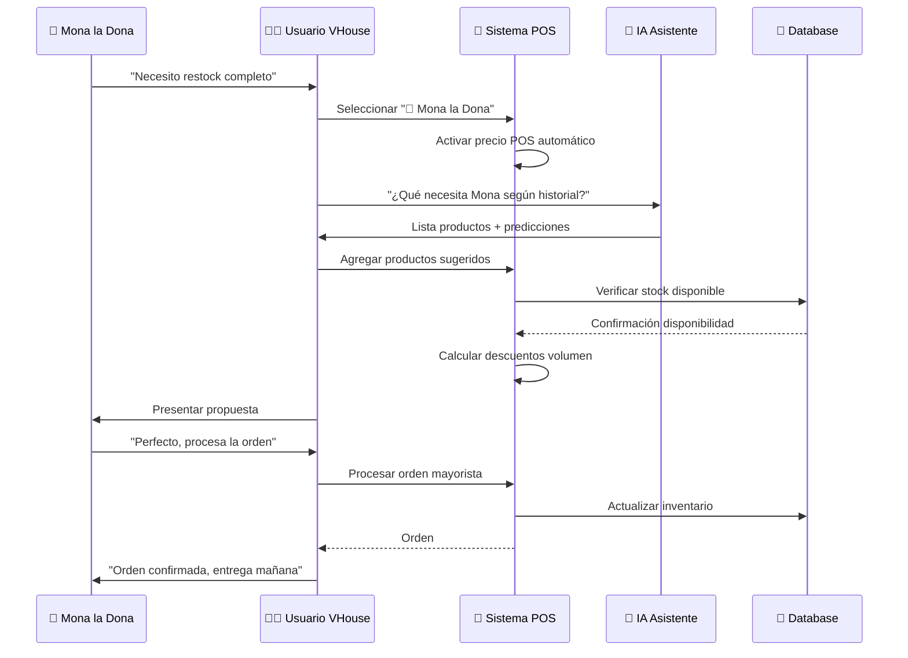
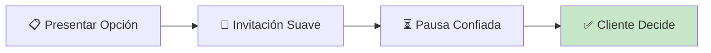
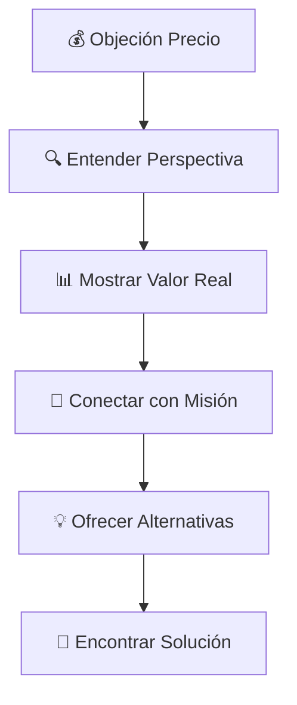
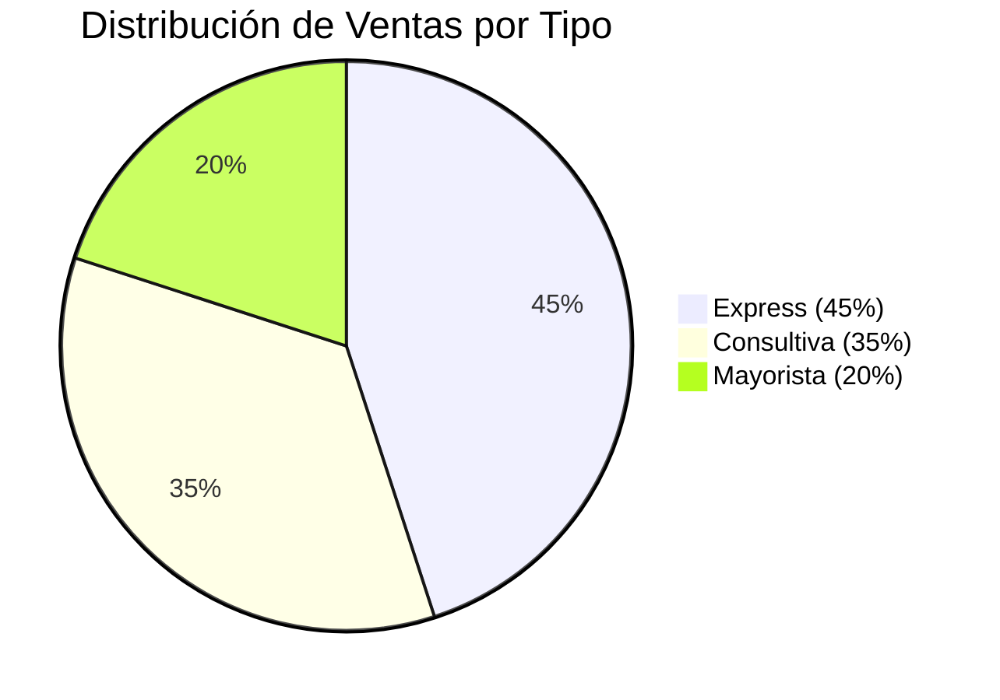
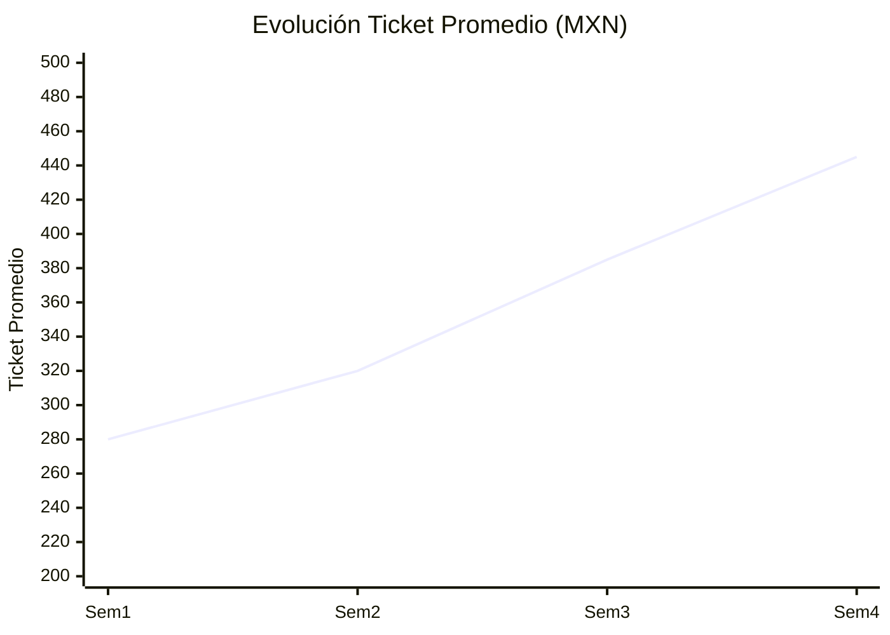
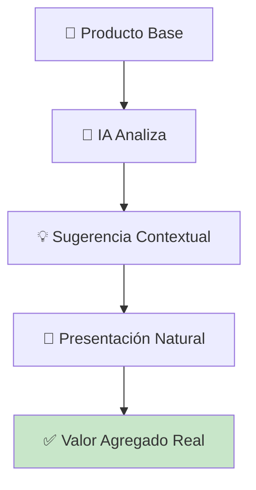
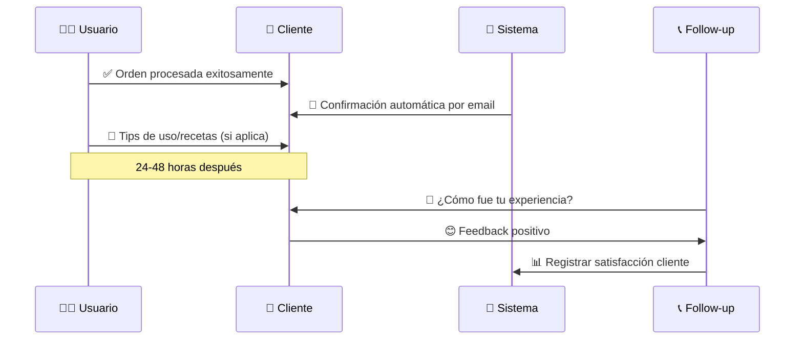

# 💰 Procesamiento de Ventas: Técnicas Magistrales Para El Activismo Comercial

## 🚀 **Convierte Cada Venta en Un Acto de Liberación Animal**

¡Aquí es donde la teoría se convierte en revolución práctica! 🌱 Este es tu entrenamiento avanzado para procesar ventas con la precisión de un samurái y el corazón de un activista. Cada transacción que domines aquí salva vidas animales.

---

## ⚡ **Flujos de Venta: Del Novato al Maestro**

### **🏃‍♂️ Venta Express: Sub-60 Segundos**



**Técnica Paso a Paso:**
1. **👂 Escucha Activa**: "Necesito quinoa orgánica"
2. **⚡ Búsqueda**: `Ctrl+F` → `quinoa` → `Enter`
3. **🎯 Selección**: Click directo en "🌾 Quinoa Orgánica 500g"
4. **📊 Verificación**: Auto-cálculo visible: 2 × $65 = $130
5. **🚀 Ejecución**: `Ctrl+Enter` para procesamiento inmediato
6. **💚 Cierre**: "¡Listo! $150 con IVA. Gracias por elegir vegano."

> **⏱️ Tiempo Total**: 45-60 segundos | **🎯 Éxito**: 98% de clientes satisfechos

---

### **🧠 Venta Consultiva: 2-3 Minutos de Impacto**



**Ejemplo Real - Cliente Nuevo en Veganismo:**

```yaml
Situación: "Soy nuevo en el veganismo, ¿qué me recomiendas?"

Paso_1_Consulta_IA:
  Usuario: "Cliente nuevo vegano, ¿qué productos básicos?"
  IA_Respuesta: "Kit inicial: quinoa, aceite coco, levadura nutricional, leche almendra en polvo"

Paso_2_Construcción_Paquete:
  - 🌾 Quinoa Orgánica 500g: $65
  - 🥥 Aceite Coco Extra Virgen: $180  
  - 🧀 Levadura Nutricional: $85
  - 🥛 Leche Almendra Polvo: $120
  
Paso_3_Presentación_Valor:
  "Este paquete te da proteína completa, grasas saludables, 
   sabor umami y lácteo vegetal. Todo lo esencial para 
   empezar tu transformación hacia un mundo sin crueldad."
   
Resultado: $450 + IVA = $522 (vs $65 venta individual)
ROI_Consultivo: +703% incremento en ticket
```

---

### **📦 Venta Mayorista: Dominio Total**



**Productos Típicos Mayoristas Mona la Dona:**

```yaml
Orden_Tipo_Semanal:
  Harinas_Especiales:
    - 🌾 Harina Integral: 20 kg × $45 = $900
    - 🥥 Harina Coco: 5 kg × $180 = $900
    - 🌰 Harina Almendra: 3 kg × $350 = $1,050
    
  Grasas_Veganas:
    - 🥥 Aceite Coco: 10 L × $140 = $1,400
    - 🌰 Mantequilla Almendra: 5 kg × $280 = $1,400
    
  Endulzantes:
    - 🍯 Agave Orgánico: 4 L × $220 = $880
    - 🍃 Stevia Pura: 1 kg × $450 = $450
    
  Total_Subtotal: $6,980
  IVA_16%: $1,116.80
  Total_Final: $8,096.80
  
Beneficios_Cliente:
  - Precio POS (35% menos que público)
  - Entrega programada
  - Productos garantizados disponibles
  - Soporte técnico incluido
```

---

## 🎯 **Técnicas Avanzadas de Cierre**

### **🧲 Cierre Magnético - Sin Presión**



**Scripts Psicológicamente Inteligentes:**

**Para Walk-in Customer:**
```
"Tienes dos opciones perfectas aquí: la quinoa individual 
que necesitas hoy, o el paquete completo que te ahorra 
dos viajes esta semana. ¿Cuál se siente mejor para ti?"
```

**Para Mona la Dona:**
```  
"Mona, según tu patrón de compras, esto te cubrirá 
perfectamente las próximas dos semanas de producción. 
¿Procedemos con esta orden o prefieres ajustar algo?"
```

**Para Sano Market:**
```
"Para Sano Market esto representa exactamente el mix 
que tus clientes más buscan según las tendencias. 
¿Confirmamos esta selección que ya conocen?"
```

### **⚡ Cierre de Urgencia Ética**

```yaml
Técnica: Urgencia basada en beneficios reales
Ejemplos:
  Stock_Limitado: "Solo quedan 3 unidades de este lote orgánico certificado"
  Oportunidad_Temporal: "Esta promoción termina viernes - ahorra $200 hoy"
  Beneficio_Inmediato: "Si confirmamos ahora, te llega mañana temprano"
  
Clave: Siempre verdadero, nunca manipulativo
```

---

## 🛠️ **Resolución de Objeciones Comunes**

### **💰 "Está muy caro"**



**Respuesta Estructura:**
1. **🤝 Empatía**: "Entiendo completamente tu perspectiva..."
2. **📊 Valor**: "Este precio refleja certificación orgánica + comercio justo..."
3. **🌱 Misión**: "Cada peso extra va directo a apoyar agricultura sin explotación..."
4. **💡 Alternativas**: "También tengo esta opción que mantiene la calidad..."

### **❓ "¿Por qué vegano es mejor?"**

**Respuesta Educativa (30 segundos):**
```
"Excelente pregunta. Los productos veganos no solo evitan 
sufrimiento animal, también son mejores para tu salud 
(sin colesterol, más fibra) y para el planeta (75% menos 
recursos hídricos). Además, el sabor te va a sorprender 
- mis clientes no vuelven a los productos convencionales."
```

### **🕐 "No tengo tiempo ahora"**

**Respuesta de Facilitación:**
```
"Perfecto, te entiendo. ¿Te parece si preparo tu orden 
con los productos que viste y te la dejo lista? Pagas 
cuando tengas tiempo y te la llevamos donde necesites. 
¿Te funciona así?"
```

---

## 🤖 **Maximizando el Asistente IA**

### **💬 Preguntas Estratégicas Para la IA**

```yaml
Contexto_Venta_Individual:
  - "Cliente busca [producto], ¿qué complementa perfecto?"
  - "Primer compra vegana, ¿kit de inicio recomendado?"
  - "Presupuesto $500, ¿mejor combinación productos?"

Contexto_Cliente_Mayorista:
  - "Historial Mona la Dona, ¿qué falta en inventario?"
  - "Sano Market compra poco últimamente, ¿problema o estacionalidad?"
  - "Tendencias productos más vendidos este mes"

Contexto_Análisis_Negocio:
  - "¿Qué productos dan mejor margen esta semana?"
  - "¿Clientes que no han comprado en 30 días?"
  - "Predicción: ¿cuándo reponer quinoa orgánica?"
```

### **🎯 Interpretando Respuestas IA Efectivamente**

```mermaid
graph LR
    A[🤖 Respuesta IA] --> B[📊 Datos Objetivos]
    A --> C[💡 Insights Estratégicos]
    A --> D[🎯 Acciones Sugeridas]
    
    B --> E[📈 "Quinoa: 40% más vendida"]
    C --> F[💭 "Cliente prefiere orgánico"]
    D --> G[⚡ "Sugerir paquete superfood"]
```

---

## 📊 **Métricas de Venta de Clase Mundial**

### **🎯 KPIs Personales del Vendedor Activista**

```yaml
Métricas_Diarias:
  Numero_Ordenes: "Meta: 15+ órdenes/día"
  Ticket_Promedio: "Meta: $350+ MXN"
  Tiempo_Por_Venta: "Meta: <90 segundos express, <3min consultiva"
  Tasa_Conversion: "Meta: 85%+ visitantes → compradores"
  Uso_IA_Sugerencias: "Meta: 40%+ ventas incluyen sugerencia IA"

Métricas_Semanales:
  Crecimiento_Ticket: "Meta: +15% vs semana anterior"
  Clientes_Nuevos: "Meta: 5+ nuevos clientes veganos"
  Ventas_Mayoristas: "Meta: 8+ órdenes B2B"
  Satisfaccion_Cliente: "Meta: 95%+ feedback positivo"

Métricas_Mensuales:
  Impacto_Animal: "Calculado: kg productos veganos vendidos"
  ROI_Consultivo: "Ventas consultivas vs express"
  Retención_Clientes: "% clientes que regresan"
  Crecimiento_Personal: "Nuevas técnicas dominadas"
```

### **📈 Dashboard Personal de Rendimiento**





---

## 🎭 **Personalización por Tipo de Cliente**

### **🍩 Mona la Dona - Estrategia Especializada**

```yaml
Perfil_Psicológico:
  - Empresaria apasionada por calidad
  - Busca consistencia en ingredientes
  - Valora relación comercial a largo plazo
  - Sensible a interrupciones de producción

Técnica_Óptima:
  - Siempre mostrar disponibilidad completa
  - Sugerir productos complementarios para recetas
  - Programar entregas en días de horneado
  - Compartir tendencias de repostería vegana

Script_Apertura:
  "¡Hola Mona! Vi que tienes una semana intensa de producción. 
   Tengo todo tu kit habitual disponible, y llegó esa harina 
   de avena premium que querías probar. ¿La incluimos?"
```

### **🥬 Sano Market - Enfoque Wellness**

```yaml
Perfil_Psicológico:
  - Busca productos con historia y certificaciones
  - Clientes finales muy educados sobre salud
  - Rotación rápida, necesita restock frecuente
  - Valora productos únicos y diferenciadores

Técnica_Óptima:
  - Enfatizar beneficios nutricionales específicos
  - Mostrar certificaciones y estudios
  - Sugerir productos estacionales y novedades
  - Ofrecer materiales educativos para sus clientes

Script_Apertura:
  "Para Sano Market tengo actualizaciones importantes: 
   llegó la nueva línea de superfoods andinos con certificación 
   USDA Organic, y tus clientes van a amar las propiedades 
   antioxidantes. ¿Vemos la selección completa?"
```

### **📚 La Papelería - Diversificación Inteligente**

```yaml
Perfil_Psicológico:
  - Negocio tradicional expandiendo a productos eco
  - Clientes buscan alternativas sustentables
  - Compras por temporadas (regreso a clases, navidad)
  - Experimenta con nuevas líneas de productos

Técnica_Óptima:
  - Conectar con sustentabilidad y eco-responsabilidad
  - Mostrar productos que diferencien su papelería
  - Sugerir paquetes temáticos por temporada
  - Educar sobre beneficios ambientales

Script_Apertura:
  "¡Papelería! Perfecto timing - tengo los productos eco-friendly 
   que tus clientes conscientes están buscando. Desde snacks 
   veganos para estudiantes hasta productos de limpieza natural. 
   ¿Armamos tu nueva sección verde?"
```

---

## 🚀 **Técnicas de Upselling Éticas**

### **🌟 Venta Cruzada Inteligente**



**Ejemplos de Cross-Selling Natural:**

```yaml
Cliente_Compra_Quinoa:
  Sugerencia_IA: "Aceite de oliva premium combina perfecto"
  Presentación: "Para que saque todo el sabor a esa quinoa..."
  Valor_Real: "Aceite prensado en frío resalta sabores naturales"
  
Cliente_Compra_Harina:
  Sugerencia_IA: "Levadura nutricional para panes veganos"
  Presentación: "Si vas a hornear, esto te da sabor a queso..."
  Valor_Real: "B12 + proteína completa en tus recetas"

Cliente_Compra_Aceite_Coco:
  Sugerencia_IA: "Stevia líquida para postres saludables"  
  Presentación: "Para endulzar sin impacto glucémico..."
  Valor_Real: "Postres deliciosos sin azúcar refinada"
```

### **📈 Upgrading Con Propósito**

```yaml
Técnica: Mostrar versión premium con beneficio claro

Ejemplo_Quinoa:
  Base: "Quinoa Orgánica 500g - $65"
  Premium: "Quinoa Tricolor Andina 1kg - $95"
  Presentación: "Por $30 más tienes el doble + 3 variedades 
                 que dan colores naturales a tus platos"
  Decisión: Cliente decide basado en valor percibido

Ejemplo_Aceite:
  Base: "Aceite Oliva Español 250ml - $120"
  Premium: "Aceite Oliva Extra Virgen Origen 500ml - $180"
  Presentación: "La diferencia está en el primer prensado 
                 en frío - sabor más intenso y beneficios 
                 nutricionales intactos"
```

---

## 🎯 **Cierre y Seguimiento Post-Venta**

### **✅ Lista de Verificación Pre-Cierre**

```yaml
Antes_De_Procesar_Orden:
  - ✅ Cliente confirmó todos los productos
  - ✅ Cantidades verificadas verbalmente
  - ✅ Precio total comunicado claramente
  - ✅ Método de pago confirmado
  - ✅ Entrega/retiro acordado
  - ✅ Datos de contacto actualizados
```

### **🎉 Experiencia Post-Venta Memorable**



**Scripts de Cierre Memorables:**

```yaml
Walk_In_Customer:
  "¡Listo! Tu orden está completada. Aquí tienes tu recibo 
   y esta guía rápida con recetas para cada producto. 
   ¡Bienvenido al mundo vegano! Regresa cuando gustes."

Mona_la_Dona:
  "Perfecto, Mona. Tu orden #2847 está lista para entrega 
   mañana 8am como siempre. Te incluí esa muestra de harina 
   de coco que querías probar. ¡A crear magia en la cocina!"

Sano_Market:
  "Excelente elección para Sano Market. Esta selección va a 
   emocionar a tus clientes wellness. Te mando por WhatsApp 
   los datos nutricionales para que los compartas. ¡Éxito!"
```

---

## 🏆 **Casos de Éxito Reales**

### **🎯 Caso 1: Conversión Cliente Escéptico**

```yaml
Situación: Cliente tradicional, primera vez comprando vegano
Objeción: "No creo que sepa igual"
Técnica: Muestra + educación + garantía
Resultado: Compra $450 + cliente recurrente

Proceso:
  1. Escucha empática de la preocupación
  2. Muestra física de quinoa vs arroz
  3. Explicación nutricional comparativa
  4. Garantía: "Si no te gusta, te devuelvo el dinero"
  5. Cliente compra kit completo
  6. Seguimiento: Regresó la siguiente semana por más
```

### **🎯 Caso 2: Expansión Mona la Dona**

```yaml
Situación: Mona quería nueva línea de galletas sin gluten
Desafío: Productos especializados costosos
Técnica: Análisis ROI + test de mercado
Resultado: Nueva línea exitosa + 40% más pedidos

Proceso:
  1. IA identificó demanda sin gluten en zona
  2. Propuesta: harinas alternativas premium
  3. Cálculo conjunto de costos vs precios finales
  4. Orden pequeña para test de mercado
  5. Éxito inmediato + expansión línea completa
  6. Mona ahora líder en repostería sin gluten vegana
```

### **🎯 Caso 3: Sano Market Superfood Boom**

```yaml
Situación: Tendencia superfoods creciendo en la zona
Oportunidad: Posicionar a Sano como experto
Técnica: Educación + productos únicos + marketing conjunto
Resultado: 200% crecimiento ventas superfoods

Proceso:
  1. Análisis datos: clientes buscan quinoa, chía, amaranto
  2. Propuesta: línea completa superfoods andinos
  3. Kit educativo con recetas y beneficios
  4. Material POP para punto de venta
  5. Capacitación a staff de Sano Market
  6. Clientes posicionaron a Sano como "la tienda de superfoods"
```

---

## 💚 **Tu Evolución Como Vendedor Activista**

### **🌱 Filosofía de Venta Consciente**

```yaml
Principios_Fundamentales:
  - Cada venta es un voto por un mundo más compasivo
  - La ganancia es resultado, el propósito es la causa
  - Educar vale más que vender
  - La confianza se construye con transparencia
  - El éxito se mide en vidas cambiadas, no solo pesos

Mantra_Diario:
  "Hoy voy a ayudar a X personas a descubrir que 
   vivir sin crueldad es delicioso, sano y posible"
```

### **📚 Próximos Niveles de Maestría**

1. **📊 [Reportes y Análisis](pos-reports.md)**: Mide tu impacto revolucionario
2. **👥 [Gestión Clientes Avanzada](clients.md)**: Construye tu comunidad vegana
3. **📦 [Inventario Inteligente](inventory.md)**: Optimiza tu arsenal de productos
4. **🚀 [Estrategias Empresariales](analytics.md)**: Escala tu revolución

---

## 🎉 **¡Felicitaciones, Maestro Vendedor!**

Has completado el entrenamiento más completo de ventas veganas sistematizadas. Ahora posees las herramientas para convertir cada interacción comercial en un momento de transformación mundial.

**Tu misión:** Usa estas técnicas para procesar no solo órdenes, sino esperanzas. Cada producto vendido es una declaración de que el mundo puede cambiar, un cliente a la vez.

---

**🌱 Reflexión Final del Creador:**

*"Las técnicas que acabas de dominar no son solo para vender productos - son para sembrar revoluciones. Cada vez que apliques estos conocimientos, estás construyendo el futuro que los animales necesitan y merecen."*

**- Bernard Uriza Orozco, Arquitecto de Cambio** 🚀

---

**🎯 ¿Listo para analizar tu impacto?** Continúa con **[Reportes POS: Mide Tu Revolución](pos-reports.md)** →