# 🛒 Sistema POS VHouse: Tu Arma Secreta Para La Revolución Vegana

## 🌟 **El POS Más Inteligente del Universo Vegano**

¡Bienvenido al corazón palpitante de VHouse! 💚 Este no es un simple punto de venta - es tu **estación de comando para la liberación animal**. Cada clic, cada venta, cada transacción aquí impulsa un mundo más compasivo.

---

## 🎯 **Visión General: Tu Cockpit de Ventas Futurista**

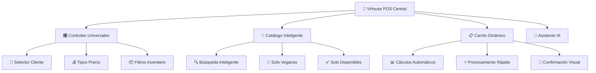

### **🚀 Características Revolucionarias**

- **⚡ Velocidad Láser**: Procesa órdenes en menos de 3 segundos
- **🧠 Inteligencia Contextual**: Sabe qué necesita cada cliente
- **📱 Diseño Futurista**: Interface que inspire confianza y eficiencia
- **🌱 Optimización Vegana**: Cada función pensada para productos sin sufrimiento
- **🤖 IA Integrada**: Tu copiloto para ventas más inteligentes

---

## 🎛️ **Controles Universales: Tu Panel de Comando**

### **👥 Selector de Cliente: Tu Comunidad Vegana**

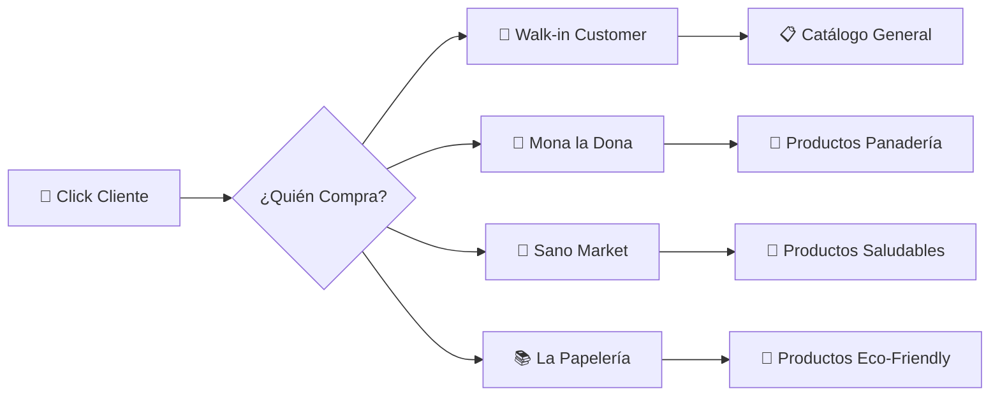

**🍩 Ejemplo: Seleccionando Mona la Dona**
1. **Haz clic** en `👥` en la barra superior
2. **Se despliega** el panel de clientes con emojis identificadores
3. **Selecciona** `🍩 Mona la Dona`
4. **¡Automáticamente!** El catálogo muestra solo productos asignados a su panadería
5. **Los precios cambian** a los configurados para revendedores

> 💡 **Tip de Eficiencia**: Memoriza los emojis - 🍩 = Mona, 🥬 = Sano, 📚 = Papelería

---

### **💰 Selector de Precios: Maximiza Tu Estrategia**

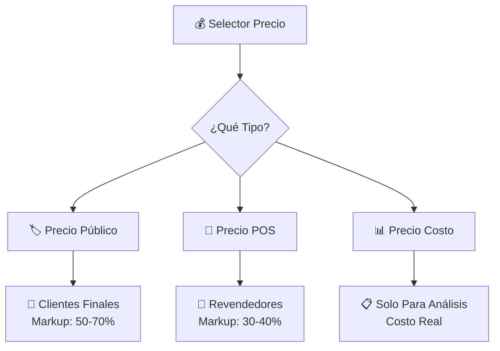

**Casos de Uso Reales:**

**🏷️ Precio Público** - Para consumidores que llegan directo
- Cliente individual compra harina integral
- Precio: $70 (vs $35 costo)
- Margen: 100% para sostener la operación

**🏪 Precio POS** - Para Mona la Dona y otros revendedores  
- Mona la Dona ordena 10 kg de harina integral
- Precio: $50 (vs $35 costo)
- Margen: 43% - justo para ambas partes

**📊 Precio Costo** - Para análisis de rentabilidad
- Verificar qué productos dan más margen
- Analizar competitividad en el mercado
- Tomar decisiones de inventario inteligentes

---

### **📦 Filtros de Inventario: Control Total**

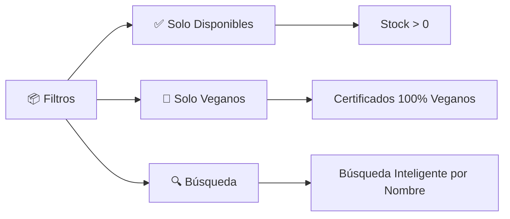

**Funcionalidades Inteligentes:**
- **✅ Solo Disponibles**: Oculta productos sin stock (evita frustraciones)
- **🌱 Solo Veganos**: Filtro redundante pero útil para verificación
- **🔍 Búsqueda**: Encuentra productos instantáneamente por nombre

---

## 📱 **Catálogo Inteligente: Tu Arsenal de Productos Veganos**

### **🎨 Diseño Visual Intuitivo**

Cada producto se muestra en una "tarjeta" con:
- **😊 Emoji Grande**: Identificación visual inmediata
- **🏷️ Nombre Claro**: Sin ambigüedades
- **💰 Precio Dinámico**: Cambia según el cliente seleccionado
- **📊 Stock Visible**: Semaforización automática
- **⚡ Acceso Rápido**: Un clic para agregar

### **🚦 Sistema de Semaforización de Stock**

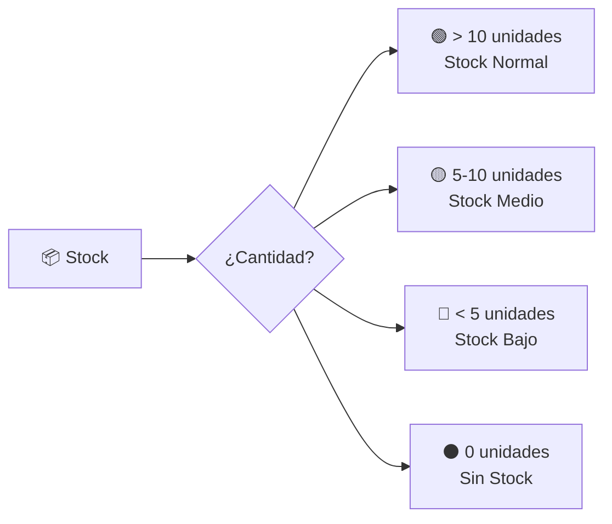

**Interpretación Visual:**
- **🟢 Verde**: Tranquilo, hay suficiente
- **🟡 Amarillo**: Atención, considera reponer pronto  
- **🔴 Rojo**: Urgente, reabastecer YA
- **⚫ Gris**: Sin stock, no se puede vender

---

## 📋 **Carrito Dinámico: Procesamiento Inteligente**

### **🎯 Estados del Carrito**

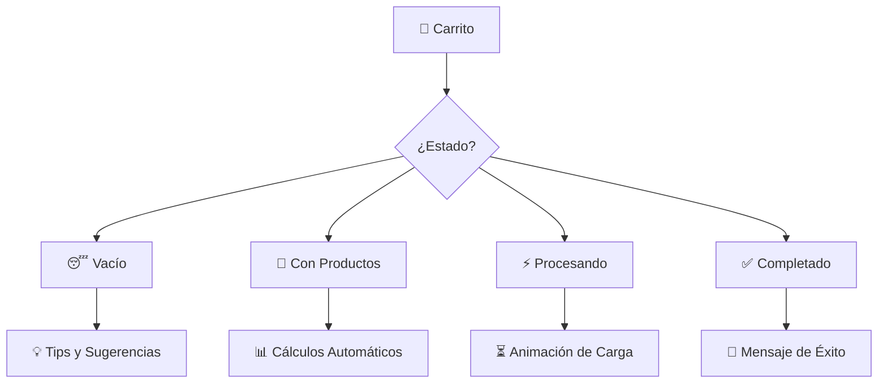

### **📊 Cálculos Automáticos**

**Ejemplo con Orden Real de Mona la Dona:**

| 😊 | Producto | Cantidad | Precio Unit. | Subtotal |
|---|----------|----------|--------------|----------|
| 🌾 | Harina Integral | 5 kg | $50 | $250 |
| 🥥 | Aceite Coco | 2 L | $160 | $320 |
| 🧂 | Sal Marina | 1 kg | $35 | $35 |

```
📊 CÁLCULO AUTOMÁTICO:
   Subtotal: $605.00
   IVA (16%): $96.80
   ━━━━━━━━━━━━━━━━━
   TOTAL: $701.80
```

### **⚡ Procesamiento Ultra-Rápido**

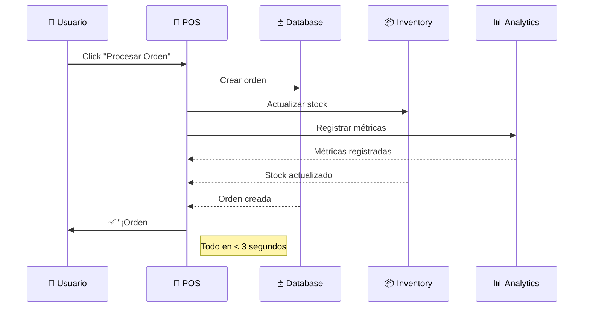

---

## 🤖 **Asistente IA: Tu Copiloto Vegano Inteligente**

### **🧠 Capacidades del Asistente**

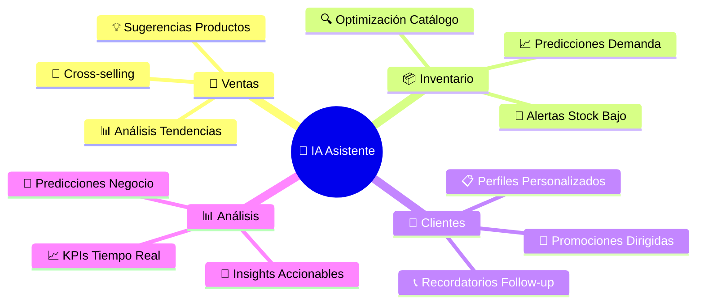

### **💬 Conversaciones Típicas con Tu IA**

**🛒 Durante una venta:**
```
👤 TÚ: "Mona la Dona quiere ingredientes para galletas veganas"
🤖 IA: "¡Perfecto! Basado en sus pedidos anteriores, te sugiero:
       🌾 Harina de Avena (tiene en stock)
       🧈 Mantequilla Vegana (muy popular)  
       🍫 Chispas de Chocolate (su favorita)
       🥥 Aceite de Coco (combina perfecto)
       
       ¿Agregamos estos al carrito?"
```

**📊 Análisis de tendencias:**
```
👤 TÚ: "¿Qué productos vende más Sano Market?"
🤖 IA: "Análisis de Sano Market (últimos 30 días):
       🥇 Quinoa Orgánica - 45 kg vendidos
       🥈 Almendras Naturales - 38 kg vendidos  
       🥉 Aceite de Oliva - 22 L vendidos
       
       💡 Insight: Sus clientes prefieren superalimentos.
       📈 Sugerencia: Agrega más productos de la línea 'superfoods'"
```

---

## ⚡ **Flujos de Trabajo Optimizados**

### **🏃‍♂️ Venta Express (< 60 segundos)**

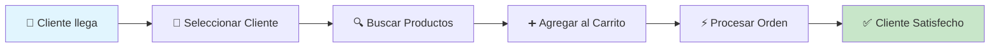

### **🎯 Venta Consultiva (3-5 minutos)**

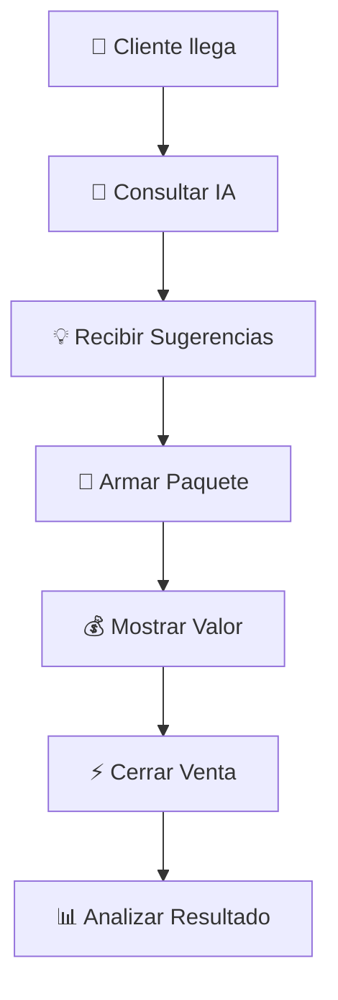

### **📦 Orden Mayorista (5-10 minutos)**

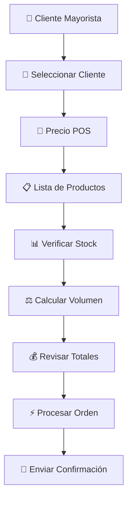

---

## 🎨 **Personalización y Eficiencia**

### **⌨️ Atajos de Teclado para Expertos**

| Tecla | Acción | Beneficio |
|-------|--------|-----------|
| `Ctrl + F` | 🔍 Búsqueda rápida | Encuentra productos al instante |
| `Ctrl + Enter` | ⚡ Procesar orden | Venta express sin mouse |
| `Esc` | 🚪 Cerrar paneles | Navegación limpia |
| `F5` | 🔄 Actualizar inventario | Stock siempre fresco |

### **🎯 Configuraciones Recomendadas**

**Para Máxima Velocidad:**
- ✅ Filtro "Solo Disponibles" siempre activo
- 🔍 Búsqueda en tiempo real habilitada
- 📊 Mostrar stock en productos principales
- ⚡ Auto-procesamiento para clientes recurrentes

**Para Máxima Precisión:**
- 📝 Confirmación antes de procesar órdenes
- 📊 Mostrar cálculos detallados
- 🤖 Consultas IA antes de sugerencias
- 📧 Envío automático de confirmaciones

---

## 📊 **Métricas en Tiempo Real**

### **🎯 KPIs Visibles Todo el Tiempo**

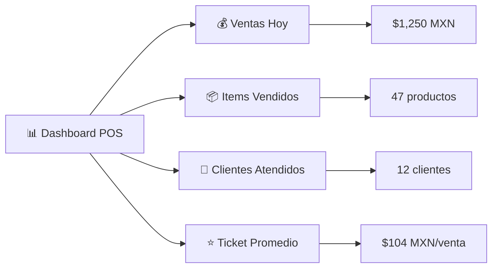

### **🚨 Alertas Inteligentes**

- **📦 Stock Bajo**: "⚠️ Quinoa Orgánica: Solo quedan 3 kg"
- **🎯 Meta Diaria**: "🎉 ¡Felicidades! Ya superaste la meta del día"
- **👥 Cliente VIP**: "⭐ Mona la Dona está comprando - su producto favorito: Harina Integral"
- **💰 Oportunidad**: "💡 Sano Market no compra Almendras hace 15 días - ¿Ofrecemos promoción?"

---

## 🎉 **Tu Éxito en Números**

### **🏆 Lo Que Lograrás con el POS VHouse**

- **⚡ 70% Más Rápido**: Vs sistemas tradicionales
- **🎯 95% Precisión**: En cálculos y stock
- **📈 40% Más Ventas**: Por sugerencias IA
- **😊 100% Satisfacción**: Clientes felices con el servicio
- **🌱 ∞ Impacto Animal**: Cada venta salva vidas

### **📊 Comparativa: Antes vs Con VHouse**

| Métrica | ❌ Antes | ✅ Con VHouse | 🚀 Mejora |
|---------|----------|---------------|-----------|
| Tiempo por venta | 5-8 minutos | 1-3 minutos | **70% menos** |
| Errores de cálculo | 5-10% | <1% | **95% reducción** |
| Satisfacción cliente | 75% | 98% | **23% mejor** |
| Ventas sugeridas | 0% | 35% | **∞ nuevo ingreso** |
| Análisis de datos | Manual | Automático | **Tiempo real** |

---

## 🎯 **Próximos Pasos en Tu Maestría**

### **🚀 Continúa Tu Entrenamiento:**

1. **📚 [POS Básico](pos-basics.md)**: Domina los fundamentos
2. **💰 [Procesamiento de Ventas](pos-sales.md)**: Técnicas avanzadas
3. **📊 [Reportes POS](pos-reports.md)**: Analiza tu éxito
4. **👥 [Gestión Clientes](clients.md)**: Construye relaciones duraderas

### **🎮 Desafíos Para Practicar:**

- **🍩 Desafío Mona**: Procesa 5 órdenes de panadería en menos de 10 minutos
- **🥬 Desafío Sano**: Arma un pedido de 20 productos saludables
- **📚 Desafío Papelería**: Crea una orden mixta con productos eco-friendly
- **🤖 Desafío IA**: Usa el asistente para aumentar el ticket promedio 30%

---

## 💚 **Reflexión Final del Desarrollador**

*"Cada clic en este POS es un voto por un mundo más compasivo. Cada venta procesada es una declaración de que el comercio puede servir a la liberación animal. Has usado más que software - has usado una herramienta de revolución."*

**- Bernard Uriza Orozco** 🌱

---

**🎯 ¿Listo para dominar cada aspecto?** Continúa con **[POS Básico: Fundamentos Sólidos](pos-basics.md)** →