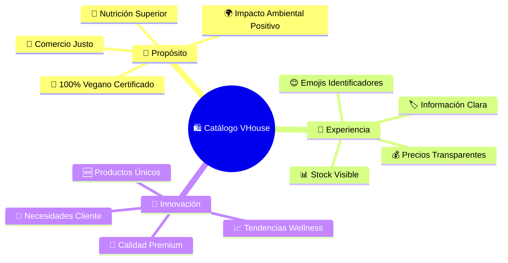
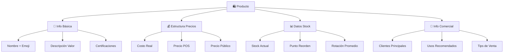
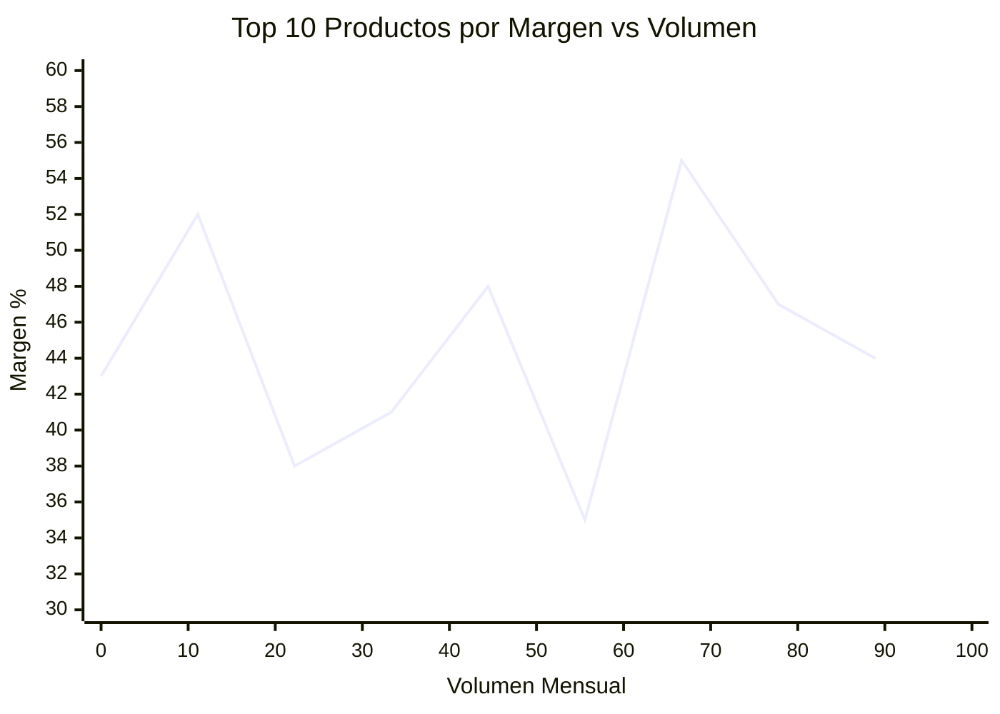
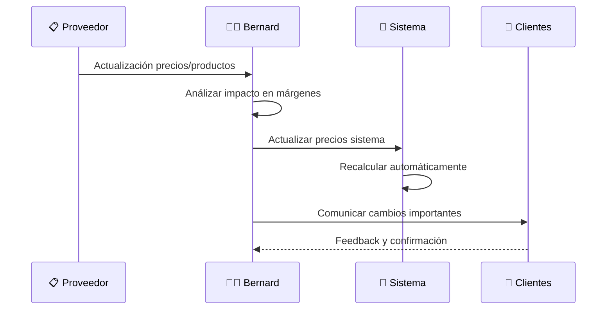
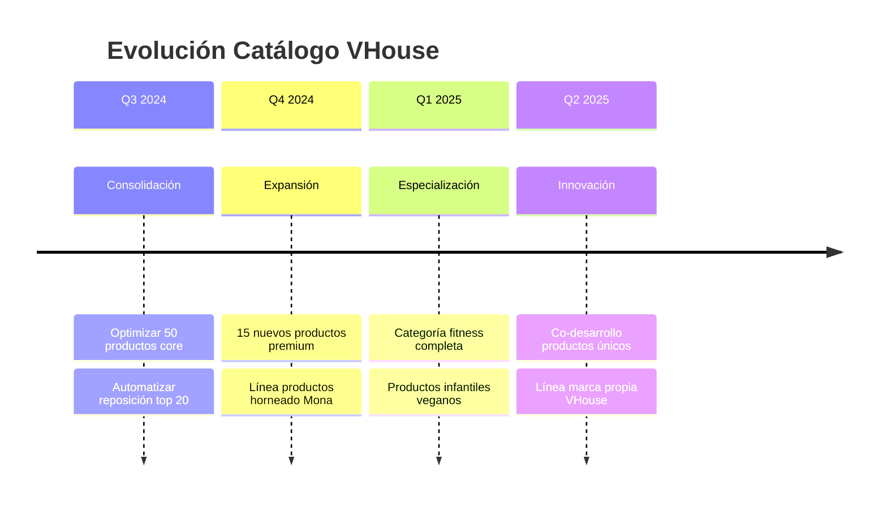

# 🛍️ Gestión de Productos: Tu Catálogo de Revolución Vegana

## 🌟 **Cada Producto Es Una Declaración de Liberación Animal**

¡Bienvenido al corazón de tu arsenal vegano! 💚 Aquí no gestionas simples "productos" - curas una **colección de herramientas para la transformación mundial**. Cada item en tu catálogo representa una alternativa compasiva que salva vidas animales.

---

## 🎯 **Filosofía del Catálogo VHouse**



---

## 🌾 **Categorías Maestras: Tu Arsenal Organizado**

### **🥇 Proteínas Vegetales: Los Héroes Nutricionales**

```yaml
Quinoa_Organica_500g:
  Emoji: "🌾"
  Nombre: "Quinoa Orgánica Premium"
  Descripción: "Proteína completa andina, 9 aminoácidos esenciales"
  Precio_Costo: $45.00
  Precio_POS: $62.00
  Precio_Publico: $78.00
  Stock_Actual: 89
  Stock_Minimo: 20
  Certificaciones: ["Orgánico", "Fair Trade", "Sin Gluten"]
  
  Beneficios_Clave:
    - "20% más proteína que arroz integral"
    - "Rica en hierro biodisponible"
    - "Fibra para salud digestiva"
    - "Índice glucémico bajo"
  
  Clientes_Principales: 
    - "🥬 Sano Market (40kg/mes)"
    - "🍩 Mona la Dona (15kg/mes)"
    - "🚶 Walk-ins fitness (25kg/mes)"

Amaranto_Expandido:
  Emoji: "🌰"
  Nombre: "Amaranto Orgánico Expandido"
  Descripción: "Cereal ancestral, ideal desayunos y postres"
  Precio_Costo: $38.00
  Precio_POS: $52.00  
  Precio_Publico: $65.00
  Stock_Actual: 34
  Especialidad: "Producto artesanal mexicano"
  
  Historia_Producto: 
    "Rescatando tradiciones prehispánicas, este amaranto 
     es cultivado por cooperativas indígenas de Puebla.
     Cada compra apoya directamente a 47 familias."
```

### **🥥 Grasas Saludables: Energía Pura y Ética**

```yaml
Aceite_Coco_Extra_Virgen:
  Emoji: "🥥"
  Nombre: "Aceite de Coco Extra Virgen Prensado en Frío"
  Descripción: "MCTs para energía inmediata, ideal cocina y cosmética"
  Precio_Costo: $95.00
  Precio_POS: $135.00
  Precio_Publico: $170.00
  Presentacion: "500ml vidrio oscuro"
  
  Características_Únicas:
    - "Prensado en frío <40°C"
    - "0% refinamiento químico"  
    - "Punto de humo 177°C"
    - "Vida útil: 24 meses"
  
  Usos_Principales:
    Culinario: ["Sartén alta temperatura", "Repostería", "Smoothies"]
    Cosmético: ["Hidratante natural", "Desmaquillante", "Mascarillas"]
    Terapéutico: ["MCTs para cetosis", "Antiinflamatorio"]
  
  Clientes_Demanda_Alta:
    - "🍩 Mona la Dona: Repostería premium"
    - "🥬 Sano Market: Comunidad wellness" 
    - "👤 Fitness enthusiasts individuales"

Mantequilla_Almendra_Artesanal:
  Emoji: "🌰"
  Nombre: "Mantequilla de Almendra Artesanal"
  Descripción: "100% almendras tostadas, sin aditivos"
  Precio_Costo: $120.00
  Precio_POS: $165.00
  Precio_Publico: $210.00
  Proceso: "Molido en piedra tradicional"
  
  Ventaja_Competitiva:
    "Única mantequilla artesanal de la región. 
     Textura cremosa sin aceites agregados.
     Producción limitada semanal."
```

---

## 🍯 **Endulzantes Éticos: Dulzura Sin Crueldad**

### **🎯 Productos Premium Diferenciadores**

```yaml
Agave_Cristalino_Premium:
  Emoji: "🍯"
  Nombre: "Agave Orgánico Cristalino Premium"
  Descripción: "Endulzante de bajo índice glucémico"
  Precio_Costo: $85.00
  Precio_POS: $115.00
  Precio_Publico: $145.00
  Origen: "Jalisco, México - Cooperativa certificada"
  
  Perfil_Nutricional:
    IG: "17 (vs 65 azúcar blanca)"
    Dulzor: "1.3x más dulce que azúcar"
    Solubilidad: "Excelente en frío y caliente"
    Calorías: "21 cal/cucharada vs 49 azúcar"
  
  Clientes_Target:
    - "🍩 Mona: Postres bajos en azúcar"
    - "🥬 Sano: Comunidad diabética"
    - "👤 Individuales conscious eating"

Stevia_Pura_Cristalizada:
  Emoji: "🍃"
  Nombre: "Stevia Pura Cristalizada"
  Descripción: "Endulzante natural 0 calorías"
  Precio_Costo: $155.00
  Precio_POS: $210.00
  Precio_Publico: $265.00
  Exclusividad: "Único distribuidor regional"
  
  Diferenciadores:
    - "Sin regusto amargo (proceso especial)"
    - "Soluble instantáneo"
    - "Estable a 200°C (horneado)"
    - "Certificación orgánica europea"
```

---

## 🌟 **Superfoods: Los Guerreros Nutricionales**

### **💎 Productos de Alto Valor Agregado**

```yaml
Spirulina_Hawaiana_Premium:
  Emoji: "🌀"
  Nombre: "Spirulina Hawaiana Certificada"
  Descripción: "Alga unicelular, 65% proteína biodisponible"
  Precio_Costo: $280.00
  Precio_POS: $380.00
  Precio_Publico: $480.00
  Presentacion: "100g polvo fino"
  
  Certificaciones_Premium:
    - "Grown in Hawaii (agua pura volcánica)"
    - "USDA Organic Certified"
    - "Non-GMO Project Verified" 
    - "Vegan Society Approved"
  
  Composición_Nutricional:
    Proteína: "65g por 100g"
    B12: "316% IDR por cucharada"
    Hierro: "158% IDR por cucharada" 
    Antioxidantes: "ORAC 24,000"
  
  Estrategia_Venta:
    "Producto ultra-premium. Venta consultiva necesaria.
     Explicar diferencia Hawaiian vs China. 
     ROI alto pero volumen bajo."

Maca_Peruana_Gelatinizada:
  Emoji: "🥔"
  Nombre: "Maca Peruana Gelatinizada Premium"
  Descripción: "Adaptógeno andino para energía y vitalidad"
  Precio_Costo: $95.00
  Precio_POS: $135.00
  Precio_Publico: $170.00
  Proceso: "Gelatinizada para mejor absorción"
  
  Beneficios_Comprobados:
    - "Energía natural sin cafeína"
    - "Equilibrio hormonal"
    - "Resistencia física y mental"
    - "Libido natural"
  
  Market_Segment:
    Primario: "Profesionales 30-45 años estresados"
    Secundario: "Atletas naturales"
    Terciario: "Mujeres en menopausia"
```

---

## 🎨 **Sistema de Información de Producto**

### **📱 Ficha Técnica Optimizada**



**Ejemplo de Ficha Completa:**

```yaml
FICHA_PRODUCTO_COMPLETA:
  Identificación:
    SKU: "VH-QUI-ORG-500"
    Nombre_Sistema: "Quinoa Orgánica 500g"
    Nombre_Comercial: "🌾 Quinoa Dorada Premium"
    Emoji_Principal: "🌾"
    
  Información_Comercial:
    Descripción_Corta: "Proteína completa andina certificada"
    Descripción_Larga: "Quinoa orgánica de los Andes bolivianos, 
                        cultivada a 3,800m altura. Proteína completa 
                        con 9 aminoácidos esenciales."
    
    Beneficios_Clave: [
      "20g proteína por 100g",
      "Rico en hierro y magnesio", 
      "Libre de gluten naturalmente",
      "Índice glucémico bajo (35)"
    ]
    
  Estructura_Precios:
    Costo_Proveedor: $45.00
    Gastos_Importación: $3.00
    Costo_Total: $48.00
    Precio_POS: $65.00 (35% margen)
    Precio_Público: $82.00 (71% margen)
    
  Datos_Inventario:
    Stock_Actual: 89 unidades
    Stock_Mínimo: 20 unidades
    Stock_Ideal: 60 unidades
    Stock_Máximo: 120 unidades
    Rotación_Promedio: "5.2x por mes"
    
  Información_Logística:
    Proveedor_Principal: "Orgánicos del Valle"
    Tiempo_Reposición: "5-7 días"
    MOQ_Proveedor: 50 unidades
    Vida_Útil: "24 meses"
    Condiciones_Almacenaje: "Lugar seco, <25°C"
    
  Clientes_y_Ventas:
    Cliente_Principal: "🥬 Sano Market (40%)"
    Cliente_Secundario: "🍩 Mona la Dona (25%)"
    Walk_ins: "35% del volumen"
    Venta_Promedio_Mensual: 85 unidades
    Estacionalidad: "Enero +30% (detox)"
```

---

## 🚀 **Estrategias de Expansión del Catálogo**

### **🔍 Investigación de Nuevos Productos**


**Proceso de Evaluación de Productos:**

```yaml
Criterios_Evaluación:
  Alineación_Misión:
    - "¿Es 100% vegano certificado?"
    - "¿Apoya comercio justo?"
    - "¿Tiene impacto ambiental positivo?"
    
  Viabilidad_Comercial:
    - "¿Margen mínimo 35%?"
    - "¿Demanda comprobada?"
    - "¿Diferenciación vs competencia?"
    
  Fit_Operativo:
    - "¿Compatible con almacenaje actual?"
    - "¿Proveedor confiable disponible?"
    - "¿Rotación estimada >3x mensual?"
    
  Impacto_Cliente:
    - "¿Complementa productos existentes?"
    - "¿Resuelve problema cliente real?"
    - "¿Potencial para educación vegana?"

Productos_En_Evaluación_Q3:
  Proteina_Guisante_Polvo:
    Estado: "🧪 Fase de prueba"
    Potencial: "Alto - mercado fitness"
    Proveedor: "Evaluando 3 opciones"
    
  Queso_Vegano_Artesanal:
    Estado: "📊 Análisis mercado"
    Reto: "Vida útil corta"
    Oportunidad: "Única opción local"
    
  Hemp_Hearts_Organico:
    Estado: "💰 Análisis financiero"
    Margen: "48% proyectado"
    Regulación: "Verificando legal"
```

---

## 🎯 **Personalización por Cliente**

### **🍩 Catálogo Especializado Mona la Dona**

```yaml
Productos_Exclusivos_Mona:
  Harina_Almendra_Blanqueada:
    Exclusividad: "Solo para Mona la Dona"
    Razón: "Textura específica para macarons"
    Volumen: "8kg mensuales garantizados"
    Precio_Especial: "$290/kg (vs $320 estándar)"
    
  Colorantes_Naturales_Premium:
    Remolacha: "Rosa intenso natural"
    Spirulina: "Verde vibrant"
    Cúrcuma: "Amarillo dorado"
    Exclusividad: "Única panadería con acceso"
    
  Vanilla_Extract_Premium:
    Origen: "Madagascar Bourbon"
    Concentración: "2x standard"
    Precio: "$450 por 250ml"
    ROI_Mona: "Justifica precio premium productos finales"
    
Productos_Desarrollo_Conjunto:
  Mezcla_Pancakes_SinGluten:
    Status: "🧪 Co-desarrollo con Mona"
    Timeline: "Listo Q4 2024"
    Exclusividad: "6 meses solo Mona"
    Proyección: "15kg mensuales"
```

### **🥬 Portfolio Wellness Sano Market**

```yaml
Enfoque_Nutricional_Sano:
  Certificaciones_Prioritarias:
    - "USDA Organic"
    - "Non-GMO Project"  
    - "Fair Trade Certified"
    - "Rainforest Alliance"
    
  Categorías_Estratégicas:
    Superfoods_Únicos:
      - Bayas_Goji_Tibetanas
      - Cacao_Ceremonial_Criollo
      - Moringa_Oleifera_Premium
      
    Proteínas_Plant_Based:
      - Proteína_Cáñamo_Orgánica
      - Spirulina_Hawaiian
      - Proteína_Arveja_Aislada
      
    Grasas_Terapéuticas:
      - MCT_Oil_C8_Puro
      - Omega_3_Algae_Oil
      - Aceite_Hemp_Prensado_Frío
      
  Materiales_Educativos:
    - Fichas nutricionales detalladas
    - Estudios científicos resumidos
    - Recetas de usage sugerido
    - Dosificaciones recomendadas
```

---

## 📊 **Analytics de Producto: Data-Driven Decisions**

### **🏆 Ranking de Performance**



**Análisis Cuadrantes:**

```yaml
Cuadrante_1_Estrellas: # Alto Volumen + Alto Margen
  - "🌾 Quinoa Orgánica"
  - "🧂 Sal Marina Artesanal" 
  - "🍯 Agave Premium"
  
Cuadrante_2_Vacas_Lecheras: # Alto Volumen + Bajo Margen
  - "🥥 Aceite Coco Standard"
  - "🌰 Almendras Naturales"
  
Cuadrante_3_Joyas_Ocultas: # Bajo Volumen + Alto Margen
  - "🌀 Spirulina Hawaiana"
  - "🍃 Stevia Cristalizada"
  - "🥔 Maca Gelatinizada"
  
Cuadrante_4_Interrogantes: # Bajo Volumen + Bajo Margen
  - "⚠️ Evaluar descontinuar o renegociar"
  - "🔍 Requieren estrategia específica"

Estrategias_Por_Cuadrante:
  Estrellas: "Maximizar inventario y promoción"
  Vacas_Lecheras: "Mantener flujo, buscar eficiencias"  
  Joyas_Ocultas: "Venta consultiva especializada"
  Interrogantes: "Revisar o eliminar del catálogo"
```

---

## 🛠️ **Herramientas de Gestión de Catálogo**

### **📝 Workflow de Actualización de Productos**



**Checklist Actualización Mensual:**

```yaml
Revisión_Mensual_Catálogo:
  Precios:
    - ✅ Verificar costos proveedores
    - ✅ Ajustar márgenes según mercado
    - ✅ Actualizar precios especiales clientes
    - ✅ Comunicar cambios significativos
    
  Stock:
    - ✅ Revisar puntos de reorden
    - ✅ Ajustar stock mínimo por estacionalidad
    - ✅ Identificar productos sin movimiento
    - ✅ Planificar productos estacionales
    
  Performance:
    - ✅ Análisis rotación por producto
    - ✅ Revisión márgenes reales
    - ✅ Identificar oportunidades cross-selling
    - ✅ Evaluar satisfacción cliente por producto
    
  Innovación:
    - ✅ Investigar nuevos productos
    - ✅ Testear productos piloto
    - ✅ Evaluar descontinuar productos
    - ✅ Planificar lanzamientos Q siguiente
```

---

## 🎨 **Presentación Visual y Marketing**

### **📸 Fotografía de Producto Profesional**

```yaml
Estándares_Fotografía:
  Lighting: "Natural, soft, sin sombras duras"
  Background: "Blanco limpio o madera natural"
  Composición: "Producto central, props mínimos"
  Resolución: "4K para zoom en detalles"
  
  Shots_Requeridos_Por_Producto:
    - Principal: "Producto solo, ángulo 45°"
    - Lifestyle: "En contexto de uso real"
    - Detalles: "Textura, certificaciones, etiqueta"
    - Tamaño: "Comparación con objeto conocido"
    
Elementos_Visuales_Únicos:
  Emoji_Grande: "Identificador visual inmediato"
  Badge_Certificaciones: "Orgánico, Fair Trade, etc"
  Color_Coding: "Verde=disponible, Rojo=agotado"
  Stock_Indicator: "Barrita visual de disponibilidad"
```

### **📱 Descripción Optimizada para Conversión**

**Template de Descripción Persuasiva:**

```yaml
Estructura_Descripción:
  Hook_Emocional: "Conectar con beneficio principal"
  Problema_Resuelto: "Qué problema específico soluciona"
  Beneficios_Únicos: "3-5 beneficios clave diferenciadores"
  Certificaciones: "Credibilidad y confianza"
  Usos_Sugeridos: "Ideas prácticas de aplicación"
  Call_to_Action: "Invitación suave a la compra"
  
Ejemplo_Quinoa:
  Hook: "🌾 La proteína completa que buscabas para tu estilo de vida vegano"
  Problema: "Difícil obtener todos los aminoácidos esenciales en plantas"
  Beneficios: 
    - "20g proteína por 100g (más que carne)"
    - "Hierro biodisponible sin hemo"
    - "Fibra prebiótica para microbiota"
    - "Energía sustentable, IG bajo"
  Certificaciones: "🏆 Orgánico certificado + Fair Trade"
  Usos: "Desayunos, ensaladas, bowls, postres veganos"
  CTA: "Descubre por qué es el favorito de Mona la Dona y Sano Market"
```

---

## 🚀 **Innovación y Futuro del Catálogo**

### **🔮 Roadmap de Expansión 2024-2025**



**Estrategia de Crecimiento:**

```yaml
Objetivos_2025:
  Cantidad_Productos: "De 87 a 150 productos"
  Categorías_Nuevas: 
    - "Fitness & Sports Nutrition"
    - "Productos Infantiles Veganos" 
    - "Línea Cosmética Natural"
    - "Suplementos Específicos"
    
  Diferenciadores_Únicos:
    - "20 productos exclusivos VHouse"
    - "15 productos co-desarrollados con clientes"
    - "Certificaciones premium únicas en región"
    - "Marca propia en 5 categorías clave"
    
  Métricas_Éxito:
    Rotación_Promedio: ">8x anual"
    Margen_Promedio: ">40%"
    Satisfacción_Cliente: ">95% NPS"
    Productos_Sin_Movimiento: "<5% catálogo"
```

---

## 💚 **Tu Evolución Como Curator Vegano**

### **🎓 Niveles de Maestría en Productos**

```yaml
Nivel_1_Organizador:
  - Mantiene catálogo básico actualizado
  - Conoce productos principales
  - Gestiona stock reactivamente
  
Nivel_2_Curator:
  - Selecciona productos estratégicamente
  - Entiende necesidades específicas clientes
  - Optimiza mix por rentabilidad
  
Nivel_3_Innovador:
  - Co-desarrolla productos únicos
  - Anticipa tendencias de mercado
  - Crea ventajas competitivas sostenibles
  
Nivel_4_Revolucionario:
  - Transforma mercados con productos únicos
  - Educa y eleva consciencia vegana
  - Catálogo como motor de cambio social
```

---

## 🌟 **Reflexión del Curator Activista**

*"Cada producto en tu catálogo no es solo un SKU en un sistema - es una oportunidad de transformación. Cada alternativa vegana que ofreces es una puerta abierta hacia un mundo más compasivo. Tu trabajo como curator trasciende lo comercial: estás seleccionando los elementos que construirán el futuro vegano."*

**- Bernard Uriza Orozco, Conscious Product Curator** 🛍️🌱

---

## 🚀 **Próximos Pasos en Tu Maestría**

### **📚 Continúa Perfeccionando Tu Arsenal:**

1. **🏪 [Gestión de Proveedores](suppliers.md)**: Construye tu red de aliados
2. **📊 [Control de Stock](stock-control.md)**: Precisión militar en inventarios  
3. **📋 [Órdenes y Entregas](orders.md)**: Logística de impacto
4. **📈 [Analytics Empresariales](analytics.md)**: Decisiones basadas en datos

---

**🎯 ¿Listo para construir tu red de proveedores?** Continúa con **[Gestión de Proveedores: Tu Red de Aliados Veganos](suppliers.md)** →