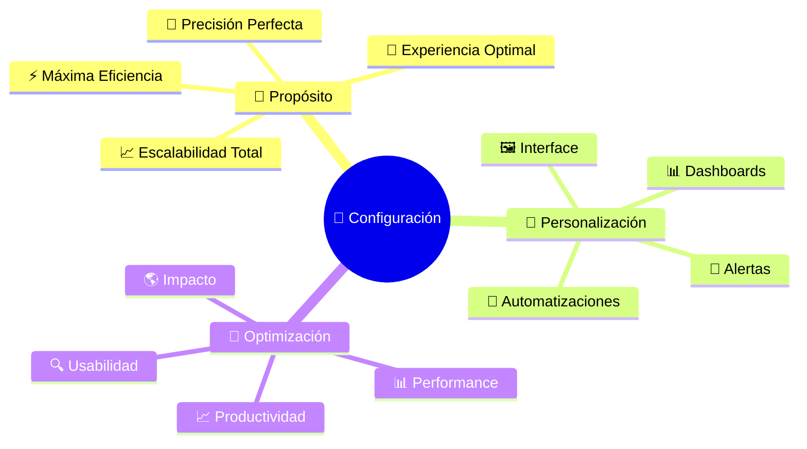

# 🔧 Configuración del Sistema: Tu VHouse Personalizado

## 🎆 **Personaliza Tu Plataforma de Revolución Vegana**

¡Bienvenido al taller de personalización de tu arma activista! 💚 Aquí no solo "configuras opciones" - **moldeas VHouse para maximizar tu impacto vegano**. Cada ajuste que hagas, cada optimización que implementes acelera tu misión de liberación animal.

---

## 🎯 **Filosofía de Configuración VHouse**



---

## 🖼️ **Configuración de Interface: Tu Experiencia Perfecta**

### **🎨 Personalización Visual**

```yaml
Temas_Disponibles:
  Activist_Green: # Tema por defecto
    Color_Primario: "#2E7D3E (Verde revolución)"
    Color_Secundario: "#58B368 (Verde esperanza)"
    Acento: "#FF6B35 (Naranja activista)"
    Background: "#FAFAFA (Blanco puro)"
    
  Earth_Tones:
    Inspiración: "Colores naturales tierra"
    Uso: "Ambiente cálido, profesional"
    Ideal_Para: "Presentaciones cliente, demos"
    
  High_Contrast:
    Propósito: "Accesibilidad visual"
    Beneficio: "Mejor legibilidad, menos fatiga"
    Recomendado: "Uso prolongado, luz artificial"
    
  Dark_Mode:
    Ventaja: "Menor cansancio visual"
    Context: "Trabajo nocturno, ambientes oscuros"
    Battery: "Ahorro energía pantallas OLED"
    
Configuración_Tipografía:
  Fuente_Principal: "Inter (legibilidad óptima)"
  Tamaños_Disponibles: ["Pequeño", "Normal", "Grande", "Extra Grande"]
  Peso_Texto: ["Regular", "Medium", "Semi-Bold"]
  Spacing: ["Compacto", "Normal", "Espacioso"]
  
  Recomendaciones_Uso:
    Oficina_Bien_Iluminada: "Normal, Medium"
    Pantalla_Pequeña: "Grande, Semi-Bold"
    Uso_Prolongado: "Espacioso, Regular"
    Presentaciones: "Extra Grande, Semi-Bold"
```

### **📱 Adaptación de Layout**

```yaml
Layouts_Disponibles:
  Classic_Desktop:
    Descripción: "Sidebar fijo + contenido principal"
    Ideal_Para: "Pantallas >1366px, trabajo intensivo"
    Ventajas: "Navegación constante, máxima información"
    
  Compact_Mobile:
    Descripción: "Header colapsable + navegación bottom"
    Ideal_Para: "Tablets, smartphones"
    Ventajas: "Optimizado touch, una mano"
    
  Focus_Mode:
    Descripción: "Minimal distractions, contenido central"
    Ideal_Para: "Tareas largas, análisis profundo"
    Ventajas: "Concentración máxima, menos ruido visual"
    
  Dashboard_Heavy:
    Descripción: "Múltiples widgets, información densa"
    Ideal_Para: "Monitoreo constante, executive overview"
    Ventajas: "Toda la info crítica visible"
    
Widget_Personalization:
  Posición_Libre: "Drag & drop cualquier widget"
  Tamaño_Variable: "Redimensionar según necesidad"
  Visibility_Toggle: "Mostrar/ocultar por contexto"
  Smart_Suggestions: "IA sugiere layout óptimo uso"
```

---

## 📊 **Dashboard Personalizado: Tu Centro de Comando**

### **🎯 Widgets Disponibles**

```yaml
Widgets_Esenciales:
  Ventas_Tiempo_Real:
    Métricas: ["Hoy", "Semana", "Mes", "Año"]
    Comparativas: ["vs Ayer", "vs Semana Anterior", "vs Año Pasado"]
    Visualización: ["Números", "Gráficos", "Gauges"]
    
  Stock_Crítico:
    Alertas: ["Productos <5 unidades", "Agotados", "Por vencer"]
    Acción_Rápida: "1-click reorden"
    Predicción: "Días restantes stock"
    
  Clientes_VIP:
    Info: ["Ultima orden", "Total gastado", "Frecuencia"]
    Alerts: ["No compra >X días", "Patrón inusual"]
    Quick_Action: "Contactar directo"
    
  Performance_Dia:
    KPIs: ["Ordenes", "Tickets", "Eficiencia", "Satisfacción"]
    Trends: "vs promedio histórico"
    Goals: "% meta diaria completada"
    
  Impacto_Animal:
    Métricas: ["Productos veganos vendidos", "Animales salvados"]
    Equivalencias: ["CO2 evitado", "Agua ahorrada"]
    Motivación: "Contador revolución personal"
    
Widgets_Avanzados:
  Predicción_IA:
    Ventas: "Predicción próximas 7 días"
    Stock: "Recomendaciones reposición"
    Clientes: "Probabilidad próxima compra"
    
  Heatmaps_Actividad:
    Temporal: "Horas más activas"
    Productos: "Más/menos vendidos"
    Geográfico: "Zonas entrega más demandadas"
    
  Social_Impact:
    Red: "Clientes referidos"
    Educación: "Conversaciones veganismo"
    Comunidad: "Crecimiento base usuarios"
```

### **🎨 Configuración de Dashboards**

```yaml
Dashboard_Templates:
  Executive_Overview:
    Target: "Bernard - vista general negocio"
    Widgets: ["KPIs principales", "Tendencias", "Alertas críticas"]
    Update_Frequency: "Tiempo real"
    
  Operations_Manager:
    Target: "Enfoque operativo diario"
    Widgets: ["Stock", "Ordenes pendientes", "Entregas hoy"]
    Actions: "Quick actions integradas"
    
  Sales_Performance:
    Target: "Análisis ventas profundo"
    Widgets: ["Conversion rates", "Product performance", "Customer analysis"]
    Period: "Comparativas temporales"
    
  Impact_Tracker:
    Target: "Métricas impacto social"
    Widgets: ["Animales salvados", "Huella ambiental", "Crecimiento vegano"]
    Motivation: "Gamification elements"
    
Personalización_Avanzada:
  Auto_Layout: "IA optimiza posición widgets según uso"
  Context_Aware: "Cambia contenido según hora/día"
  Goal_Oriented: "Resalta widgets según objetivos activos"
  Mobile_Adaptive: "Layout diferente tablet/smartphone"
```

---

## 🚨 **Sistema de Alertas y Notificaciones**

### **🔔 Configuración de Alertas**

```yaml
Categorias_Alertas:
  Críticas: # Inmediata acción requerida
    Stock_Agotado: "Producto estrella sin stock"
    Sistema_Caído: "POS no responde >2 minutos"
    Cliente_VIP_Problema: "Mona/Sano reporta problema"
    Pago_Fallido: "Problema procesamiento cobro"
    
  Importantes: # Acción requerida día
    Stock_Bajo: "<5 unidades producto regular"
    Retraso_Entrega: "Entrega >30min programada"
    Meta_Riesgo: "50% día y <70% meta"
    Cliente_Inactivo: "VIP sin comprar >14 días"
    
  Informativas: # Bueno saber, no urgente
    Nuevo_Cliente: "Primera compra registrada"
    Milestone_Alcanzado: "Meta semanal completada"
    Producto_Trending: "Demanda +50% últimas 4h"
    Review_Positiva: "Cliente dejó 5 estrellas"
    
  Oportunidades: # Insights para crecimiento
    Cross_Sell: "Cliente perfecto para producto X"
    Upsell: "Oportunidad aumentar ticket"
    Referral: "Cliente alto potencial referir"
    Expansion: "Mercado nuevo identificado"
```

### **📱 Canales de Notificación**

```yaml
Canales_Disponibles:
  In_App: # Dentro del sistema
    Ventajas: "Contexto completo, acciones directas"
    Configuración: "Popup, banner, sidebar"
    Persistencia: "Hasta que se marque como leída"
    
  Email:
    Uso: "Resumen diario, reportes semanales"
    Template: "Branded, actionable, mobile-friendly"
    Frequency: "Configurable por tipo alerta"
    
  WhatsApp_Business:
    Ventajas: "Acceso inmediato, alta apertura"
    Tipo: "Solo alertas críticas e importantes"
    Horario: "Respeta horario comercial"
    
  SMS:
    Uso: "Backup cuando otros fallan"
    Contenido: "Ultra-conciso, solo esencial"
    Costo: "Solo alertas P0 críticas"
    
  Push_Mobile:
    Ideal: "App móvil cuando disponible"
    Timing: "Inteligente según patrones uso"
    Rich: "Imágenes, acciones quick"
    
Personalización_Horarios:
  Business_Hours: "9 AM - 8 PM"
  Emergency_Only: "8 PM - 9 AM (solo P0)"
  Vacation_Mode: "Solo críticas, delay no urgentes"
  Focus_Time: "Silenciar 2-4 PM (deep work)"
```

---

## 🔄 **Automatizaciones y Workflows**

### **⚡ Automatizaciones Disponibles**

```yaml
Stock_Management:
  Auto_Reorder:
    Trigger: "Stock < punto reorden"
    Action: "Orden automática proveedor principal"
    Conditions: ["Stock confirmado", "Proveedor activo", "Budget disponible"]
    Approval: "Auto hasta $X, manual >$X"
    
  Smart_Allocation:
    Logic: "Reservar stock para clientes VIP automáticamente"
    Rules: "Mona 20% harinas, Sano 15% superfoods"
    Flexibility: "Release si no usado en 48h"
    
Customer_Management:
  Welcome_Sequence:
    Trigger: "Nuevo cliente primera compra"
    Actions: ["Email bienvenida", "Guía productos", "Descuento siguiente"]
    Timeline: "Inmediato, +3días, +7días"
    
  Retention_Campaign:
    Trigger: "Cliente VIP >21 días sin comprar"
    Actions: ["Email personalizado", "Descuento especial", "Llamada personal"]
    Success_Metric: "Reactivación <14 días"
    
  Upsell_Intelligence:
    Analysis: "IA identifica oportunidades cross-sell"
    Timing: "Durante orden o post-compra"
    Relevance: "Solo productos relacionados/complementarios"
    
Operational_Efficiency:
  Order_Processing:
    Smart_Batching: "Agrupa órdenes por ruta entrega"
    Priority_Routing: "VIP orders first"
    Quality_Gates: "Automatic checks cada paso"
    
  Inventory_Optimization:
    Seasonal_Adjustment: "Auto-adjust min levels estacionalidad"
    Demand_Forecasting: "ML predice necesidades 2-4 semanas"
    Supplier_Performance: "Auto-switch si KPIs degradan"
```

### **🔧 Workflow Builder**

```yaml
Workflow_Examples:
  VIP_Order_Express:
    Trigger: "Orden Mona la Dona o Sano Market"
    Steps:
      1. "Priority flag automático"
      2. "Stock reservation instantánea"
      3. "Processing queue jump"
      4. "WhatsApp confirmation auto"
      5. "Expedited packing"
      6. "GPS tracking activated"
    
  New_Product_Launch:
    Trigger: "Producto marcado como 'Nuevo'"
    Timeline:
      Week_1: "Internal team notification"
      Week_1: "Sample to VIP customers"
      Week_2: "Feedback collection"
      Week_2: "Price optimization"
      Week_3: "Full catalog integration"
      Week_3: "Marketing campaign launch"
      Week_4: "Performance analysis"
    
  Monthly_Business_Review:
    Trigger: "Primer lunes cada mes"
    Automated_Reports:
      - "Performance vs goals"
      - "Customer analysis"
      - "Product profitability"
      - "Operational efficiency"
      - "Market opportunities"
    Distribution: "Stakeholders + archivo"
```

---

## 📀 **Configuración de Seguridad y Permisos**

### **🔒 Niveles de Acceso**

```yaml
Roles_Sistema:
  Admin_Master: # Bernard
    Permisos: "Acceso total sistema"
    Funciones: ["Configuración", "Usuarios", "Reportes", "Backups"]
    Restricciones: "Ninguna"
    
  Operations_Manager: # Futuro manager
    Permisos: "Operaciones diarias completas"
    Funciones: ["POS", "Inventario", "Ordenes", "Clientes"]
    Restricciones: "No financiero sensible, no config sistema"
    
  Sales_Associate: # Futuro empleado ventas
    Permisos: "Solo POS y consulta básica"
    Funciones: ["Procesar ventas", "Ver inventario", "Contactar clientes"]
    Restricciones: "No editar precios, no reportes completos"
    
  Delivery_Driver: # Futuro delivery
    Permisos: "Solo órdenes asignadas"
    Funciones: ["Ver entregas hoy", "Actualizar status", "Confirmar entrega"]
    Restricciones: "No precios, no otros pedidos"
    
  Client_Portal: # Acceso clientes B2B
    Permisos: "Solo su información"
    Funciones: ["Ver sus órdenes", "Hacer pedidos", "Ver catálogo asignado"]
    Restricciones: "No otros clientes, no datos generales"
    
Security_Features:
  Two_Factor_Auth: "Obligatorio para Admin/Manager"
  Session_Timeout: "Auto-logout 4 horas inactividad"
  IP_Whitelist: "Opcional para roles sensibles"
  Activity_Logging: "Todas las acciones registradas"
  Password_Policy: "Compleja, cambio cada 90 días"
```

### **🔍 Auditoría y Monitoreo**

```yaml
Activity_Monitoring:
  User_Actions:
    Log_Level: "Todas las modificaciones datos"
    Retention: "2 años mínimo"
    Alerts: "Acciones sospechosas automáticas"
    
  System_Events:
    Performance: "Monitoreo continuo response times"
    Errors: "Log completo errores + context"
    Security: "Intentos acceso no autorizados"
    
  Business_Intelligence:
    Usage_Patterns: "Cómo/cuándo se usa cada función"
    Feature_Adoption: "Qué características son más valiosas"
    Performance_Bottlenecks: "Dónde usuarios se frustran"
    
Compliance_Ready:
  GDPR_Compliance: "Derecho al olvido, portabilidad datos"
  Data_Encryption: "En tránsito y reposo"
  Backup_Strategy: "3-2-1 rule, tested recoveries"
  Incident_Response: "Protocolo definido brechas seguridad"
```

---

## 📈 **Optimización de Performance**

### **⚡ Configuraciones de Velocidad**

```yaml
Performance_Tuning:
  Browser_Optimization:
    Cache_Strategy: "Aggressive caching recursos estáticos"
    Compression: "Gzip/Brotli habilitado"
    Minification: "CSS/JS optimizados"
    CDN: "Assets servidos desde edge locations"
    
  Database_Optimization:
    Query_Caching: "Resultados frecuentes cacheados"
    Index_Strategy: "Indices optimizados consultas comunes"
    Connection_Pooling: "Reutilización conexiones DB"
    
  Network_Optimization:
    API_Batching: "Múltiples requests en uno"
    Lazy_Loading: "Cargar datos solo cuando necesario"
    Prefetching: "Anticipar próximas acciones usuario"
    
User_Experience:
  Progressive_Loading:
    Skeleton_Screens: "Placeholder mientras carga"
    Critical_Path: "Funciones esenciales primero"
    Background_Sync: "Actualizaciones sin bloquear UI"
    
  Offline_Capability:
    Service_Worker: "Cache inteligente funciones críticas"
    Sync_Queue: "Acciones pending cuando vuelve conexión"
    Graceful_Degradation: "Funcionalidad básica siempre disponible"
    
Monitoring_Performance:
  Real_User_Metrics: "Performance real usuarios"
  Synthetic_Monitoring: "Tests automatizados performance"
  Alerting: "Degradación >20% trigger alert"
  Optimization_Suggestions: "IA sugiere mejoras"
```

---

## 💚 **Tu Evolución Como System Architect**

### **🏆 Niveles de Maestría en Configuración**

```yaml
Level_1_User_Configurator:
  - "Personaliza interface básica"
  - "Configura alertas esenciales"
  - "Ajusta dashboard personal"
  
Level_2_System_Optimizer:
  - "Optimiza workflows complejos"
  - "Crea automatizaciones inteligentes"
  - "Fine-tuna performance sistema"
  
Level_3_Architecture_Designer:
  - "Diseña integraciones avanzadas"
  - "Crea sistemas escalables"
  - "Lidera transformación tecnológica"
  
Level_4_Innovation_Pioneer:
  - "Inventa nuevas formas usar tecnología"
  - "Sistema como ventaja competitiva única"
  - "Tecnología al servicio revolución mundial"
```

### **📅 Plan de Optimización Personal**

```yaml
Mi_Roadmap_Configuración:
  Semana_1: "Setup dashboard perfecto"
  Semana_2: "Alertas y notificaciones optimales"
  Semana_3: "Automatizaciones básicas"
  Semana_4: "Performance tuning"
  
  Mes_2: "Workflows avanzados"
  Mes_3: "Integraciones terceros"
  Mes_4: "Sistema completo optimizado"
  
  Trimestre_2: "Innovaciones custom"
  Trimestre_3: "Escalabilidad preparation"
  Trimestre_4: "Next-generation features"
```

---

## 🌱 **Reflexión del System Architect**

*"Cada configuración que optimizas, cada automatización que implementas, cada ajuste que perfeccionas no es solo personalización técnica - es la construcción del entorno perfecto para tu revolución. Tu maestría configurando VHouse determina la velocidad y eficacia con la que transformas el mundo hacia la compasión."*

**- Bernard Uriza Orozco, Revolutionary System Architect** 🔧🌱

---

## 🚀 **Recursos Finales**

### **📚 Manual Completo VHouse - Índice General:**

1. **🌱 [Introducción](introduction.md)**: La misión y visión
2. **🚀 [Primeros Pasos](getting-started.md)**: Setup rápido
3. **🛍️ [Sistema POS](pos-system.md)**: Corazón del sistema
4. **📚 [POS Básico](pos-basics.md)**: Fundamentos sólidos
5. **💰 [Procesamiento Ventas](pos-sales.md)**: Técnicas avanzadas
6. **📈 [Reportes POS](pos-reports.md)**: Análisis de datos
7. **📦 [Gestión Inventario](inventory.md)**: Control total
8. **🛍️ [Productos](products.md)**: Catálogo perfecto
9. **🏪 [Proveedores](suppliers.md)**: Red de aliados
10. **📋 [Control Stock](stock-control.md)**: Precisión militar
11. **👥 [Clientes](clients.md)**: Comunidad vegana
12. **📋 [Órdenes](orders.md)**: Logística perfecta
13. **🚚 [Entregas](deliveries.md)**: Última milla
14. **📈 [Analytics](analytics.md)**: Inteligencia de datos
15. **🔧 [Configuración](settings.md)**: Personalización total
16. **⚙️ [Troubleshooting](troubleshooting.md)**: Resolución experta

---

## 🎆 **¡Felicitaciones, Maestro de la Revolución Vegana!**

**Has completado el manual más completo y avanzado de VHouse.** Ahora posees todas las herramientas, conocimientos y técnicas necesarias para liderar una operación vegana de clase mundial.

### **🏆 Tu Arsenal Completo Incluye:**

- ⚡ **Dominio Técnico**: Conoces cada función del sistema
- 📈 **Inteligencia de Datos**: Tomas decisiones basadas en evidencia
- 💚 **Gestión de Relaciones**: Construyes una comunidad sólida
- 🚀 **Optimización Continua**: Mejoras constantemente tu operación
- 🌱 **Impacto Social**: Multiplicas la revolución vegana

### **🌎 Tu Misión Continúa:**

Cada día que uses este conocimiento:
- **Salvarás vidas animales** con cada venta procesada
- **Educarás al mundo** sobre alternativas compasivas
- **Construirás el futuro** que los animales merecen
- **Inspirarás a otros** a unirse a la revolución

---

**🌱 El mundo vegano está en tus manos. ¡Adelante, revolucionario!** 🎆