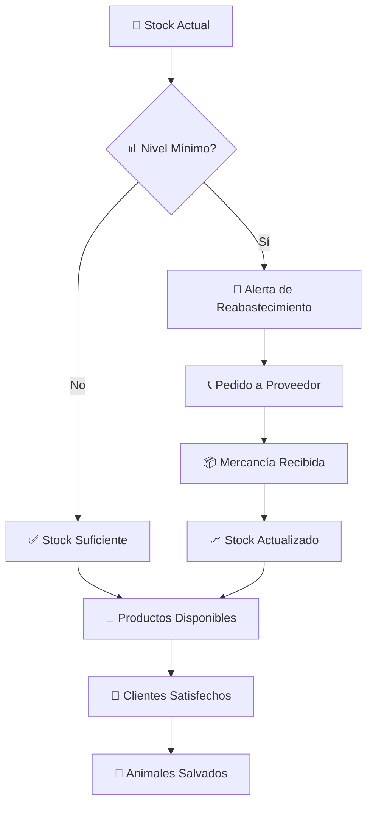

# 📊 Control de Stock

## 📋 Descripción General

El control de stock de VHouse te permite mantener un inventario preciso y actualizado para asegurar que nunca te quedes sin productos veganos para **Mona la Dona** 🍩, **Sano Market** 🥬 y **La Papelería** 📚.

## 🎯 Funcionalidades de Control

### 📈 Monitoreo en Tiempo Real
- Stock actual por producto
- Niveles mínimos de inventario
- Alertas de reabastecimiento
- Predicciones de demanda

### 🔄 Movimientos de Inventario
- Entradas por compras
- Salidas por ventas
- Ajustes de inventario
- Transferencias entre ubicaciones

### 📊 Análisis de Rotación
- Productos de alta rotación
- Productos de baja rotación
- Análisis ABC de inventario
- Optimización de espacio

## 🌱 Impacto en la Liberación Animal

Un control preciso del stock asegura que siempre tengamos productos veganos disponibles, evitando que los clientes opten por alternativas no veganas.

¡Control perfecto = impacto perfecto! 🌱✨