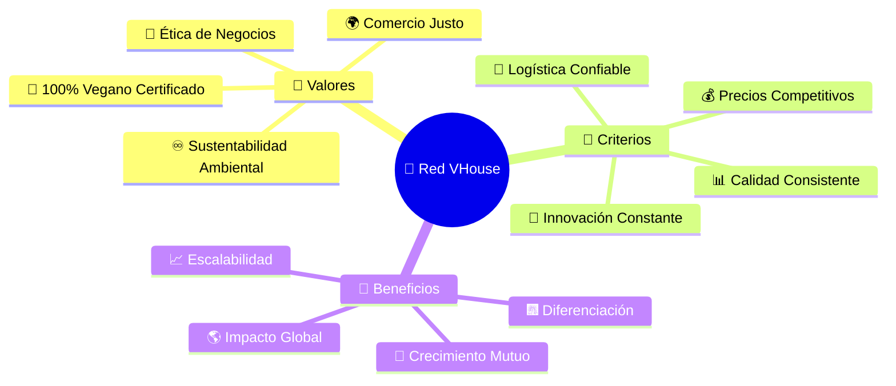
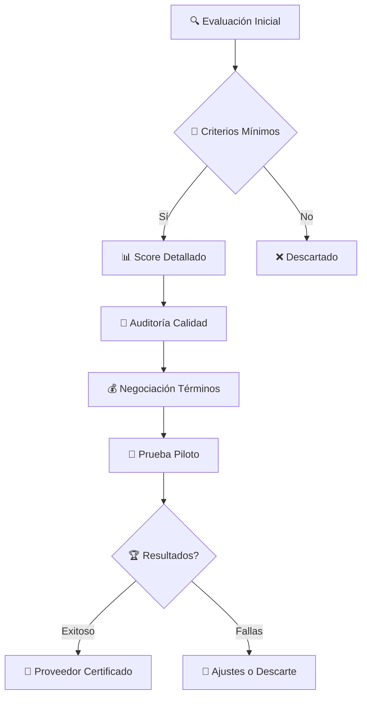
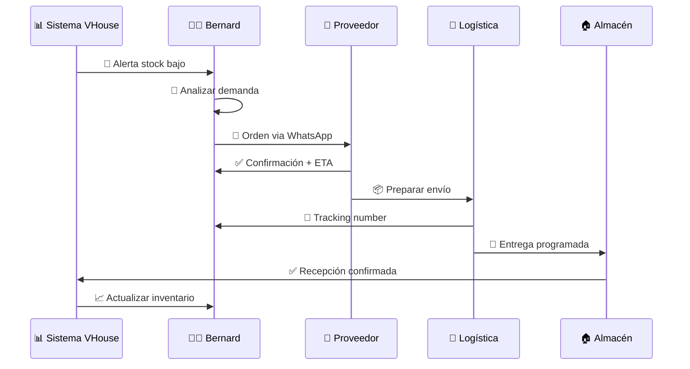
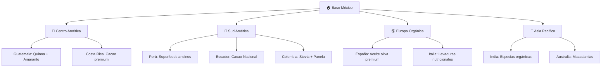
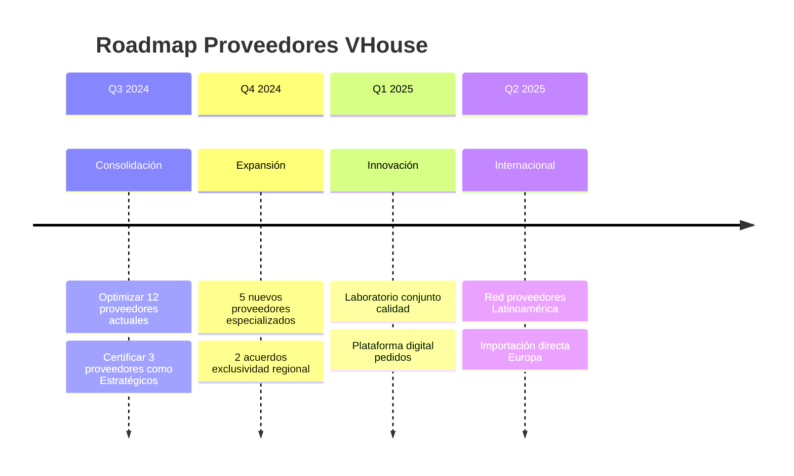

# 🏪 Gestión de Proveedores: Tu Red de Aliados Veganos

## 🌱 **Más que Proveedores: Son Compañeros de Revolución**

¡Bienvenido al ecosistema de aliados que hace posible tu misión vegana! 💚 Aquí no gestionas simples "proveedores" - construyes una **red de revolucionarios comprometidos** con la liberación animal. Cada socio comercial es una extensión de tus valores.

---

## 🎯 **Filosofía de la Red de Aliados VHouse**



---

## 🏆 **Portafolio de Proveedores Estrella**

### **🌾 Orgánicos del Valle - Socio Estratégico #1**

```yaml
Perfil_Completo:
  Nombre: "Orgánicos del Valle S. de R.L."
  Ubicación: "Toluca, Estado de México"
  Años_Relación: 4
  Especialidad: "Quinoa, amaranto y cereales andinos"
  Certificaciones: ["SAGARPA Orgánico", "Fair Trade Mexico", "USDA Organic"]
  
Contacto_Principal:
  Nombre: "Ing. María Elena Gutierrez"
  Puesto: "Directora Comercial"
  WhatsApp: "+52 722 xxx xxxx"
  Email: "comercial@organicosdevalle.mx"
  Mejor_Horario: "9AM - 6PM (Lun-Vie)"
  
Especificaciones_Operativas:
  Tiempo_Entrega: "3-5 días hábiles"
  MOQ_Mínimo: "50 kg por producto"
  Descuento_Volumen: "5% >200kg, 8% >500kg"
  Términos_Pago: "30 días neto"
  Entrega: "CDMX y zona metropolitana incluida"
  
Productos_Estrella:
  Quinoa_Orgánica:
    Variedades: ["Blanca Real", "Tricolor Premium", "Negra Boliviana"]
    Precio: "$89/kg (FOB Toluca)"
    Calidad: "Grado exportación"
    
  Amaranto_Reventado:
    Proceso: "Artesanal en comal de barro"
    Precio: "$67/kg"
    Exclusividad: "Proceso único en México"
    
Ventajas_Competitivas:
  - "Relación directa con 347 productores pequeños"
  - "Trazabilidad completa campo-mesa"
  - "Flexibilidad en cantidades emergencias"
  - "Desarrollo conjunto productos exclusivos"
  
Retos_y_Limitaciones:
  - "Estacionalidad quinoa (Dic-Feb limitado)"
  - "Capacidad producción limitada amaranto"
  - "Sensible a condiciones climáticas"
```

### **🥥 NaturaVida Premium - Especialista en Aceites**

```yaml
Perfil_Estratégico:
  Empresa: "NaturaVida Premium S.A. de C.V."
  Ubicación: "Guadalajara, Jalisco"
  Fundación: 2018
  Enfoque: "Aceites prensados en frío y superfoods"
  
Fortalezas_Clave:
  Infraestructura:
    - "Prensa hidráulica 40 toneladas"
    - "Almacén temperatura controlada"
    - "Laboratorio calidad in-house"
    - "Certificación ISO 22000"
    
  Productos_Exclusivos:
    Aceite_Coco_Extra_Virgen:
      Origen: "Colima, México (comercio directo)"
      Proceso: "Prensado <40°C, 0 químicos"
      Precio: "$185/L (precio mayorista)"
      Diferenciador: "Único aceite coco mexicano premium"
      
    MCT_Oil_Premium:
      Concentración: "70% C8, 30% C10"
      Pureza: "99.8% (analizada por lote)"
      Precio: "$420/L"
      Market: "Nicho keto/biohacking"
      
  Relación_Comercial:
    Años_Trabajando: 3
    Contacto_Directo: "CEO Lic. Roberto Sandoval"
    Comunicación: "WhatsApp directo + videollamadas mensuales"
    Flexibilidad: "Ajustan producción a nuestras necesidades"
    
  Términos_Preferenciales:
    Descuentos: "Cliente VIP - 12% en órdenes >$25K"
    Pago: "45 días neto (vs 30 estándar)"
    Muestras: "Nuevos productos gratis para testing"
    Exclusividad: "Primera opción productos innovadores"
```

### **🌿 SuperFoods Andes - Productos Únicos Globales**

```yaml
Posicionamiento_Nicho:
  Empresa: "SuperFoods Andes Import/Export"
  Modelo: "Importador directo Sud América"
  Ventaja: "Productos auténticos origen"
  
Red_Internacional:
  Perú: "Maca gelatinizada Junin, Cacao ceremonial Cusco"
  Bolivia: "Quinoa real altiplano, Chía negra Tarija"
  Ecuador: "Cacao Nacional Fino Aroma"
  Colombia: "Panela orgánica, Stevia premium"
  
Productos_Diferenciadores:
  Maca_Gelatinizada_Premium:
    Origen: "Meseta Bombón, Junin 4,100m altitud"
    Proceso: "Gelatinizada para absorción óptima"
    Concentración: "4:1 (4kg maca fresca = 1kg polvo)"
    Precio: "$280/kg"
    Certificación: "EU Organic + USDA + JAS Japan"
    
  Cacao_Ceremonial_Criollo:
    Origen: "Cooperativa Machu Picchu, Cusco"
    Variedad: "Chuncho (variedad ancestral)"
    Proceso: "Fermentado 7 días, secado solar"
    Precio: "$450/kg"
    Uso: "Ceremonias cacao + chocolatería premium"
    
Operación_Logística:
  Importación: "Contenedor completo cada 2 meses"
  Tiempos: "21 días Puerto Callao - México"
  Almacenaje: "CDMX - bodega fiscal"
  Entrega_Nacional: "5-7 días cualquier ciudad"
  
Retos_Gestión:
  - "Variaciones precio por tipo cambio"
  - "Disponibilidad estacional algunos productos"
  - "Tiempos importación dependientes aduana"
  - "MOQ alto por importación ($50K MXN mínimo)"
```

---

## 🤝 **Estrategias de Relación y Negociación**

### **📋 Framework de Evaluación de Proveedores**



**Matriz de Evaluación (100 puntos máximo):**

```yaml
Criterios_Puntuación:
  Calidad_Producto: # 30 puntos
    Certificaciones: "10 pts"
    Consistencia: "10 pts" 
    Diferenciación: "10 pts"
    
  Confiabilidad_Operativa: # 25 puntos
    Tiempo_Entrega: "10 pts"
    Cumplimiento_Ordenes: "8 pts"
    Comunicación: "7 pts"
    
  Competitividad_Comercial: # 20 puntos
    Precio_Mercado: "10 pts"
    Términos_Pago: "5 pts"
    Flexibilidad_MOQ: "5 pts"
    
  Alineación_Valores: # 15 puntos
    Certificación_Vegana: "8 pts"
    Prácticas_Sustentables: "4 pts"
    Comercio_Justo: "3 pts"
    
  Potencial_Crecimiento: # 10 puntos
    Capacidad_Escalamiento: "5 pts"
    Innovación: "3 pts"
    Visión_Largo_Plazo: "2 pts"
    
Rangos_Clasificación:
  90-100: "🌟 Socio Estratégico"
  80-89: "🏅 Proveedor Preferente"
  70-79: "✅ Proveedor Aceptable"
  60-69: "⚠️ Proveedor Condicional"
  <60: "❌ No Califica"
```

### **💰 Técnicas de Negociación Gana-Gana**

```yaml
Preparación_Negociación:
  Research_Previo:
    - "Análisis competencia (precios, términos)"
    - "Historial relación comercial"
    - "Situación financiera proveedor"
    - "Estacionalidad y tendencias mercado"
    
  Objetivos_Claros:
    Principal: "Mejor precio manteniendo calidad"
    Secundario: "Mejores términos pago"
    Terciario: "Exclusividades o preferencias"
    
  BATNA_Definido: # Best Alternative to Negotiated Agreement
    Plan_B: "Proveedor alternativo identificado"
    Precio_Límite: "Umbral máximo aceptable"
    Tiempo_Decisión: "Deadline para acuerdo"
    
Tácticas_Efectivas:
  Volumen_Commitment:
    "Ofrecemos compromiso 6 meses compra garantizada
     a cambio de 8% descuento adicional"
     
  Payment_Terms_Trade:
    "Aceptamos pago 15 días (vs 30 actual) 
     por 5% descuento adicional en órdenes"
     
  Exclusive_Partnership:
    "Exclusividad regional (solo VHouse en CDMX)
     a cambio de precio especial y soporte marketing"
     
  Innovation_Collaboration:
    "Co-desarrollo productos exclusivos
     con inversión compartida I+D"
     
Frases_Poder_Negociación:
  - "Necesitamos ser socios, no solo proveedor-cliente"
  - "Nuestro crecimiento es su crecimiento"
  - "Buscamos relación long-term, no transaccional"
  - "Qué necesitan de nosotros para darnos mejor precio?"
```

---

## 📈 **Optimización de la Cadena de Suministro**

### **🔄 Gestión de Órdenes de Compra Inteligente**



**Optimización de Frecuencias de Pedido:**

```yaml
Estrategias_Por_Producto:
  Alta_Rotación: # Quinoa, Aceite Coco
    Frecuencia: "Semanal"
    Cantidad: "2 semanas consumo"
    Proveedor: "Local preferente"
    
  Rotación_Media: # Harinas especiales
    Frecuencia: "Quincenal"
    Cantidad: "1 mes consumo"
    Proveedor: "Regional confiable"
    
  Rotación_Lenta: # Superfoods premium
    Frecuencia: "Mensual"
    Cantidad: "6-8 semanas consumo"
    Proveedor: "Especializado internacional"
    
  Productos_Estacionales: # Especias navideñas
    Frecuencia: "Anual programado"
    Cantidad: "Temporada completa"
    Timing: "Julio (preparación Dic)"
    
Beneficios_Optimización:
  Cash_Flow: "+30% mejora liquidez"
  Espacio_Almacén: "-25% espacio ocupado"
  Productos_Frescos: "+40% rotación"
  Costo_Almacenamiento: "-15% costos operativos"
```

### **📊 Analytics de Proveedores**

```yaml
KPIs_Por_Proveedor:
  Orgánicos_del_Valle:
    On_Time_Delivery: "94% (últimos 12 meses)"
    Calidad_Consistente: "98% lotes aprobados"
    Precio_Competitivo: "Rango medio-alto mercado"
    Servicio_Cliente: "9.2/10 rating interno"
    
  NaturaVida_Premium:
    On_Time_Delivery: "97%"
    Calidad_Consistente: "99% (élite)"
    Precio_Competitivo: "Premium justificado"
    Innovación: "3 productos nuevos/año"
    
  SuperFoods_Andes:
    On_Time_Delivery: "87% (factor importación)"
    Calidad_Consistente: "96%"
    Productos_Únicos: "60% portafolio exclusivo"
    Rentabilidad: "Márgenes 45-55%"
    
Comparativas_Benchmarking:
  Mejor_Precio: "🌾 Orgánicos Valle (productos base)"
  Mejor_Calidad: "🥥 NaturaVida (aceites premium)"
  Más_Innovador: "🌿 SuperFoods Andes (productos únicos)"
  Mejor_Servicio: "🥥 NaturaVida (comunicación excepcional)"
  Mayor_Confiabilidad: "🌾 Orgánicos Valle (4 años sin fallas)"
```

---

## 🚀 **Desarrollo de Proveedores y Crecimiento Conjunto**

### **🌱 Programa de Desarrollo de Proveedores**

```yaml
Objetivo_Programa:
  "Transformar proveedores buenos en socios excepcionales
   mediante colaboración estratégica y crecimiento mutuo"
   
Componentes_Desarrollo:
  Capacitación_Técnica:
    - "Talleres certificaciones orgánicas"
    - "Mejores prácticas almacenamiento"
    - "Control calidad y trazabilidad"
    - "Packaging sustentable"
    
  Soporte_Comercial:
    - "Pronósticos demanda compartidos"
    - "Financiamiento proyectos conjuntos"
    - "Marketing co-branded"
    - "Acceso red contactos VHouse"
    
  Innovación_Conjunta:
    - "Co-desarrollo productos exclusivos"
    - "Testing nuevas tecnologías"
    - "Investigación tendencias mercado"
    - "Laboratorio calidad compartido"
    
Casos_Éxito_Desarrollo:
  Proveedor_Local_Artesanal:
    Antes: "Producción 50kg/mes, calidad variable"
    Intervención: "Capacitación + equipo + financiamiento"
    Después: "Producción 200kg/mes, certificación orgánica"
    Resultado: "Proveedor exclusivo amaranto premium"
    
  Cooperativa_Mujeres_Oaxaca:
    Antes: "Venta local, precios bajos"
    Intervención: "Certificación Fair Trade + canal directo"
    Después: "Exportación CDMX, precios justos"
    Impacto: "47 familias beneficiadas directamente"
```

### **🌎 Expansión Internacional de Red**



---

## 🔄 **Gestión de Riesgos en Cadena de Suministro**

### **⚠️ Identificación y Mitigación de Riesgos**

```yaml
Riesgos_Críticos:
  Concentración_Proveedor:
    Riesgo: "80% quinoa de un solo proveedor"
    Impacto: "Desabasto crítico si falla"
    Mitigación: "Desarrollar 2 proveedores alternativos"
    Timeline: "Q4 2024"
    
  Dependencia_Importación:
    Riesgo: "Superfoods 100% importados"
    Impacto: "Variación tipo cambio + aduanas"
    Mitigación: "Stock seguridad + contratos forward"
    Inversión: "$15K buffer inventory"
    
  Estacionalidad_Extrema:
    Riesgo: "Amaranto solo cosecha Oct-Dic"
    Impacto: "9 meses stock único"
    Mitigación: "Almacenamiento controlado + proveedores multi-región"
    
  Calidad_Inconsistente:
    Riesgo: "Lotes defectuosos productos naturales"
    Impacto: "Rechazos + clientes insatisfechos"
    Mitigación: "Protocolo QC + muestras previas + seguro calidad"
    
Plan_Contingencia:
  Proveedor_Principal_Falla:
    Hora_0: "Activar proveedor backup"
    Hora_4: "Comunicar a clientes afectados"
    Hora_24: "Orden emergencia proveedor alternativo"
    Día_3: "Evaluar causa raíz + acción correctiva"
    
  Crisis_Logística_Nacional:
    "Stock emergencia 15 días productos críticos"
    "Acuerdos previos transporte alternativo"
    "Comunicación proactiva expectativas clientes"
```

---

## 📁 **Gestión Documental y Compliance**

### **📄 Documentación Esencial por Proveedor**

```yaml
Carpeta_Digital_Proveedor:
  Documentación_Legal:
    - "RFC y Constancia Situación Fiscal"
    - "Acta Constitutiva"
    - "Poder Notarial representante"
    - "Contrato Marco Suministro"
    
  Certificaciones_Calidad:
    - "Certificado Orgánico vigente"
    - "HACCP / BPM si aplica"
    - "Análisis microbiologicos por lote"
    - "Certificaciones internacionales"
    
  Información_Comercial:
    - "Lista precios actualizada"
    - "Términos y condiciones"
    - "Política descuentos"
    - "Catálogo productos completo"
    
  Evaluaciones_Performance:
    - "Auditorías anuales"
    - "KPIs trimestrales"
    - "Feedback clientes internos"
    - "Plan mejora anual"
    
Sistema_Archivo:
  Estructura: "Proveedor/Año/Categoría/Documento"
  Acceso: "Google Drive compartido + backup local"
  Actualización: "Revisión trimestral obligatoria"
  Notificaciones: "Alertas vencimientos certificaciones"
```

---

## 📊 **Dashboard de Gestión de Proveedores**

### **📈 Métricas Clave en Tiempo Real**

```yaml
Widget_Principal:
  Proveedores_Activos: "12 proveedores"
  Órdenes_Pendientes: "7 órdenes ($47K MXN)"
  Entregas_Esta_Semana: "4 entregas programadas"
  Alertas_Críticas: "2 vencimientos certificación"
  
Gráficos_Performance:
  On_Time_Delivery:
    Orgánicos_Valle: 94%
    NaturaVida: 97%
    SuperFoods_Andes: 87%
    Promedio_General: 93%
    Meta: 95%
    
  Calidad_Lotes:
    Aprobados_Primer_Intento: 96%
    Rechazados_Calidad: 2%
    Devoluciones: 2%
    
  Costo_Total_Ownership:
    Precio_Producto: 78%
    Logística: 12%
    Calidad/Reclamos: 3%
    Administrativo: 7%
    
Alertas_Automatizadas:
  - "🚨 Certificación orgánica NaturaVida vence en 30 días"
  - "⚠️ Retraso SuperFoods: orden #1234 +3 días"
  - "📈 Oportunidad: precio quinoa -8% en mercado spot"
  - "🎉 Nuevo proveedor hemp oil califició como 'Preferente'"
```

---

## 🚀 **Innovación y Futuro de la Red**

### **🔮 Tendencias y Oportunidades 2025**



**Proyectos Estratégicos:**

```yaml
Plataforma_Digital_Proveedores:
  Objetivo: "Portal self-service proveedores"
  Funciones:
    - "Subida catálogos + precios"
    - "Tracking órdenes tiempo real"
    - "Facturación electrónica integrada"
    - "Analytics conjunto performance"
  Timeline: "Desarrollo Q4 2024 - Lanzamiento Q1 2025"
  Inversión: "$25K MXN desarrollo + $3K/mes mantenimiento"
  
Laboratorio_Calidad_Compartido:
  Objetivo: "Certificación calidad in-house"
  Socios: "NaturaVida + Orgánicos Valle + VHouse"
  Capacidad: "200 análisis/mes"
  Ahorro: "40% vs laboratorios externos"
  Ubicación: "Toluca (central para socios)"
  
Programa_Sustentabilidad:
  Meta: "100% proveedores con certificación sustentable"
  Componentes:
    - "Huella carbono neutralizada"
    - "Packaging biodegradable 80%"
    - "Energías renovables 60%"
    - "Cero desperdicio programas"
```

---

## 💚 **Tu Evolución Como Constructor de Redes**

### **🏆 Niveles de Maestría en Proveedores**

```yaml
Nivel_1_Comprador:
  - Encuentra proveedores básicos
  - Negocia precios reactivamente
  - Relación transaccional simple
  
Nivel_2_Gestor:
  - Evalúa proveedores sistemáticamente
  - Diversifica riesgos inteligentemente
  - Construye relaciones sólidas
  
Nivel_3_Estratéga:
  - Co-desarrolla productos únicos
  - Lidera innovación en cadena
  - Crea ventajas competitivas sostenibles
  
Nivel_4_Ecosistema_Builder:
  - Transforma industrias completas
  - Impacta positivamente comunidades
  - Red de proveedores como motor cambio social
```

---

## 🌱 **Reflexión del Ecosystem Builder**

*"Tu red de proveedores no es solo una cadena de suministro - es una red de activistas comprometidos con la transformación del mundo. Cada relación comercial que cultivas multiplica el impacto vegano exponencialmente. Cuando eliges proveedores alineados con tus valores, no solo compras productos: construyes el futuro compasivo que los animales necesitan."*

**- Bernard Uriza Orozco, Ecosystem Revolutionary** 🏪🌱

---

## 🚀 **Próximos Pasos en Tu Maestría**

### **📚 Continúa Perfeccionando Tu Operación:**

1. **📋 [Control de Stock Avanzado](stock-control.md)**: Precisión militar en inventarios
2. **📎 [Órdenes y Entregas](orders.md)**: Logística de impacto
3. **🚚 [Gestión de Entregas](deliveries.md)**: Última milla perfecta
4. **📈 [Analytics Empresariales](analytics.md)**: Decisiones basadas en datos

---

**🎯 ¿Listo para perfeccionar tu control de stock?** Continúa con **[Control de Stock: Precisión Militar Para Tu Arsenal](stock-control.md)** →