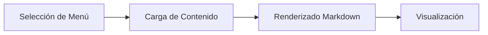

# Documento de Prueba

Este es un documento de prueba para verificar que el cambio dinámico de contenido funciona correctamente.

## Características de Prueba

- Cambio dinámico de contenido
- Renderizado de Markdown
- Integración con el menú lateral

### Verificación

Si puedes ver este contenido al seleccionar diferentes elementos del menú, entonces la funcionalidad está funcionando correctamente.

---

**Prueba exitosa** si este contenido se muestra al cambiar entre documentos.