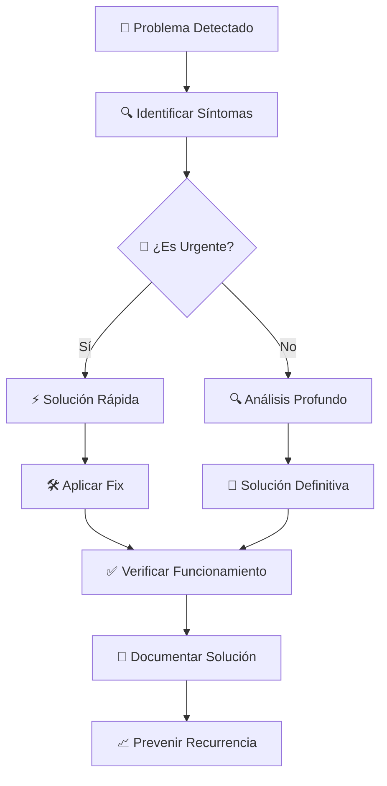

# ⚙️ Troubleshooting: Resuelve Cualquier Desafío Como Un Pro

## 🚀 **Ningún Problema Puede Detener Tu Revolución Vegana**

¡Tranquilo, activista! 💚 Incluso los sistemas más revolucionarios enfrentan desafíos ocasionales. Aquí tienes tu **guía maestra para resolver cualquier situación** y mantener tu operación vegana funcionando perfectamente. Cada problema es una oportunidad de aprendizaje.

---

## 🎯 **Metodología de Resolución: El Método VHouse**



### **🏆 Principios de Troubleshooting Activista**

```yaml
Philosophy_Debug:
  Mantra: "Cada problema resuelto fortalece la revolución"
  
  Approach:
    1. "Mantener la calma - los animales confían en nosotros"
    2. "Documentar todo - el conocimiento se comparte"
    3. "Solucionar rápido pero pensar a largo plazo"
    4. "Prevenir mejor que curar"
    5. "Cada error es aprendizaje para la comunidad"
    
  Priority_Matrix:
    P0_Crítico: "Sistema caído, ventas imposibles"
    P1_Alto: "Funcionalidad clave afectada"
    P2_Medio: "Inconvenientes operativos"
    P3_Bajo: "Mejoras y optimizaciones"
```

---

## 🚨 **Problemas Críticos (P0): Solución Inmediata**

### **🔴 Sistema POS No Responde**

```yaml
Síntomas:
  - "Pantalla congelada en POS"
  - "No se procesan órdenes"
  - "Error de conexión"
  
Diagnóstico_Rápido:
  1. "Verificar conexión internet: ping google.com"
  2. "Revisar consumo CPU/RAM en Task Manager"
  3. "Comprobar logs de error en navegador (F12)"
  
Soluciones_Inmediatas:
  Nivel_1: # 30 segundos
    - "F5 - Recargar página"
    - "Ctrl+Shift+R - Hard refresh"
    - "Cerrar y abrir navegador"
    
  Nivel_2: # 2 minutos
    - "Reiniciar navegador completamente"
    - "Limpiar cache y cookies: Ctrl+Shift+Delete"
    - "Probar navegador alternativo (Chrome/Firefox/Edge)"
    
  Nivel_3: # 5 minutos
    - "Reiniciar computadora"
    - "Verificar firewall/antivirus bloqueando"
    - "Probar desde dispositivo alternativo"
    
Workaround_Emergencia:
  "Si persiste problema:"
  - "Usar smartphone como POS backup"
  - "Anotar ventas manual + procesar después"
  - "Contactar clientes para reprogramar si necesario"
```

### **📶 Problemas de Conexión**

```yaml
Síntomas_Comunes:
  - "Datos no se guardan"
  - "Inventario no actualiza"
  - "Mensajes 'Sin conexión'"
  
Diagnóstico_Red:
  Windows:
    - "ipconfig /all (verificar IP)"
    - "ping 8.8.8.8 (test internet)"
    - "nslookup vhouse.com (DNS)"
    - "tracert vhouse.com (ruta conexión)"
    
  Chrome_DevTools:
    - "F12 > Network tab"
    - "Buscar requests fallidos (red)"
    - "Verificar response codes"
    
Soluciones_Escalonadas:
  Immediate: # <1 minuto
    - "Desconectar/reconectar WiFi"
    - "Cambiar a datos móviles temporalmente"
    - "Reiniciar router si accesible"
    
  Short_Term: # 5 minutos
    - "ipconfig /release && ipconfig /renew"
    - "Cambiar DNS a 8.8.8.8 y 8.8.4.4"
    - "Desactivar VPN si activa"
    
  Network_Reset: # 15 minutos
    - "netsh winsock reset"
    - "netsh int ip reset"
    - "Reiniciar computadora"
```

---

## ⚠️ **Problemas de Alta Prioridad (P1)**

### **📦 Inventario Desincronizado**

```yaml
Problema_Desc:
  "Stock mostrado no coincide con realidad física"
  
Causas_Comunes:
  - "Ventas no procesadas completamente"
  - "Recepción mercadería no registrada"
  - "Múltiples dispositivos simultáneos"
  - "Interrupciones durante actualizaciones"
  
Solución_Paso_a_Paso:
  Verification:
    1. "Comprobar órdenes pendientes de procesar"
    2. "Revisar log transacciones últimas 24h"
    3. "Identificar productos con discrepancia"
    
  Correction:
    1. "Realizar conteo físico productos críticos"
    2. "Ajustar manualmente en sistema"
    3. "Procesar órdenes pendientes"
    4. "Verificar sincronización"
    
  Prevention:
    - "Activar alertas discrepancias >5%"
    - "Conteos cíclicos semanales"
    - "Un solo dispositivo para recepciones"
```

### **💰 Problemas de Precios**

```yaml
Escenarios_Típicos:
  Precios_Incorrectos:
    Síntoma: "Cliente reporta precio diferente"
    Verificación:
      - "Confirmar cliente seleccionado correctamente"
      - "Revisar tipo precio activo (Público/POS/Costo)"
      - "Verificar actualización reciente precios"
    
    Fix_Inmediato:
      1. "Cambiar tipo precio correcto"
      2. "Recalcular orden afectada"
      3. "Aplicar ajuste manual si necesario"
      
  Descuentos_No_Aplican:
    Diagnóstico:
      - "Verificar vigencia promoción"
      - "Confirmar condiciones cumplidas"
      - "Revisar configuración cliente"
      
    Resolución:
      - "Aplicar descuento manual con justificación"
      - "Actualizar configuración promoción"
      - "Documentar para corrección sistemática"
```

---

## 🔧 **Problemas Operativos Comunes (P2)**

### **🔍 Búsqueda No Encuentra Productos**

```yaml
Causas_y_Soluciones:
  Producto_Inactivo:
    Check: "Verificar campo 'IsActive' en producto"
    Fix: "Reactivar producto si corresponde"
    
  Stock_Cero:
    Check: "Verificar filtro 'Solo Disponibles' activo"
    Fix: "Desactivar filtro o reabastecer stock"
    
  Typos_Búsqueda:
    Técnica: "Buscar por palabras parciales"
    Ejemplo: "quin" en lugar de "quinoa"
    Alternativa: "Buscar por categoría o emoji"
    
  Base_Datos_Desactualizada:
    Síntoma: "Productos nuevos no aparecen"
    Fix: "F5 para refrescar catálogo"
    Escalación: "Contactar soporte si persiste"
```

### **📱 Problemas de Asistente IA**

```yaml
IA_No_Responde:
  Verificaciones:
    - "Conexión internet estable"
    - "No hay mensajes en cola pendientes"
    - "Servicio IA disponible (status page)"
    
  Soluciones:
    - "Refrescar ventana chat"
    - "Limpiar historial conversación"
    - "Reintentar con pregunta más específica"
    
  Backup_Manual:
    - "Continuar sin IA temporalmente"
    - "Usar conocimiento manual productos"
    - "Consultar catálogo directo"
    
Respuestas_Incorrectas:
  Approach:
    1. "Proporcionar más contexto en pregunta"
    2. "Ser específico sobre cliente/producto"
    3. "Reformular pregunta diferente manera"
    
  Escalación:
    "Reportar ejemplos específicos para mejorar IA"
```

---

## 🖥️ **Problemas de Performance (P2-P3)**

### **🚐 Sistema Lento**

```yaml
Diagnóstico_Performance:
  Browser_DevTools:
    1. "F12 > Performance tab"
    2. "Record durante operación lenta"
    3. "Identificar bottlenecks"
    
  System_Resources:
    - "Task Manager > Performance"
    - "Verificar CPU <80%, RAM <85%"
    - "Revisar procesos consumo alto"
    
Optimizaciones_Inmediatas:
  Browser:
    - "Cerrar tabs innecesarias"
    - "Limpiar cache navegador"
    - "Desactivar extensiones no críticas"
    - "Usar modo incógnito para test"
    
  System:
    - "Cerrar aplicaciones no esenciales"
    - "Reiniciar si >24h uptime"
    - "Verificar actualizaciones sistema"
    
Monitoreo_Continuo:
  Métricas_Clave:
    - "Tiempo carga página <3 segundos"
    - "Respuesta clicks <500ms"
    - "Procesamiento órdenes <10 segundos"
    
  Alertas_Configurar:
    - "Performance degradation >50%"
    - "Error rate >5%"
    - "Response time >10 segundos"
```

### **📱 Problemas Móviles**

```yaml
Tablet_Smartphone_Issues:
  Responsive_Problems:
    - "Verificar orientación pantalla"
    - "Zoom navegador al 100%"
    - "Cambiar a vista desktop si disponible"
    
  Touch_Interface:
    - "Verificar calibración touch"
    - "Limpiar pantalla físicamente"
    - "Usar stylus si disponible"
    
  Performance_Móvil:
    - "Cerrar apps background"
    - "Liberar memoria RAM"
    - "Conectar a WiFi vs datos móviles"
    
Best_Practices_Mobile:
  - "Usar navegador nativo (Safari/Chrome)"
  - "Mantener iOS/Android actualizado"
  - "Batería >20% para performance óptimo"
  - "Conexión estable para sincronización"
```

---

## 📊 **Problemas de Datos e Informes**

### **📈 Reportes No Cargan**

```yaml
Troubleshooting_Reports:
  Empty_Data:
    Verificar:
      - "Rango fechas seleccionado correcto"
      - "Filtros no demasiado restrictivos"
      - "Datos existentes en período"
      
    Fix:
      - "Ampliar rango fechas"
      - "Resetear filtros a defaults"
      - "Verificar con rango conocido con datos"
      
  Slow_Loading:
    Causa: "Consulta gran volumen datos"
    Optimización:
      - "Reducir rango fechas"
      - "Aplicar filtros más específicos"
      - "Usar reportes pre-calculados"
      
  Formato_Errors:
    Excel_Export:
      - "Verificar permisos escritura"
      - "Cerrar archivos Excel abiertos"
      - "Probar navegador diferente"
      
    PDF_Generation:
      - "Popup blocker desactivado"
      - "JavaScript habilitado"
      - "Suficiente espacio disco"
```

### **🔄 Problemas de Sincronización**

```yaml
Data_Sync_Issues:
  Symptoms:
    - "Cambios no se reflejan otros dispositivos"
    - "Datos obsoletos mostrados"
    - "Conflictos actualización simultánea"
    
  Resolution_Steps:
    1. "Forzar sincronización manual (Ctrl+F5)"
    2. "Verificar timestamp última actualización"
    3. "Logout/login para refresh sesión"
    4. "Verificar permisos usuario"
    
  Prevention:
    - "Un usuario por proceso crítico"
    - "Sincronización automática cada 5 min"
    - "Validación conflictos antes guardado"
    - "Backup automático cada cambio"
```

---

## 👥 **Problemas de Usuarios y Permisos**

### **🔒 Acceso Denegado**

```yaml
Authentication_Issues:
  Login_Failed:
    Common_Causes:
      - "Credenciales incorrectas"
      - "Cuenta bloqueada por intentos"
      - "Sesión expirada"
      - "Cambio contraseña reciente"
      
    Resolution:
      1. "Verificar username exacto (case sensitive)"
      2. "Reset password si necesario"
      3. "Verificar caps lock activo"
      4. "Probar navegador incógnito"
      5. "Contactar admin para desbloqueo"
      
  Permission_Denied:
    Diagnóstico:
      - "Verificar rol usuario asignado"
      - "Revisar permisos específicos módulo"
      - "Confirmar sesión activa"
      
    Fix:
      - "Re-login para refresh permisos"
      - "Contactar admin para ajuste permisos"
      - "Usar cuenta con privilegios adecuados"
```

---

## 🔍 **Herramientas de Diagnóstico Avanzado**

### **📊 Browser Developer Tools**

```yaml
Chrome_DevTools_Master:
  Console_Tab:
    Use: "Verificar errores JavaScript"
    Key_Commands:
      - "console.log('debug info')"
      - "localStorage.clear() // limpiar storage"
      - "location.reload(true) // hard refresh"
      
  Network_Tab:
    Monitor: "Requests HTTP, tiempos respuesta"
    Red_Flags:
      - "Status codes 4xx, 5xx"
      - "Timeouts >30 segundos"
      - "Failed requests"
      
  Application_Tab:
    Storage_Management:
      - "Local Storage inspection"
      - "Session Storage cleanup"
      - "Cookies verification"
      
  Performance_Tab:
    Profiling:
      - "Record user interactions"
      - "Identify bottlenecks"
      - "Memory usage analysis"
```

### **🗄 Log Analysis**

```yaml
Log_Locations:
  Browser_Console:
    Access: "F12 > Console"
    Focus: "JavaScript errors, API responses"
    
  Network_Logs:
    Location: "DevTools > Network"
    Key_Info: "Status codes, response times, headers"
    
  Application_Logs:
    Server_Side: "Contact support for access"
    Focus: "Backend errors, database issues"
    
Log_Analysis_Patterns:
  Error_Types:
    - "TypeError: Usually coding issues"
    - "NetworkError: Connectivity problems"
    - "404: Missing resources"
    - "500: Server-side issues"
    
  Performance_Indicators:
    - "Load times >3 seconds"
    - "Multiple failed retries"
    - "Memory leaks (increasing usage)"
```

---

## 📞 **Escalación y Soporte**

### **🎆 Cuándo Escalar**

```yaml
Escalation_Matrix:
  Level_1_Self_Service: # 0-15 minutos
    - "Problemas conocidos con solución documentada"
    - "Reinicio/refresh resuelve"
    - "Configuración básica usuario"
    
  Level_2_Community: # 15-60 minutos
    - "Problemas complejos pero no críticos"
    - "Requiere investigación adicional"
    - "Workarounds disponibles"
    
  Level_3_Technical_Support: # Inmediato
    - "Sistema completamente inoperativo"
    - "Pérdida datos críticos"
    - "Seguridad comprometida"
    - "Impacto negocio severo"
    
  Level_4_Emergency: # Inmediato + escalación
    - "Múltiples clientes afectados"
    - "Corrupción datos masiva"
    - "Brecha seguridad confirmada"
    - "Revenue loss significativo"
```

### **📧 Información para Soporte Efectivo**

```yaml
Support_Ticket_Template:
  Header:
    - "Priority Level: P0/P1/P2/P3"
    - "Affected Module: POS/Inventory/Reports/etc"
    - "Business Impact: Critical/High/Medium/Low"
    
  Problem_Description:
    - "What happened? (specific symptoms)"
    - "When did it start? (exact time if possible)"
    - "How often? (always/intermittent/first time)"
    - "Who is affected? (all users/specific user/role)"
    
  Environment_Details:
    - "Browser: Chrome 118.0.5993.88"
    - "OS: Windows 11 Pro"
    - "Screen Resolution: 1920x1080"
    - "Network: WiFi/Ethernet/Mobile"
    
  Troubleshooting_Attempted:
    - "List all steps tried"
    - "Include screenshots/videos if relevant"
    - "Error messages exact text"
    - "Workarounds if found"
    
  Business_Context:
    - "Customer impact if applicable"
    - "Revenue impact if measurable"
    - "Urgency justification"
    - "Alternative processes if available"
```

---

## 📚 **Base de Conocimiento y FAQ**

### **❓ Preguntas Frecuentes**

```yaml
Top_10_FAQ:
  1. "Cómo cambiar precios productos?"
     Answer: "Productos > Editar > Actualizar precios > Guardar"
     
  2. "Por qué no aparece producto en POS?"
     Answer: "Verificar: Activo=Sí, Stock>0, Asignado a cliente"
     
  3. "Cómo cancelar orden procesada?"
     Answer: "Contactar soporte - no hay cancelación self-service"
     
  4. "Error 'conexión perdida' constante?"
     Answer: "Verificar internet, reiniciar router, contactar ISP"
     
  5. "Cómo exportar reporte a Excel?"
     Answer: "Reportes > Seleccionar rango > Botón 'Export Excel'"
     
  6. "Olvidaste contraseña?"
     Answer: "Login screen > 'Forgot password' > Seguir instrucciones"
     
  7. "Datos no coinciden entre dispositivos?"
     Answer: "F5 ambos dispositivos, verificar sincronización"
     
  8. "IA no responde preguntas?"
     Answer: "Verificar internet, refrescar chat, ser más específico"
     
  9. "Cómo agregar nuevo proveedor?"
     Answer: "Proveedores > Nuevo > Llenar datos > Certificaciones"
     
  10. "Sistema muy lento en peak hours?"
      Answer: "Cerrar apps innecesarias, usar ethernet vs WiFi"
```

---

## 🚀 **Prevención y Mantenimiento Proactivo**

### **📅 Rutinas de Mantenimiento**

```yaml
Daily_Checks: # 5 minutos diarios
  - "Backup datos automático verificado"
  - "Performance dashboard review"
  - "Error logs quick scan"
  - "Critical alerts review"
  
Weekly_Maintenance: # 30 minutos semanales
  - "Browser cache cleanup"
  - "Temporary files deletion"
  - "System updates check"
  - "User permissions audit"
  - "Data consistency verification"
  
Monthly_Reviews: # 2 horas mensuales
  - "Full system performance analysis"
  - "Security updates application"
  - "User training needs assessment"
  - "Process optimization opportunities"
  - "Disaster recovery plan test"
  
Quarterly_Audits: # 1 día trimestral
  - "Complete system health check"
  - "Security penetration testing"
  - "User access rights comprehensive review"
  - "Business continuity plan validation"
  - "Technology stack updates evaluation"
```

### **🕰️ Alertas Proactivas**

```yaml
Automated_Monitoring:
  System_Health:
    - "CPU usage >80% por >5 minutos"
    - "Memory usage >90% por >2 minutos"
    - "Disk space <10% disponible"
    - "Network latency >500ms promedio"
    
  Application_Performance:
    - "Page load time >5 segundos"
    - "Database query timeout"
    - "API response time >10 segundos"
    - "Error rate >1% requests"
    
  Business_Metrics:
    - "Ventas diarias -30% vs promedio"
    - "Inventory discrepancy >5%"
    - "Customer complaints spike"
    - "Payment processing failures"
    
  Security_Monitoring:
    - "Multiple failed login attempts"
    - "Unusual data access patterns"
    - "Unauthorized system changes"
    - "Suspicious network traffic"
```

---

## 💚 **Tu Evolución Como Troubleshooting Master**

### **🏆 Niveles de Expertise**

```yaml
Level_1_Problem_Solver:
  - "Resuelve problemas básicos siguiendo guías"
  - "Identifica síntomas correctamente"
  - "Sabe cuándo escalar apropiadamente"
  
Level_2_Troubleshooter:
  - "Diagnostica causas raíz independientemente"
  - "Crea soluciones creativas temporales"
  - "Documenta problemas para prevención"
  
Level_3_System_Expert:
  - "Anticipa problemas antes que ocurran"
  - "Optimiza sistemas proactivamente"
  - "Entrena otros en troubleshooting"
  
Level_4_Innovation_Leader:
  - "Transforma problemas en oportunidades"
  - "Diseña sistemas resilientes"
  - "Lidera cultura de mejora continua"
```

---

## 🌱 **Reflexión del Master Troubleshooter**

*"Cada problema que resuelves no solo restaura la funcionalidad del sistema - fortalece toda la revolución vegana. Tu habilidad para mantener VHouse funcionando perfectamente asegura que ningún obstáculo técnico detenga la misión de salvar vidas animales. Eres el guardián silencioso de la transformación del mundo."*

**- Bernard Uriza Orozco, System Resilience Architect** ⚙️🌱

---

## 🚀 **Recursos Adicionales**

### **📚 Enlaces Rápidos de Referencia:**

- **🎆 [Configuración del Sistema](settings.md)**: Personaliza tu VHouse
- **📈 [Analytics Avanzados](analytics.md)**: Datos para decisiones
- **📦 [Gestión de Inventario](inventory.md)**: Control total de stock
- **👥 [Clientes y Comunidad](clients.md)**: Relaciones que transforman

### **🎯 Contactos de Emergencia:**

```yaml
Support_Contacts:
  Technical_Issues: "soporte@vhouse.com"
  Business_Critical: "urgente@vhouse.com"
  Security_Incidents: "security@vhouse.com"
  
  Response_Times:
    P0_Critical: "<1 hora"
    P1_High: "<4 horas"
    P2_Medium: "<24 horas"
    P3_Low: "<72 horas"
```

---

**🏆 ¡Felicitaciones! Has completado el manual más completo de VHouse. Ahora tienes todas las herramientas para liderar la revolución vegana con confianza total.** 🌱✨