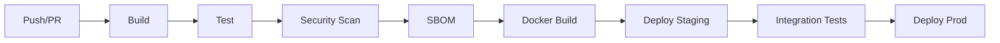

# 🚀 CI/CD Pipeline VHouse

## 🔄 GitHub Actions Workflow

### Pipeline Overview


### Current Workflows

#### 1. Continuous Integration (.github/workflows/ci.yml)
```yaml
name: CI Pipeline
on:
  push:
    branches: [master, develop]
  pull_request:
    branches: [master]

jobs:
  build-test:
    runs-on: ubuntu-latest
    steps:
      - uses: actions/checkout@v4

      - name: Setup .NET
        uses: actions/setup-dotnet@v3
        with:
          dotnet-version: '8.0.x'

      - name: Restore dependencies
        run: dotnet restore

      - name: Build
        run: dotnet build --no-restore --configuration Release

      - name: Test
        run: dotnet test --no-build --configuration Release --collect:"XPlat Code Coverage"

      - name: Upload coverage
        uses: codecov/codecov-action@v3
```

#### 2. Security Scanning (.github/workflows/security.yml)
```yaml
name: Security Scan
on:
  push:
    branches: [master]
  schedule:
    - cron: '0 6 * * *'  # Daily at 6 AM

jobs:
  sast:
    runs-on: ubuntu-latest
    steps:
      - uses: actions/checkout@v4

      - name: CodeQL Analysis
        uses: github/codeql-action/init@v2
        with:
          languages: csharp

      - name: Build for analysis
        run: dotnet build --configuration Release

      - name: Perform CodeQL Analysis
        uses: github/codeql-action/analyze@v2

  dependency-scan:
    runs-on: ubuntu-latest
    steps:
      - uses: actions/checkout@v4

      - name: Dependency Review
        uses: actions/dependency-review-action@v3

      - name: Generate SBOM
        run: |
          dotnet tool install --global Microsoft.Sbom.Targets
          sbom-tool generate -b ./src -bc . -pn VHouse -pv 1.0.0 -ps Bernard -nsb
```

#### 3. Docker Build & Deploy (.github/workflows/deploy.yml)
```yaml
name: Build & Deploy
on:
  push:
    branches: [master]
    tags: ['v*']

jobs:
  docker:
    runs-on: ubuntu-latest
    steps:
      - uses: actions/checkout@v4

      - name: Docker meta
        id: meta
        uses: docker/metadata-action@v4
        with:
          images: bernardouriza/vhouse
          tags: |
            type=ref,event=branch
            type=ref,event=pr
            type=semver,pattern={{version}}

      - name: Build and push
        uses: docker/build-push-action@v4
        with:
          context: .
          push: true
          tags: ${{ steps.meta.outputs.tags }}
          labels: ${{ steps.meta.outputs.labels }}
```

## 📊 Quality Gates

### Build Requirements
- ✅ All tests pass (Unit + Integration)
- ✅ Code coverage >80% for critical paths
- ✅ No high/critical security vulnerabilities
- ✅ Docker image builds successfully
- ✅ No compiler warnings in Release mode

### Deployment Requirements
- ✅ Staging deployment successful
- ✅ Integration tests pass
- ✅ Performance tests meet thresholds
- ✅ Security scans clean
- ✅ SBOM generated and stored

## 🔒 Security Integration

### Static Analysis (SAST)
- **CodeQL**: GitHub native security scanning
- **SonarCloud**: Code quality and security
- **Semgrep**: Custom security rules

### Dependency Management
- **Dependabot**: Automated dependency updates
- **SBOM Generation**: Complete bill of materials
- **License Compliance**: Ensure compatible licenses

### Container Security
- **Trivy**: Container vulnerability scanning
- **Distroless Images**: Minimal attack surface
- **Multi-stage Builds**: Clean production images

## 🐳 Container Strategy

### Dockerfile Best Practices
```dockerfile
# Multi-stage build for security
FROM mcr.microsoft.com/dotnet/sdk:8.0 AS build
WORKDIR /src
COPY ["VHouse.Web/VHouse.Web.csproj", "VHouse.Web/"]
RUN dotnet restore "VHouse.Web/VHouse.Web.csproj"

COPY . .
RUN dotnet build "VHouse.Web/VHouse.Web.csproj" -c Release -o /app/build

FROM build AS publish
RUN dotnet publish "VHouse.Web/VHouse.Web.csproj" -c Release -o /app/publish

# Runtime image - distroless for security
FROM mcr.microsoft.com/dotnet/aspnet:8.0-bookworm-slim AS final
WORKDIR /app
COPY --from=publish /app/publish .

# Non-root user for security
RUN adduser --disabled-password --gecos '' appuser
USER appuser

ENTRYPOINT ["dotnet", "VHouse.Web.dll"]
```

### Image Optimization
- Multi-stage builds to reduce size
- .dockerignore to exclude unnecessary files
- Layer caching optimization
- Security scanning on each build

## 📈 Monitoring & Observability

### Application Metrics
```csharp
// Example: Custom metrics for business impact
app.MapGet("/metrics", () => {
    return new {
        ProductsAdded = metrics.ProductsAddedToday,
        OrdersProcessed = metrics.OrdersProcessedToday,
        ClientsActive = metrics.ActiveClientsCount
    };
});
```

### Performance Monitoring
- Response time tracking
- Database query performance
- Memory and CPU usage
- Error rate monitoring

### Business KPIs
- Products added per day
- Orders processed successfully
- Client adoption metrics
- System availability

## 🚀 Deployment Strategies

### Environments
1. **Development**: Feature branches, local testing
2. **Staging**: Master branch, integration testing
3. **Production**: Tagged releases, manual approval

### Blue-Green Deployment
```bash
# Deploy to green environment
kubectl apply -f k8s/green/

# Verify green deployment
kubectl get pods -l version=green

# Switch traffic to green
kubectl patch service vhouse -p '{"spec":{"selector":{"version":"green"}}}'

# Cleanup blue environment
kubectl delete -f k8s/blue/
```

### Rollback Strategy
```bash
# Quick rollback to previous version
kubectl rollout undo deployment/vhouse-api

# Rollback to specific revision
kubectl rollout undo deployment/vhouse-api --to-revision=2

# Monitor rollback status
kubectl rollout status deployment/vhouse-api
```

## 📋 Runbooks

### Failed Build Recovery
1. Check build logs in GitHub Actions
2. Verify all tests pass locally: `dotnet test`
3. Check for dependency conflicts: `dotnet restore --verbosity detailed`
4. Ensure all migrations applied: `dotnet ef database update`

### Failed Deployment Recovery
1. Check deployment logs: `kubectl logs deployment/vhouse-api`
2. Verify configmaps and secrets: `kubectl get configmap,secret`
3. Check service connectivity: `kubectl get svc,endpoints`
4. Rollback if necessary: `kubectl rollout undo deployment/vhouse-api`

### Security Incident Response
1. **Immediate**: Stop deployment pipeline
2. **Assess**: Review security scan results
3. **Patch**: Update vulnerable dependencies
4. **Verify**: Re-run security scans
5. **Deploy**: Resume pipeline after clearance

---

**🎯 Pipeline Activista**: Cada deploy debe acercar productos veganos a más personas. Si el pipeline falla, los animales esperan - priorizamos velocidad segura sobre perfección.